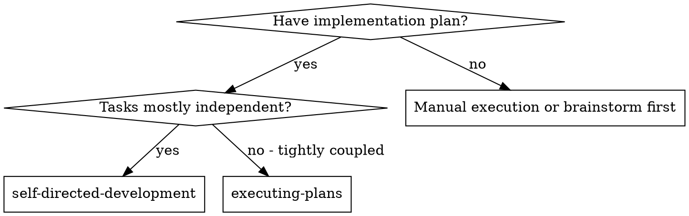

# Self-Directed Development

Execute plan task-by-task in the current session. After each task: self-review for spec compliance, then code quality. Fix before moving on.

**Core principle:** Implement → Self-review (spec) → Self-review (quality) → Fix → Next task

> **Note (Antigravity):** In this environment, all work happens in the same agent session. There are no fresh-context subagents. The quality gates are enforced by the same agent through disciplined self-review with a fresh perspective after each task.

## When to Use



**Use when:** Plan is written, tasks can be done one at a time, you want quality gates between tasks.

## The Process

### 1. Read the Plan

Read the full plan once. Extract all tasks and their context. Note dependencies between tasks.

Use the plan's `- [ ]` checkboxes to track status.

### 2. Per Task Loop

For each task in order:

**a. Implement**
- Follow each step in the task exactly
- Commit after each step where specified
- Don't skip verifications specified in the plan

**b. Spec Compliance Self-Review**

Re-read the task spec. Then check the diff:

```bash
git diff HEAD~N HEAD  # N = commits in this task
```

Ask yourself with fresh eyes:
- Is every requirement covered? (nothing missing)
- Is anything extra added that wasn't requested? (nothing extra)
- Do edge cases match spec behavior?

If issues found → fix immediately → re-review.

**c. Code Quality Self-Review**

Check the same diff for:
- N+1 queries or DB calls in loops
- Unindexed WHERE filters on large tables
- `any` types, unsafe `!` assertions, unchecked casts
- Dead code — unused variables, imports, declared but never returned values
- Commented-out code → delete it
- Function doing more than one thing → split

If issues found → fix → re-review.

**d. Mark task complete** — tick the checkbox in the plan.

### 3. Final Review

After all tasks: read the full diff from the start of the branch:

```bash
git diff origin/main HEAD
```

Verify the complete implementation makes sense as a whole. Check for:
- Inconsistency between tasks (naming drift, duplicated logic)
- Missing integration (tasks that should connect but don't)
- Overall correctness against the spec

### 4. Finish

Use superpowers:finishing-a-development-branch.

## Example Workflow

```
[Read plan — 4 tasks extracted]
[Task 1: checkbox marked in-progress]

  [Implement step 1-5 per plan]
  [Commit]

  [Spec self-review: re-read task 1 spec → read diff]
  Finding: progress reporting missing (spec says "report every 100 items")
  → Fix: add progress reporting
  → Re-review: ✅ spec compliant

  [Quality self-review: read same diff]
  Finding: magic number 100 → extract as PROGRESS_INTERVAL constant
  → Fix: extract constant
  → Re-review: ✅ quality approved

[Task 1: checkbox marked done]
[Task 2: ...]
```

## Handling Blockers

**Missing context:** Stop. Ask the human before proceeding.

**Test fails repeatedly:** Stop after 3 failed fix attempts. Question the architecture — don't keep patching.

**Plan has gaps:** Stop. Raise with human — don't guess and proceed.

**Never:** Force through blockers, mark task done with known open issues, skip a review because "it's simple".

## Red Flags

- Moving to next task before both self-reviews pass
- Doing implementation and review in the same mental pass (wait, re-read with fresh eyes)
- Starting a new task knowing the previous one has unfixed issues
- Skipping spec review because "I wrote the code, I know what's in it" (that's exactly when you miss things)

## Integration

**Required before starting:** superpowers:using-git-worktrees  
**Required after all tasks:** superpowers:finishing-a-development-branch  
**Plan comes from:** superpowers:writing-plans  
**For review detail:** superpowers:requesting-code-review (checklist)
