# Quy trình Nghiệp vụ Chi tiết - Hệ thống Quản trị Affiliate Marketing

## 1. Tổng quan Quy trình Nghiệp vụ

Hệ thống AffiliateMax Pro bao gồm 8 quy trình nghiệp vụ chính được tích hợp để tạo thành hệ sinh thái quản lý Affiliate Marketing hoàn chỉnh, tương tự như mô hình Growstack.

### 1.1 Sơ đồ Tổng quan Quy trình

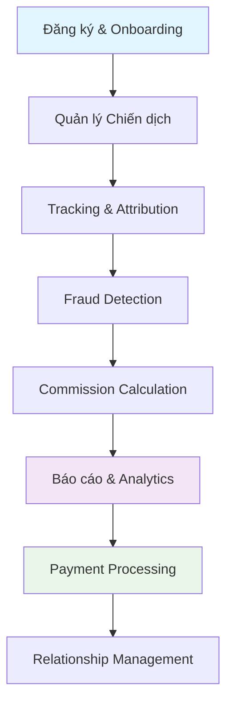

## 2. Chi tiết Quy trình Nghiệp vụ

### 2.1 Quy trình Đăng ký & Onboarding

#### 2.1.1 Use Case Diagram

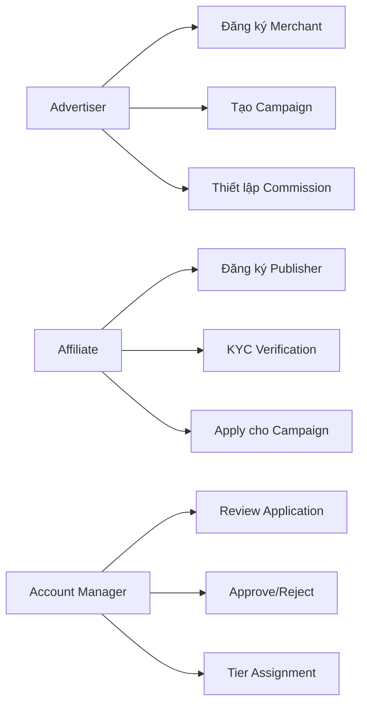

#### 2.1.2 Quy trình Affiliate Onboarding Chi tiết

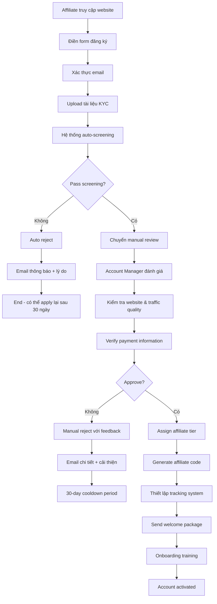

#### 2.1.3 Business Rules cho Onboarding

1. **Auto-screening criteria**:
   - Email domain không được trong blacklist
   - IP không từ high-risk countries
   - Website phải có traffic > 1000/month
   - Không duplicate information với existing affiliates

2. **KYC Requirements**:
   - Government issued ID
   - Business registration (nếu có)
   - Bank account verification
   - Tax ID number

3. **Tier Assignment Logic**:
   - Tier Bronze: Mới bắt đầu, không có history
   - Tier Silver: 6 tháng kinh nghiệm + 10k clicks/month
   - Tier Gold: 1 năm kinh nghiệm + 50k clicks/month
   - Tier Platinum: 2+ năm + 100k clicks/month + high quality traffic

### 2.2 Quy trình Quản lý Chiến dịch

#### 2.2.1 Campaign Lifecycle Management

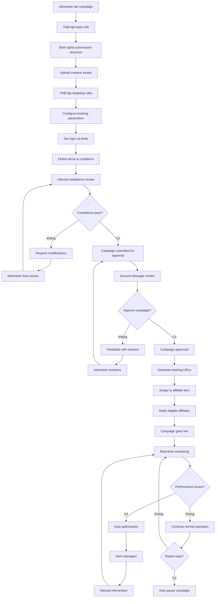

#### 2.2.2 Campaign Approval Workflow

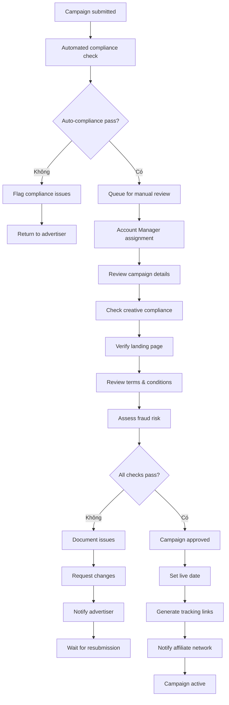

### 2.3 Quy trình Tracking & Attribution

#### 2.3.1 Click Tracking Flow

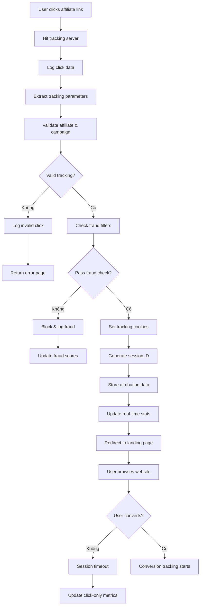

#### 2.3.2 Conversion Attribution Logic

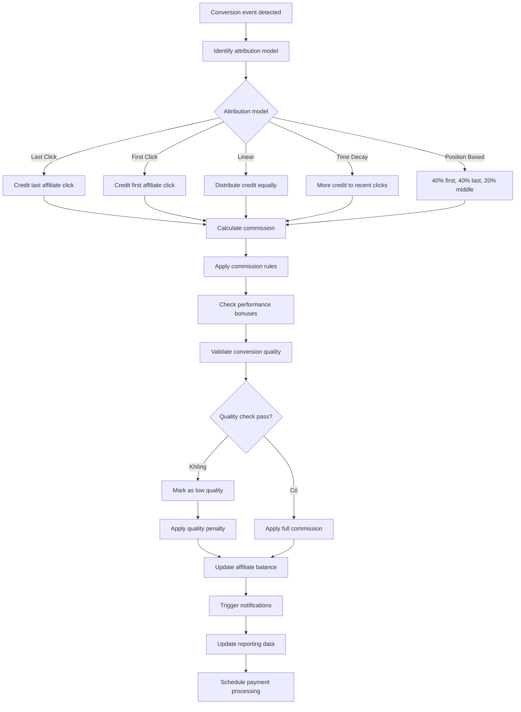

### 2.4 Quy trình Fraud Detection

#### 2.4.1 Real-time Fraud Analysis

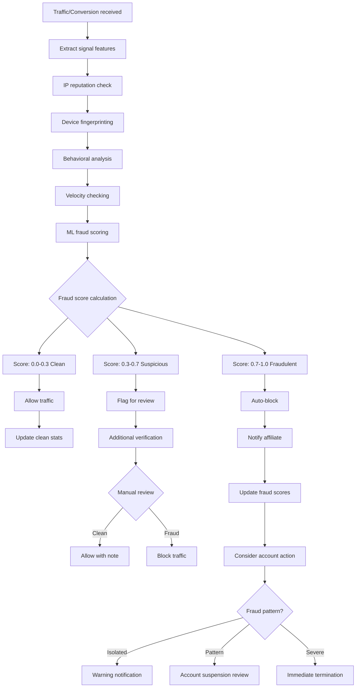

#### 2.4.2 Fraud Investigation Process

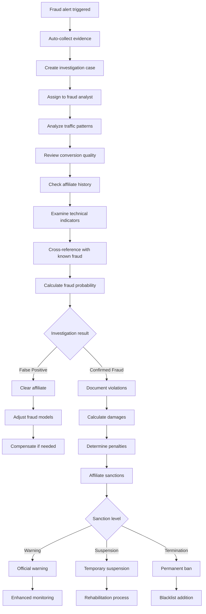

### 2.5 Quy trình Commission Calculation & Payment

#### 2.5.1 Commission Calculation Engine

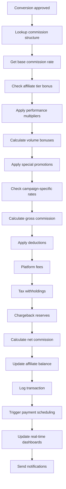

#### 2.5.2 Payment Processing Workflow

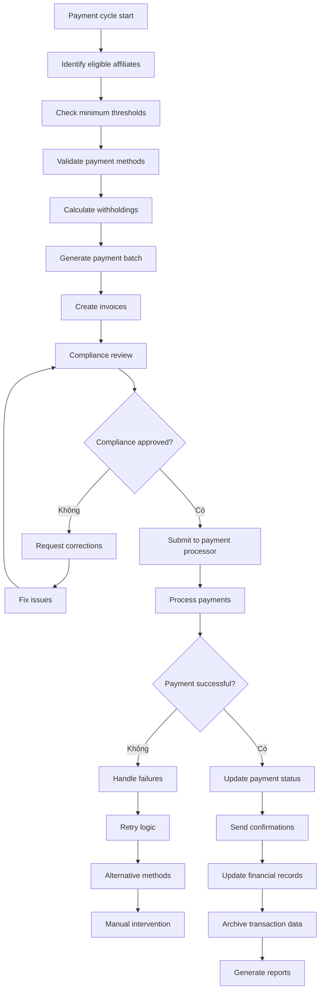

### 2.6 Quy trình Báo cáo & Analytics

#### 2.6.1 Real-time Dashboard Updates

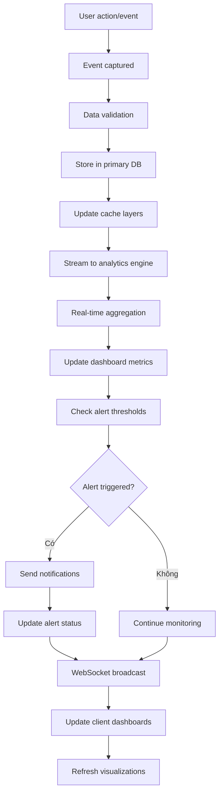

#### 2.6.2 Custom Report Generation

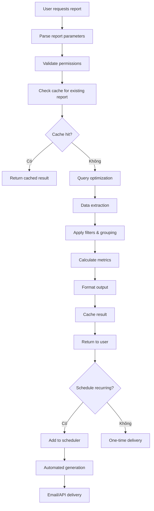

### 2.7 Quy trình Relationship Management

#### 2.7.1 Account Management Workflow

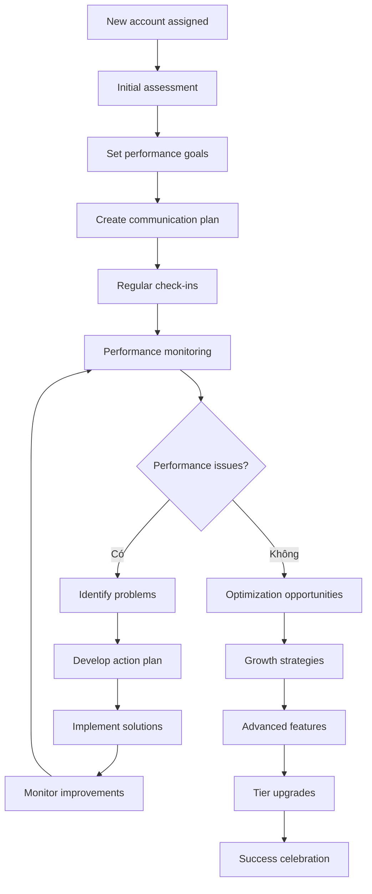

#### 2.7.2 Affiliate Support Process

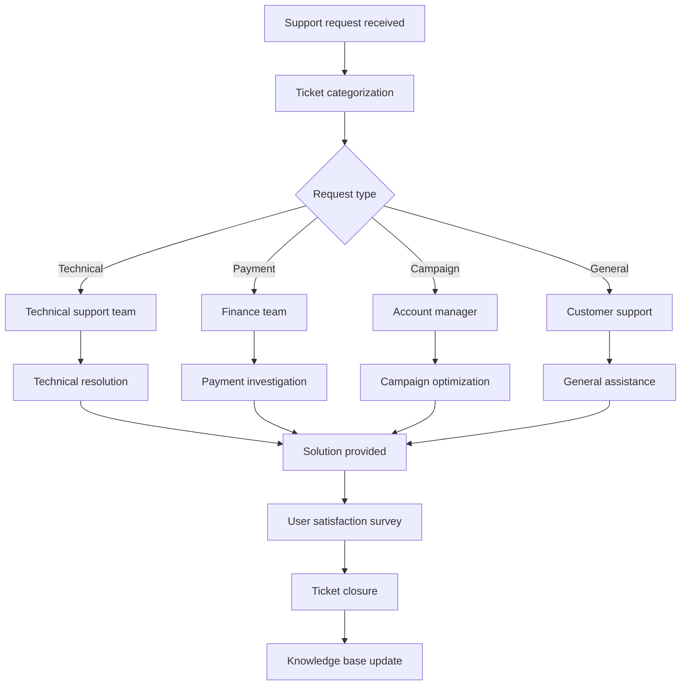

## 3. Business Rules & Policies

### 3.1 Commission Structure Rules

1. **Base Commission Rates**:
   - CPA: Fixed amount per action
   - CPL: Fixed amount per lead
   - CPS: Percentage of sale value
   - CPM: Amount per 1000 impressions

2. **Tier Bonuses**:
   - Bronze: 0% bonus
   - Silver: 5% bonus
   - Gold: 10% bonus
   - Platinum: 15% bonus

3. **Performance Multipliers**:
   - Quality Score > 95%: +5%
   - Conversion Rate > industry average: +3%
   - Volume bonuses at 1k, 5k, 10k conversions

### 3.2 Fraud Prevention Policies

1. **Auto-block Criteria**:
   - Fraud score > 0.85
   - Impossible conversion velocity
   - Known fraudulent IP ranges
   - Invalid traffic patterns

2. **Investigation Triggers**:
   - Sudden traffic spikes (>300% normal)
   - Conversion rate anomalies
   - Geographic inconsistencies
   - Device fingerprint duplicates

3. **Account Actions**:
   - First offense: Warning + monitoring
   - Second offense: 30-day suspension
   - Third offense: Permanent termination

### 3.3 Payment Policies

1. **Payment Schedule**:
   - Net-15: Platinum tier
   - Net-30: Gold tier
   - Net-45: Silver/Bronze tier

2. **Minimum Thresholds**:
   - PayPal: $50
   - Bank Transfer: $100
   - Wire Transfer: $500
   - Cryptocurrency: $25

3. **Hold Periods**:
   - New affiliates: 60 days
   - Established affiliates: 30 days
   - High-risk categories: 90 days

## 4. KPI & Success Metrics

### 4.1 Platform KPIs

- **Growth Metrics**:
  - New affiliate registrations/month
  - Active affiliate retention rate
  - Campaign approval rate
  - Revenue growth month-over-month

- **Quality Metrics**:
  - Average fraud score
  - Conversion quality rating
  - Customer satisfaction score
  - Support ticket resolution time

- **Financial Metrics**:
  - Total GMV (Gross Merchandise Value)
  - Commission payout accuracy
  - Payment processing success rate
  - Revenue per affiliate

### 4.2 Operational Excellence

- **System Performance**:
  - Click processing latency < 50ms
  - Dashboard load time < 2 seconds
  - 99.9% uptime SLA
  - Zero data loss guarantee

- **Process Efficiency**:
  - Application approval time < 24 hours
  - Payment processing time < 3 days
  - Support response time < 2 hours
  - Report generation time < 30 seconds

Quy trình nghiệp vụ này đảm bảo hệ thống AffiliateMax Pro hoạt động hiệu quả, minh bạch và có thể cạnh tranh với các nền tảng hàng đầu như Growstack.