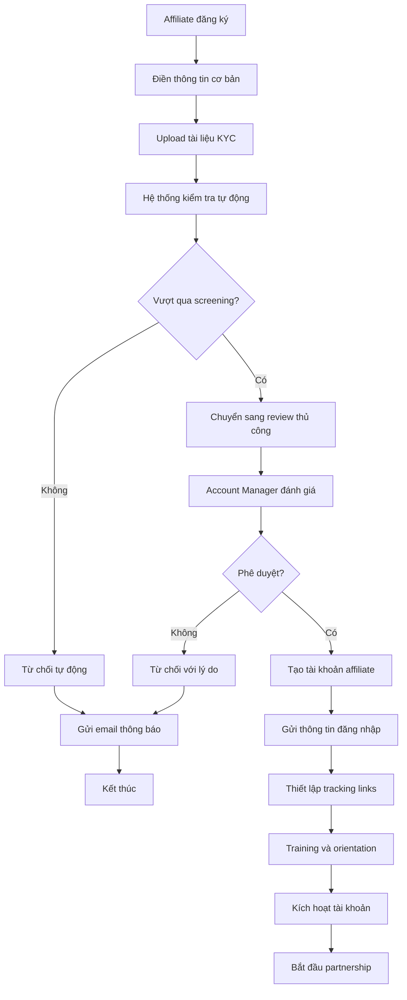
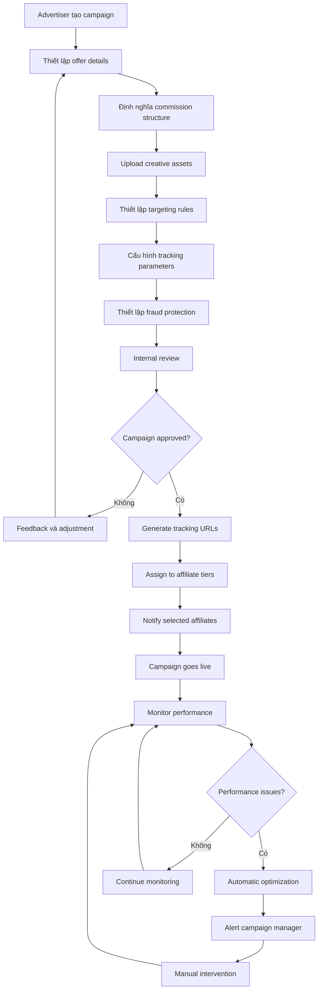
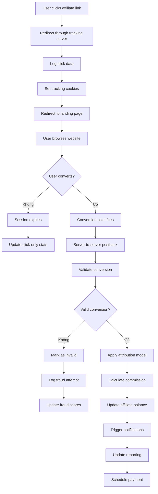
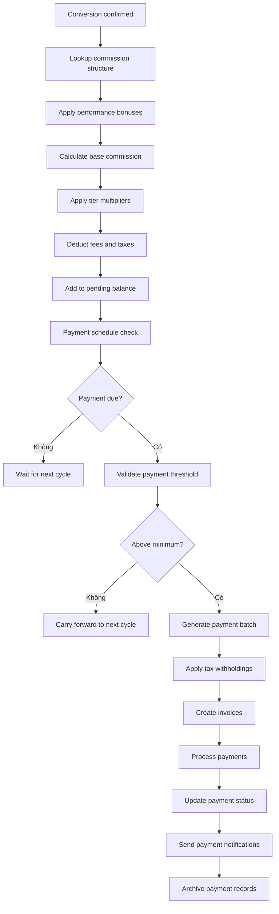
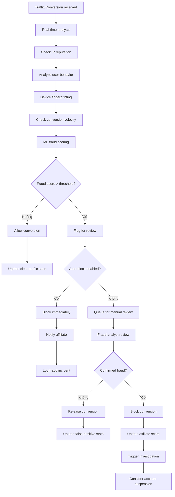

# Kiến trúc Hệ thống Quản trị Affiliate Marketing Tối ưu - AffiliateMax Pro

## 1. Tổng quan Hệ thống

AffiliateMax Pro là giải pháp quản trị Affiliate Marketing toàn diện, được thiết kế để giúp doanh nghiệp tối ưu hóa doanh thu thông qua mạng lưới đối tác và cộng tác viên. Hệ thống áp dụng kiến trúc microservices hiện đại với khả năng mở rộng không giới hạn và tích hợp đa nền tảng.

### 1.1 Mục tiêu Hệ thống
- Số hóa hoàn toàn quy trình quản lý Affiliate Marketing
- Tự động hóa theo dõi, báo cáo và thanh toán commissions
- Cung cấp analytics real-time và dashboard tổng quan
- Hỗ trợ đa thiết bị và đa kênh marketing
- Đảm bảo tính minh bạch và chống gian lận

### 1.2 Đối tượng Sử dụng
- **Advertiser/Merchant**: Chủ sở hữu sản phẩm/dịch vụ cần quảng bá
- **Affiliate/Publisher**: Cộng tác viên thực hiện marketing
- **Network Manager**: Quản lý mạng lưới affiliate
- **Account Manager**: Quản lý mối quan hệ đối tác
- **Finance Team**: Quản lý thanh toán và đối soát
- **Data Analyst**: Phân tích hiệu suất và tối ưu hóa

### 1.3 Lợi ích Cốt lõi (Theo mô hình Growstack)
- **Marketing thông minh**: Khai thác sức mạnh cộng đồng và mạng lưới
- **Tăng giá trị doanh nghiệp**: Quản lý không giới hạn data và đối tác
- **Phát triển không giới hạn**: Không bị ràng buộc địa lý và thời gian
- **Giảm rủi ro tài chính**: Chi phí chỉ phát sinh khi có conversion
- **Hệ thống minh bạch**: Quản lý trên nền tảng số thống nhất
- **Giữ chân nhân viên**: Cơ chế linh động và thu nhập thụ động

## 2. Kiến trúc Hệ thống

### 2.1 Kiến trúc Tổng thể

```
┌─────────────────────────────────────────────────────────────┐
│                    PRESENTATION LAYER                       │
├─────────────────┬─────────────────┬─────────────────────────┤
│   Mobile App    │  Admin Portal   │   Publisher Portal      │
│ (iOS/Android)   │  (React/Next)   │   (Vue/Nuxt)           │
├─────────────────┼─────────────────┼─────────────────────────┤
│ Advertiser Hub  │  Analytics UI   │   API Documentation     │
│  (Dashboard)    │   (Charts.js)   │    (Swagger/OpenAPI)    │
└─────────────────┴─────────────────┴─────────────────────────┘
                            │
┌─────────────────────────────────────────────────────────────┐
│                      API GATEWAY                           │
│         (Rate Limiting, Authentication, Routing)           │
└─────────────────────────────────────────────────────────────┘
                            │
┌─────────────────────────────────────────────────────────────┐
│                   MICROSERVICES LAYER                      │
├─────────────┬─────────────┬─────────────┬─────────────────┤
│  Campaign   │   Partner   │  Tracking   │   Commission    │
│ Management  │ Management  │   Service   │   Management    │
├─────────────┼─────────────┼─────────────┼─────────────────┤
│  Analytics  │   Payment   │   Fraud     │   Notification  │
│   Engine    │   System    │ Detection   │    Service      │
├─────────────┼─────────────┼─────────────┼─────────────────┤
│   Report    │   Content   │   User      │     File        │
│  Generator  │ Management  │ Management  │   Storage       │
└─────────────┴─────────────┴─────────────┴─────────────────┘
                            │
┌─────────────────────────────────────────────────────────────┐
│                     DATA LAYER                             │
├─────────────┬─────────────┬─────────────┬─────────────────┤
│ PostgreSQL  │    Redis    │ ElasticSearch│   ClickHouse    │
│(Transact.)  │  (Cache)    │  (Search)   │  (Analytics)    │
├─────────────┼─────────────┼─────────────┼─────────────────┤
│   MongoDB   │    Kafka    │     S3      │   Blockchain    │
│(Documents)  │(Event Bus)  │(File Store) │(Transparency)   │
└─────────────┴─────────────┴─────────────┴─────────────────┘
```

### 2.2 Các Module Chính

#### 2.2.1 Module Quản lý Chiến dịch (Campaign Management)
- **Chức năng chính**:
  - Tạo và quản lý offers/campaigns
  - Thiết lập commission structures (CPA, CPL, CPS, CPM)
  - Quản lý landing pages và creative assets
  - A/B testing cho campaigns
  - Targeting và segmentation
  - Campaign lifecycle management

#### 2.2.2 Module Quản lý Đối tác (Partner Management)
- **Chức năng chính**:
  - Onboarding và KYC affiliates
  - Hệ thống tier và ranking
  - Performance scoring
  - Relationship management
  - Contract và terms management
  - Affiliate recruitment tools

#### 2.2.3 Module Tracking & Attribution
- **Chức năng chính**:
  - Multi-touch attribution modeling
  - Cross-device tracking
  - Server-to-server postbacks
  - Cookie và fingerprint tracking
  - Deep linking cho mobile
  - Real-time conversion tracking

#### 2.2.4 Module Quản lý Commission
- **Chức năng chính**:
  - Flexible commission structures
  - Automated calculation engine
  - Performance bonuses và incentives
  - Commission approval workflow
  - Chargeback handling
  - Revenue sharing models

#### 2.2.5 Module Analytics & Reporting
- **Chức năng chính**:
  - Real-time dashboard
  - Custom report builder
  - Cohort analysis
  - Predictive analytics
  - ROI và LTV calculations
  - Performance benchmarking

#### 2.2.6 Module Payment & Finance
- **Chức năng chính**:
  - Multi-currency support
  - Automated payment processing
  - Invoice generation
  - Tax compliance
  - Escrow services
  - Financial reconciliation

#### 2.2.7 Module Fraud Detection
- **Chức năng chính**:
  - ML-powered fraud detection
  - Click fraud prevention
  - Conversion quality scoring
  - Blacklist/whitelist management
  - Risk assessment
  - Compliance monitoring

#### 2.2.8 Module Content & Creative Management
- **Chức năng chính**:
  - Creative asset library
  - Dynamic creative optimization
  - Brand compliance checking
  - Localization tools
  - Version control
  - Usage rights management

## 3. Quy trình Nghiệp vụ Chi tiết

### 3.1 Quy trình Affiliate Onboarding



### 3.2 Quy trình Campaign Creation & Launch



### 3.3 Quy trình Conversion Tracking & Attribution



### 3.4 Quy trình Commission Calculation & Payment



### 3.5 Quy trình Fraud Detection & Prevention



## 4. Các Tính năng Nổi bật (Theo tiêu chuẩn Growstack)

### 4.1 Dashboard & Báo cáo Trực quan
- **Báo cáo chỉ số trực quan**: Hiển thị Clicks, Conversions, CR, Revenue theo thời gian thực
- **Biểu đồ xu hướng**: Thay đổi các chỉ số theo timeline
- **Cập nhật real-time**: Conversions mới nhất được cập nhật liên tục
- **Custom dashboards**: Tùy chỉnh dashboard theo role và preference

### 4.2 Quản lý Chiến dịch Cụ thể
- **Multi-goal campaigns**: Hỗ trợ nhiều mục tiêu chuyển đổi (CPA, CPL, CPS)
- **Flexible payment models**: Đa dạng phương thức thanh toán
- **Visibility control**: Kiểm soát khả năng hiển thị campaign
- **Advanced filtering**: Lọc và sắp xếp campaigns dễ dàng
- **Bulk operations**: Thao tác hàng loạt trên multiple campaigns

### 4.3 Quản lý Cộng tác viên & Publishers
- **Comprehensive profiles**: Thông tin chi tiết về performance
- **Automated onboarding**: Quy trình tự động hóa cho affiliates mới
- **Performance tracking**: Theo dõi clicks và conversions 14 ngày gần đây
- **Payment management**: Quản lý phương thức và lịch sử thanh toán
- **Tier system**: Hệ thống phân cấp dựa trên performance

### 4.4 Theo dõi Doanh thu Dễ dàng
- **Multi-dimensional reporting**: Báo cáo theo ngày, tháng, affiliate, advertiser
- **Granular analytics**: Phân tích theo offer, goal, country, device type
- **Revenue forecasting**: Dự báo doanh thu dựa trên xu hướng
- **Profit margin analysis**: Phân tích lợi nhuận chi tiết
- **Export capabilities**: Xuất báo cáo dưới nhiều format

### 4.5 Quản lý Đối soát & Thanh toán
- **Automated invoicing**: Tự động tạo hóa đơn
- **Payment scheduling**: Lên lịch thanh toán linh hoạt
- **Multi-currency support**: Hỗ trợ đa tiền tệ
- **Tax compliance**: Tuân thủ quy định thuế
- **Payment tracking**: Theo dõi trạng thái thanh toán

## 5. Kiến trúc Kỹ thuật Chi tiết

### 5.1 Technology Stack
- **Frontend**: React/Next.js, Vue/Nuxt.js, TypeScript
- **Backend**: Node.js/Hono, Python/FastAPI, Go
- **Database**: PostgreSQL, MongoDB, Redis, ClickHouse
- **Message Queue**: Apache Kafka, RabbitMQ
- **Caching**: Redis, Memcached
- **Search**: Elasticsearch
- **Storage**: AWS S3, MinIO
- **Analytics**: ClickHouse, Apache Superset
- **Monitoring**: Prometheus, Grafana, Sentry
- **CI/CD**: GitHub Actions, Docker, Kubernetes

### 5.2 Security & Compliance
- **Data Encryption**: End-to-end encryption cho sensitive data
- **API Security**: OAuth 2.0, JWT tokens, rate limiting
- **GDPR Compliance**: Data privacy và user consent management
- **Fraud Prevention**: ML-based detection và real-time monitoring
- **Audit Trail**: Complete logging và activity tracking
- **PCI DSS Compliance**: Payment security standards

### 5.3 Scalability & Performance
- **Microservices Architecture**: Independent scaling của các service
- **Load Balancing**: Horizontal scaling với load balancers
- **CDN Integration**: Global content delivery
- **Database Sharding**: Phân tán data cho performance cao
- **Caching Strategy**: Multi-layer caching architecture
- **Auto-scaling**: Kubernetes-based auto-scaling

## 6. Implementation Roadmap

### Phase 1: Core Platform (3 tháng)
- User management và authentication
- Basic campaign management
- Simple tracking và conversion recording
- Basic dashboard và reporting
- Payment system foundation

### Phase 2: Advanced Features (3 tháng)
- Advanced analytics và custom reports
- Fraud detection engine
- Mobile app development
- API ecosystem
- Advanced affiliate management

### Phase 3: AI & Optimization (3 tháng)
- Machine learning models
- Predictive analytics
- Automated optimization
- Advanced fraud prevention
- Blockchain integration

### Phase 4: Enterprise Features (3 tháng)
- Advanced integrations
- White-label solutions
- Enterprise security features
- Advanced compliance tools
- Global expansion capabilities

## 7. Success Metrics & KPIs

### 7.1 Platform Metrics
- **User Growth**: Monthly active users, retention rates
- **Performance**: Response time < 200ms, 99.9% uptime
- **Conversion Rates**: Platform-wide conversion optimization
- **Revenue Growth**: GMV, commission volume, platform revenue

### 7.2 Business Metrics
- **Partner Satisfaction**: NPS scores, retention rates
- **Revenue Impact**: ROI cho advertisers, earnings cho affiliates
- **Market Penetration**: Market share, competitive positioning
- **Operational Efficiency**: Cost per acquisition, operational costs

## 8. Kết luận

AffiliateMax Pro được thiết kế để trở thành giải pháp quản trị Affiliate Marketing hàng đầu, kết hợp các tính năng tiên tiến với kiến trúc kỹ thuật mạnh mẽ. Hệ thống không chỉ đáp ứng các nhu cầu hiện tại mà còn sẵn sàng cho các xu hướng tương lai của ngành Affiliate Marketing.

Với kiến trúc microservices, AI/ML integration, và focus vào user experience, AffiliateMax Pro sẽ giúp các doanh nghiệp tối ưu hóa ROI từ Affiliate Marketing và xây dựng mạng lưới đối tác bền vững và hiệu quả.