# Quy trình Nghiệp vụ Chi tiết - Hệ thống FastCons

## 1. Tổng quan Quy trình Nghiệp vụ

Hệ thống FastCons bao gồm 13 quy trình nghiệp vụ chính được tích hợp chặt chẽ với nhau để tạo thành một hệ sinh thái quản lý dự án xây dựng hoàn chỉnh.

### 1.1 Sơ đồ Tổng quan Quy trình

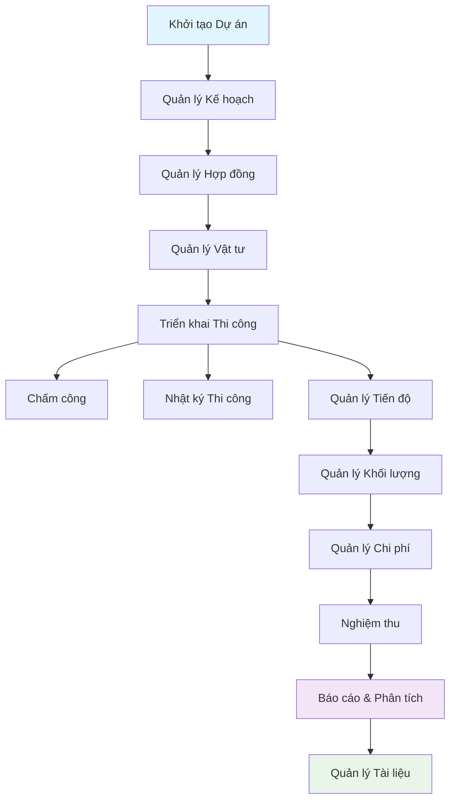

## 2. Chi tiết Quy trình Nghiệp vụ

### 2.1 Quy trình Quản lý Kế hoạch (Plan Management)

#### 2.1.1 Use Case Diagram

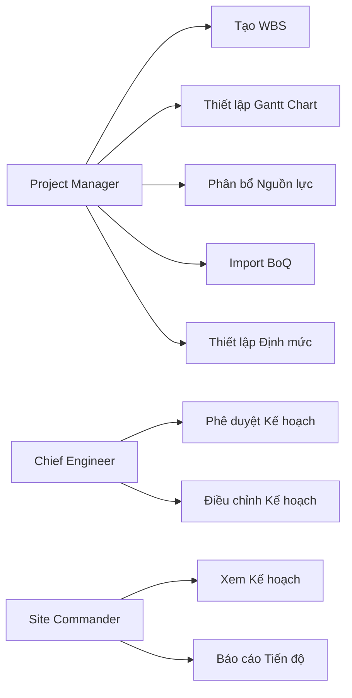

#### 2.1.2 Quy trình Chi tiết

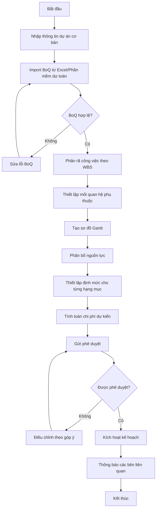

#### 2.1.3 Business Rules

1. **Phân rã WBS**: Tối đa 5 cấp độ, mỗi cấp có mã định danh duy nhất
2. **Gantt Chart**: Tự động tính toán critical path
3. **Nguồn lực**: Không được vượt quá 100% capacity của resource
4. **Định mức**: Phải có ít nhất 3 loại: nhân công, vật tư, máy móc
5. **Phê duyệt**: Cần ít nhất 2 cấp phê duyệt cho dự án > 10 tỷ

### 2.2 Quy trình Quản lý Tiến độ (Progress Management)

#### 2.2.1 Quy trình Real-time Tracking

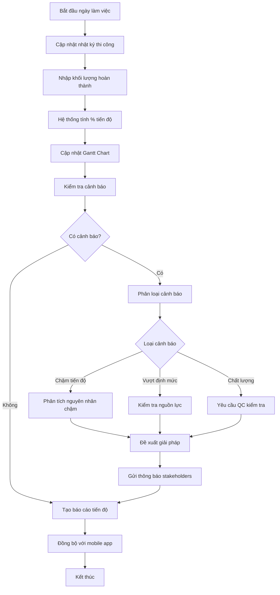

#### 2.2.2 Burn-up Chart Logic

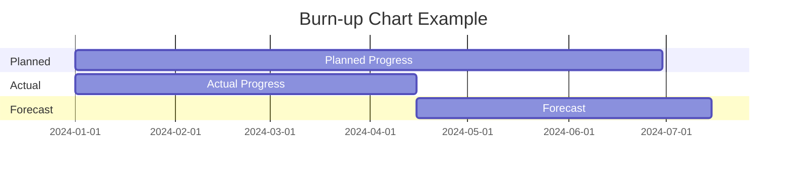

### 2.3 Quy trình Quản lý Khối lượng (Quantity Management)

#### 2.3.1 Quy trình Nghiệm thu

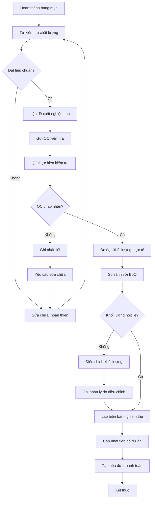

#### 2.3.2 Quy trình Quản lý Thầu phụ

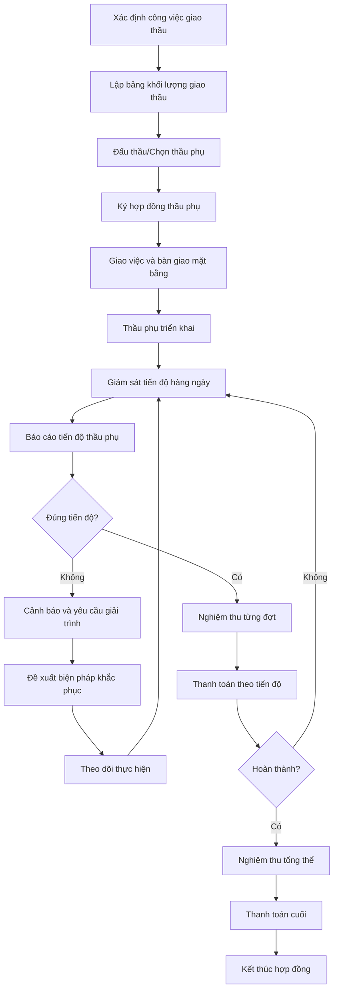

### 2.4 Quy trình Quản lý Vật tư (Materials Management)

#### 2.4.1 Quy trình Cung ứng Vật tư

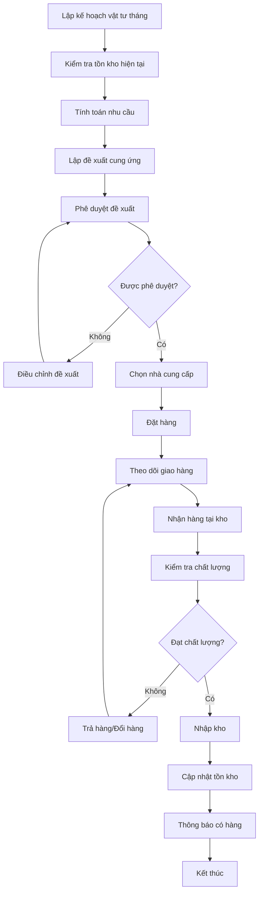

#### 2.4.2 Quy trình Xuất kho và Sử dụng

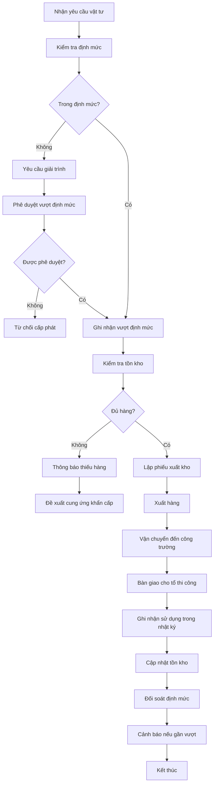

### 2.5 Quy trình Quản lý Chi phí (Cost Management)

#### 2.5.1 Quy trình Kiểm soát Ngân sách

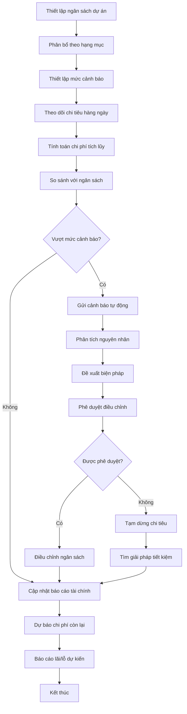

#### 2.5.2 Quy trình Thanh toán

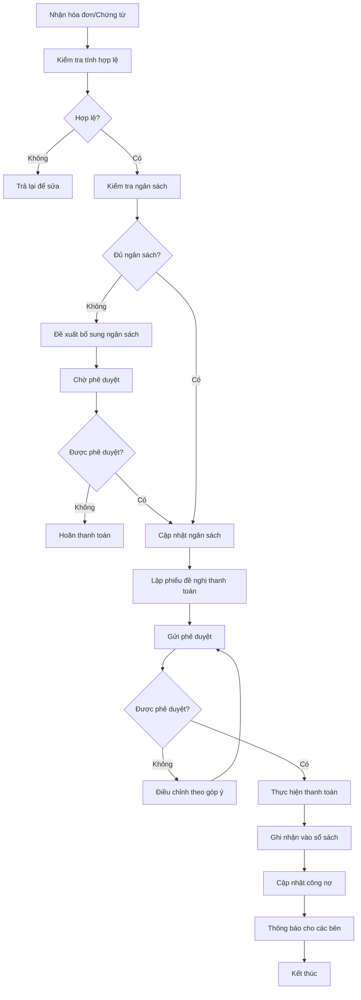

### 2.6 Quy trình Quản lý Hợp đồng (Contract Management)

#### 2.6.1 Quy trình Quản lý Hợp đồng Chính

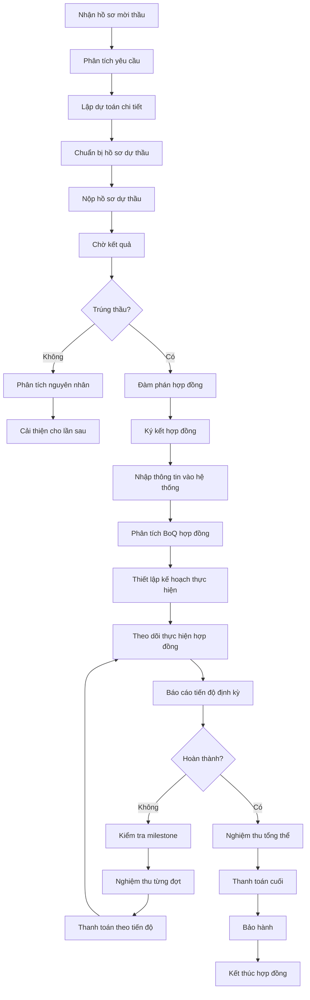

### 2.7 Quy trình Nhật ký Thi công (Construction Log)

#### 2.7.1 Quy trình Báo cáo Hàng ngày

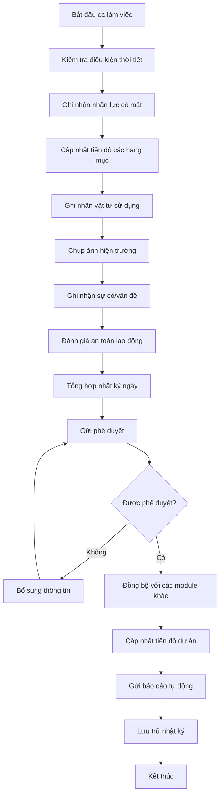

### 2.8 Quy trình Chấm công (Timesheet Management)

#### 2.8.1 Quy trình Chấm công với FaceID

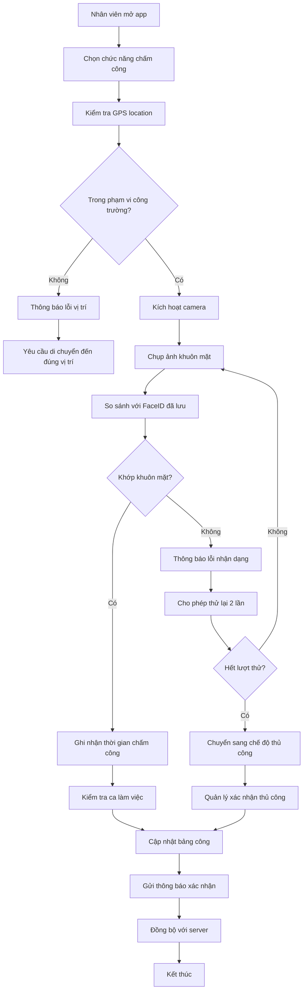

### 2.9 Quy trình Quản lý Tài liệu (Document Management)

#### 2.9.1 Quy trình Quản lý Hồ sơ Dự án

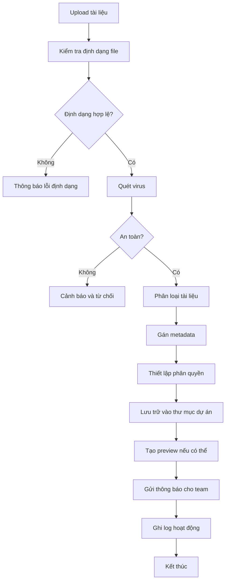

#### 2.9.2 Quy trình Ký số Tài liệu

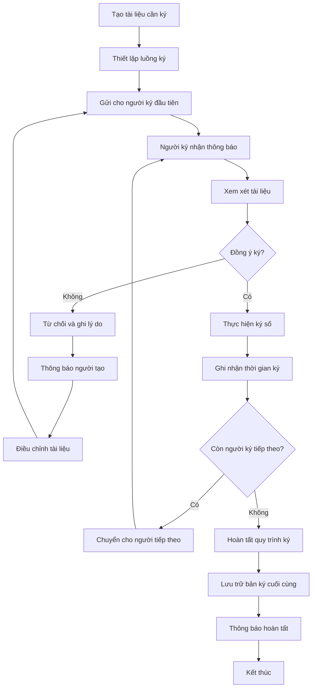

## 3. Tích hợp Quy trình

### 3.1 Ma trận Tích hợp Quy trình

| Module | Kế hoạch | Tiến độ | Khối lượng | Vật tư | Chi phí | Hợp đồng | Nhật ký | Chấm công | Tài liệu |
|--------|----------|---------|------------|--------|---------|----------|---------|-----------|----------|
| Kế hoạch | ● | ● | ● | ● | ● | ● | ○ | ○ | ● |
| Tiến độ | ● | ● | ● | ● | ● | ○ | ● | ● | ○ |
| Khối lượng | ● | ● | ● | ● | ● | ● | ● | ○ | ● |
| Vật tư | ● | ● | ● | ● | ● | ● | ● | ○ | ○ |
| Chi phí | ● | ● | ● | ● | ● | ● | ● | ● | ○ |
| Hợp đồng | ● | ○ | ● | ● | ● | ● | ○ | ○ | ● |
| Nhật ký | ○ | ● | ● | ● | ● | ○ | ● | ● | ● |
| Chấm công | ○ | ● | ○ | ○ | ● | ○ | ● | ● | ○ |
| Tài liệu | ● | ○ | ● | ○ | ○ | ● | ● | ○ | ● |

**Chú thích**: ● = Tích hợp chặt chẽ, ○ = Tích hợp lỏng lẻo

### 3.2 Luồng Dữ liệu Chính

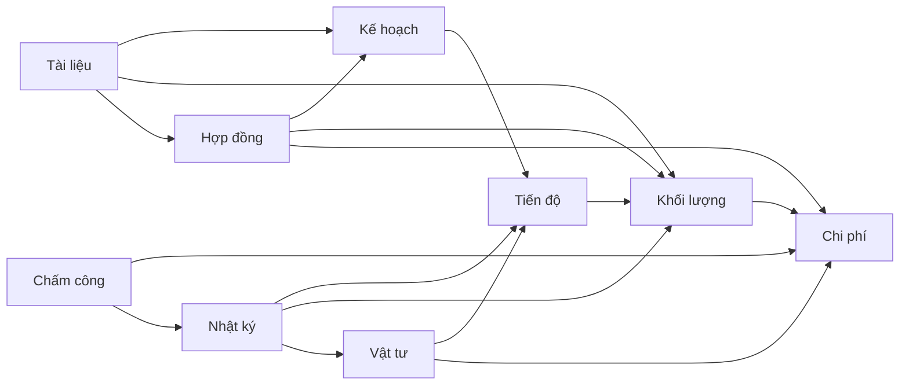

## 4. Quy tắc Nghiệp vụ (Business Rules)

### 4.1 Quy tắc Chung

1. **Phân quyền**: Mọi thao tác đều phải có phân quyền rõ ràng
2. **Audit Trail**: Ghi log tất cả các thay đổi quan trọng
3. **Validation**: Kiểm tra dữ liệu đầu vào ở mọi cấp độ
4. **Notification**: Thông báo tự động cho các bên liên quan
5. **Backup**: Sao lưu dữ liệu định kỳ và trước mọi thay đổi lớn

### 4.2 Quy tắc Cụ thể theo Module

#### 4.2.1 Quản lý Kế hoạch
- WBS không được quá 5 cấp độ
- Mỗi work package phải có ít nhất 1 resource được gán
- Thời gian dự án không được vượt quá 5 năm
- Critical path phải được tính toán tự động

#### 4.2.2 Quản lý Tiến độ
- Cập nhật tiến độ ít nhất 1 lần/ngày
- Cảnh báo khi tiến độ chậm > 5% so với kế hoạch
- Burn-up chart được cập nhật real-time
- KPI hoàn thành được tính theo công thức chuẩn

#### 4.2.3 Quản lý Vật tư
- Không được xuất kho khi không đủ tồn kho
- Cảnh báo khi sử dụng > 90% định mức
- Phải có ít nhất 2 cấp phê duyệt cho đề xuất > 100 triệu
- Kiểm tra chất lượng bắt buộc với vật tư quan trọng

#### 4.2.4 Quản lý Chi phí
- Không được chi vượt ngân sách đã phê duyệt
- Cảnh báo khi chi phí đạt 80% ngân sách
- Phải có chứng từ hợp lệ cho mọi khoản chi
- Báo cáo tài chính phải được tạo hàng ngày

## 5. Exception Handling

### 5.1 Xử lý Ngoại lệ Thường gặp

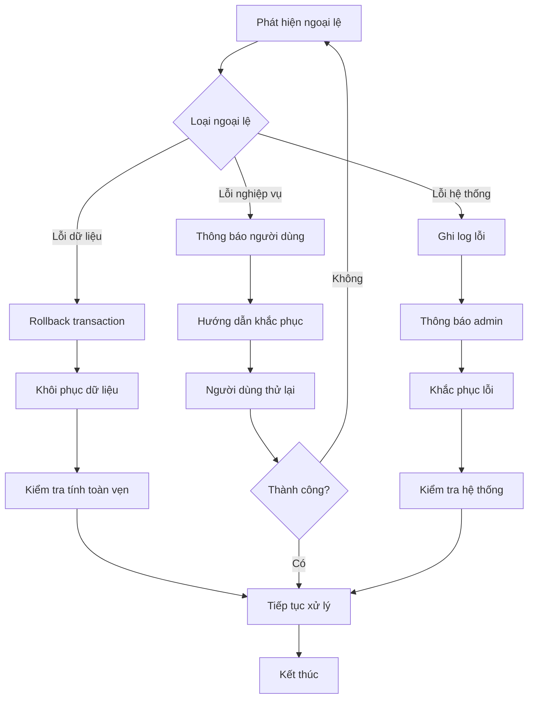

### 5.2 Disaster Recovery

1. **Backup Strategy**: 
   - Full backup hàng ngày
   - Incremental backup mỗi 4 giờ
   - Transaction log backup mỗi 15 phút

2. **Recovery Procedures**:
   - RTO (Recovery Time Objective): < 4 giờ
   - RPO (Recovery Point Objective): < 15 phút
   - Automatic failover cho critical services

3. **Business Continuity**:
   - Offline mode cho mobile app
   - Manual processes cho critical operations
   - Communication plan cho stakeholders

## 6. Performance Requirements

### 6.1 Response Time Requirements

| Chức năng | Response Time | Throughput |
|-----------|---------------|------------|
| Đăng nhập | < 2s | 1000 concurrent users |
| Xem dashboard | < 3s | 500 concurrent users |
| Cập nhật tiến độ | < 1s | 200 TPS |
| Upload tài liệu | < 10s | 50 concurrent uploads |
| Tạo báo cáo | < 30s | 10 concurrent reports |
| Sync mobile | < 5s | 100 concurrent syncs |

### 6.2 Scalability Requirements

- **Horizontal Scaling**: Hỗ trợ scale out cho tất cả services
- **Database Sharding**: Theo project_id
- **Caching Strategy**: Multi-level caching
- **CDN**: Cho static assets và documents

## 7. Monitoring và Alerting

### 7.1 Business Metrics

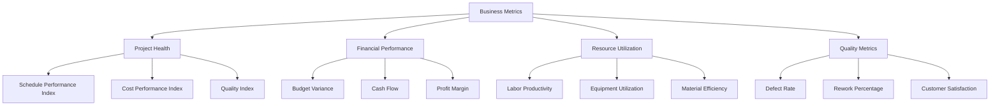

### 7.2 Alert Rules

1. **Critical Alerts** (Immediate notification):
   - System down
   - Data corruption
   - Security breach
   - Budget exceeded by >10%

2. **Warning Alerts** (Within 1 hour):
   - Schedule delay >5%
   - Resource utilization >90%
   - Quality issues
   - Performance degradation

3. **Info Alerts** (Daily digest):
   - Progress updates
   - Milestone achievements
   - Regular reports

## 8. Kết luận

Hệ thống quy trình nghiệp vụ FastCons được thiết kế để:

1. **Tự động hóa** các quy trình thủ công
2. **Tích hợp chặt chẽ** giữa các module
3. **Đảm bảo tính nhất quán** của dữ liệu
4. **Cung cấp visibility** cho tất cả stakeholders
5. **Hỗ trợ ra quyết định** dựa trên dữ liệu real-time

Việc triển khai thành công các quy trình này sẽ giúp các doanh nghiệp xây dựng nâng cao hiệu quả quản lý dự án, giảm thiểu rủi ro và tối ưu hóa chi phí.