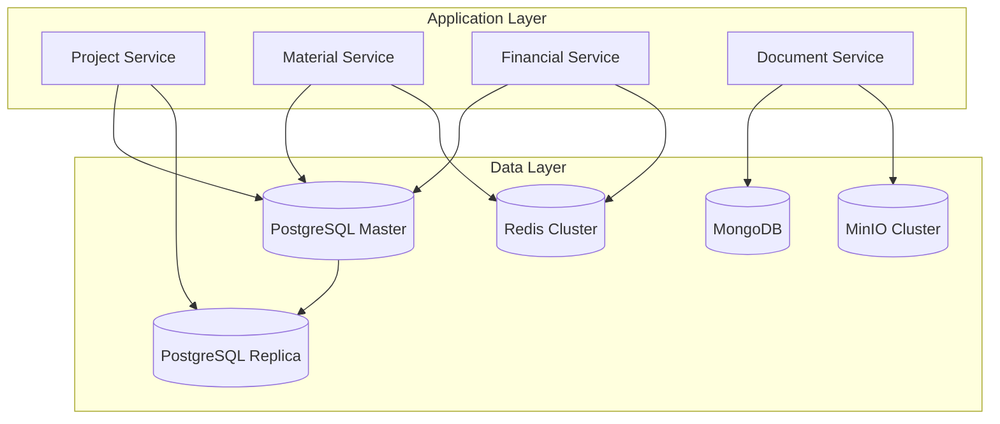

# Database Schema - Hệ thống FastCons

## 1. Tổng quan Database Architecture

### 1.1 Database Strategy

Hệ thống FastCons sử dụng kiến trúc database hybrid:

- **PostgreSQL**: Dữ liệu quan hệ chính (projects, users, transactions)
- **MongoDB**: Documents, files metadata, logs
- **Redis**: Cache, sessions, real-time data
- **MinIO/S3**: File storage (documents, images, BIM files)

### 1.2 Database Topology



## 2. PostgreSQL Schema Design

### 2.1 Core Entities

#### 2.1.1 Users và Authentication

```sql
-- Users table
CREATE TABLE users (
    id UUID PRIMARY KEY DEFAULT gen_random_uuid(),
    username VARCHAR(50) UNIQUE NOT NULL,
    email VARCHAR(255) UNIQUE NOT NULL,
    password_hash VARCHAR(255) NOT NULL,
    first_name VARCHAR(100),
    last_name VARCHAR(100),
    phone VARCHAR(20),
    avatar_url TEXT,
    status VARCHAR(20) DEFAULT 'ACTIVE', -- ACTIVE, INACTIVE, SUSPENDED
    last_login_at TIMESTAMP,
    created_at TIMESTAMP DEFAULT NOW(),
    updated_at TIMESTAMP DEFAULT NOW()
);

-- Roles table
CREATE TABLE roles (
    id UUID PRIMARY KEY DEFAULT gen_random_uuid(),
    name VARCHAR(50) UNIQUE NOT NULL,
    description TEXT,
    permissions JSONB,
    created_at TIMESTAMP DEFAULT NOW()
);

-- User roles mapping
CREATE TABLE user_roles (
    id UUID PRIMARY KEY DEFAULT gen_random_uuid(),
    user_id UUID REFERENCES users(id) ON DELETE CASCADE,
    role_id UUID REFERENCES roles(id) ON DELETE CASCADE,
    project_id UUID REFERENCES projects(id) ON DELETE CASCADE,
    assigned_at TIMESTAMP DEFAULT NOW(),
    assigned_by UUID REFERENCES users(id),
    UNIQUE(user_id, role_id, project_id)
);

-- Sessions table
CREATE TABLE user_sessions (
    id UUID PRIMARY KEY DEFAULT gen_random_uuid(),
    user_id UUID REFERENCES users(id) ON DELETE CASCADE,
    token_hash VARCHAR(255) NOT NULL,
    device_info JSONB,
    ip_address INET,
    expires_at TIMESTAMP NOT NULL,
    created_at TIMESTAMP DEFAULT NOW()
);
```

#### 2.1.2 Organizations và Projects

```sql
-- Organizations table
CREATE TABLE organizations (
    id UUID PRIMARY KEY DEFAULT gen_random_uuid(),
    name VARCHAR(255) NOT NULL,
    code VARCHAR(50) UNIQUE NOT NULL,
    tax_code VARCHAR(50),
    address TEXT,
    phone VARCHAR(20),
    email VARCHAR(255),
    website VARCHAR(255),
    logo_url TEXT,
    settings JSONB,
    created_at TIMESTAMP DEFAULT NOW(),
    updated_at TIMESTAMP DEFAULT NOW()
);

-- Projects table
CREATE TABLE projects (
    id UUID PRIMARY KEY DEFAULT gen_random_uuid(),
    organization_id UUID REFERENCES organizations(id),
    name VARCHAR(255) NOT NULL,
    code VARCHAR(50) NOT NULL,
    description TEXT,
    project_type VARCHAR(50), -- BUILDING, INFRASTRUCTURE, RENOVATION
    location JSONB, -- {address, coordinates, region}
    start_date DATE,
    end_date DATE,
    planned_budget DECIMAL(15,2),
    actual_budget DECIMAL(15,2) DEFAULT 0,
    currency VARCHAR(3) DEFAULT 'VND',
    status VARCHAR(20) DEFAULT 'PLANNING', -- PLANNING, ACTIVE, SUSPENDED, COMPLETED, CANCELLED
    progress DECIMAL(5,2) DEFAULT 0,
    owner_id UUID REFERENCES users(id),
    manager_id UUID REFERENCES users(id),
    settings JSONB,
    created_at TIMESTAMP DEFAULT NOW(),
    updated_at TIMESTAMP DEFAULT NOW(),
    UNIQUE(organization_id, code)
);

-- Project stakeholders
CREATE TABLE project_stakeholders (
    id UUID PRIMARY KEY DEFAULT gen_random_uuid(),
    project_id UUID REFERENCES projects(id) ON DELETE CASCADE,
    stakeholder_type VARCHAR(50), -- CLIENT, CONTRACTOR, SUBCONTRACTOR, SUPPLIER, CONSULTANT
    organization_name VARCHAR(255),
    contact_person VARCHAR(255),
    email VARCHAR(255),
    phone VARCHAR(20),
    address TEXT,
    role_description TEXT,
    created_at TIMESTAMP DEFAULT NOW()
);
```

#### 2.1.3 Work Breakdown Structure (WBS)

```sql
-- WBS Items table
CREATE TABLE wbs_items (
    id UUID PRIMARY KEY DEFAULT gen_random_uuid(),
    project_id UUID REFERENCES projects(id) ON DELETE CASCADE,
    parent_id UUID REFERENCES wbs_items(id) ON DELETE CASCADE,
    code VARCHAR(50) NOT NULL,
    name VARCHAR(255) NOT NULL,
    description TEXT,
    level INTEGER NOT NULL,
    sort_order INTEGER DEFAULT 0,
    work_type VARCHAR(50), -- TASK, MILESTONE, SUMMARY
    start_date DATE,
    end_date DATE,
    duration INTEGER, -- in days
    progress DECIMAL(5,2) DEFAULT 0,
    weight DECIMAL(5,2) DEFAULT 0, -- for progress calculation
    is_critical BOOLEAN DEFAULT FALSE,
    status VARCHAR(20) DEFAULT 'NOT_STARTED', -- NOT_STARTED, IN_PROGRESS, COMPLETED, CANCELLED
    created_at TIMESTAMP DEFAULT NOW(),
    updated_at TIMESTAMP DEFAULT NOW(),
    UNIQUE(project_id, code)
);

-- WBS Dependencies
CREATE TABLE wbs_dependencies (
    id UUID PRIMARY KEY DEFAULT gen_random_uuid(),
    predecessor_id UUID REFERENCES wbs_items(id) ON DELETE CASCADE,
    successor_id UUID REFERENCES wbs_items(id) ON DELETE CASCADE,
    dependency_type VARCHAR(20) DEFAULT 'FS', -- FS, SS, FF, SF
    lag_days INTEGER DEFAULT 0,
    created_at TIMESTAMP DEFAULT NOW(),
    UNIQUE(predecessor_id, successor_id)
);
```

#### 2.1.4 Bill of Quantities (BoQ)

```sql
-- BoQ Categories
CREATE TABLE boq_categories (
    id UUID PRIMARY KEY DEFAULT gen_random_uuid(),
    project_id UUID REFERENCES projects(id) ON DELETE CASCADE,
    code VARCHAR(50) NOT NULL,
    name VARCHAR(255) NOT NULL,
    description TEXT,
    parent_id UUID REFERENCES boq_categories(id),
    sort_order INTEGER DEFAULT 0,
    created_at TIMESTAMP DEFAULT NOW(),
    UNIQUE(project_id, code)
);

-- BoQ Items
CREATE TABLE boq_items (
    id UUID PRIMARY KEY DEFAULT gen_random_uuid(),
    project_id UUID REFERENCES projects(id) ON DELETE CASCADE,
    wbs_item_id UUID REFERENCES wbs_items(id),
    category_id UUID REFERENCES boq_categories(id),
    item_code VARCHAR(50) NOT NULL,
    description TEXT NOT NULL,
    unit VARCHAR(20) NOT NULL,
    quantity DECIMAL(12,3) NOT NULL,
    unit_price DECIMAL(12,2) NOT NULL,
    total_amount DECIMAL(15,2) GENERATED ALWAYS AS (quantity * unit_price) STORED,
    specifications JSONB,
    notes TEXT,
    created_at TIMESTAMP DEFAULT NOW(),
    updated_at TIMESTAMP DEFAULT NOW(),
    UNIQUE(project_id, item_code)
);

-- BoQ Revisions (for change management)
CREATE TABLE boq_revisions (
    id UUID PRIMARY KEY DEFAULT gen_random_uuid(),
    boq_item_id UUID REFERENCES boq_items(id) ON DELETE CASCADE,
    revision_number INTEGER NOT NULL,
    change_type VARCHAR(20), -- ADD, MODIFY, DELETE
    old_values JSONB,
    new_values JSONB,
    reason TEXT,
    approved_by UUID REFERENCES users(id),
    approved_at TIMESTAMP,
    created_by UUID REFERENCES users(id),
    created_at TIMESTAMP DEFAULT NOW()
);
```

### 2.2 Resource Management

#### 2.2.1 Resources Master Data

```sql
-- Resource Categories
CREATE TABLE resource_categories (
    id UUID PRIMARY KEY DEFAULT gen_random_uuid(),
    name VARCHAR(255) NOT NULL,
    code VARCHAR(50) UNIQUE NOT NULL,
    resource_type VARCHAR(20) NOT NULL, -- LABOR, MATERIAL, EQUIPMENT
    description TEXT,
    parent_id UUID REFERENCES resource_categories(id),
    created_at TIMESTAMP DEFAULT NOW()
);

-- Resources
CREATE TABLE resources (
    id UUID PRIMARY KEY DEFAULT gen_random_uuid(),
    category_id UUID REFERENCES resource_categories(id),
    code VARCHAR(50) UNIQUE NOT NULL,
    name VARCHAR(255) NOT NULL,
    description TEXT,
    resource_type VARCHAR(20) NOT NULL, -- LABOR, MATERIAL, EQUIPMENT
    unit VARCHAR(20) NOT NULL,
    standard_cost DECIMAL(12,2),
    specifications JSONB,
    supplier_info JSONB,
    is_active BOOLEAN DEFAULT TRUE,
    created_at TIMESTAMP DEFAULT NOW(),
    updated_at TIMESTAMP DEFAULT NOW()
);

-- Resource Allocations
CREATE TABLE resource_allocations (
    id UUID PRIMARY KEY DEFAULT gen_random_uuid(),
    project_id UUID REFERENCES projects(id) ON DELETE CASCADE,
    wbs_item_id UUID REFERENCES wbs_items(id) ON DELETE CASCADE,
    resource_id UUID REFERENCES resources(id),
    planned_quantity DECIMAL(12,3) NOT NULL,
    planned_cost DECIMAL(15,2),
    actual_quantity DECIMAL(12,3) DEFAULT 0,
    actual_cost DECIMAL(15,2) DEFAULT 0,
    allocation_date DATE DEFAULT CURRENT_DATE,
    notes TEXT,
    created_at TIMESTAMP DEFAULT NOW(),
    updated_at TIMESTAMP DEFAULT NOW()
);
```

#### 2.2.2 Material Management

```sql
-- Warehouses
CREATE TABLE warehouses (
    id UUID PRIMARY KEY DEFAULT gen_random_uuid(),
    project_id UUID REFERENCES projects(id) ON DELETE CASCADE,
    name VARCHAR(255) NOT NULL,
    code VARCHAR(50) NOT NULL,
    location TEXT,
    manager_id UUID REFERENCES users(id),
    capacity JSONB, -- {area, volume, weight_limit}
    is_active BOOLEAN DEFAULT TRUE,
    created_at TIMESTAMP DEFAULT NOW(),
    UNIQUE(project_id, code)
);

-- Material Inventory
CREATE TABLE material_inventory (
    id UUID PRIMARY KEY DEFAULT gen_random_uuid(),
    warehouse_id UUID REFERENCES warehouses(id) ON DELETE CASCADE,
    resource_id UUID REFERENCES resources(id),
    quantity_on_hand DECIMAL(12,3) DEFAULT 0,
    quantity_reserved DECIMAL(12,3) DEFAULT 0,
    quantity_available DECIMAL(12,3) GENERATED ALWAYS AS (quantity_on_hand - quantity_reserved) STORED,
    unit_cost DECIMAL(12,2),
    total_value DECIMAL(15,2) GENERATED ALWAYS AS (quantity_on_hand * unit_cost) STORED,
    reorder_level DECIMAL(12,3),
    max_stock_level DECIMAL(12,3),
    last_updated TIMESTAMP DEFAULT NOW(),
    UNIQUE(warehouse_id, resource_id)
);

-- Material Transactions
CREATE TABLE material_transactions (
    id UUID PRIMARY KEY DEFAULT gen_random_uuid(),
    warehouse_id UUID REFERENCES warehouses(id),
    resource_id UUID REFERENCES resources(id),
    transaction_type VARCHAR(20) NOT NULL, -- IN, OUT, TRANSFER, ADJUSTMENT
    reference_type VARCHAR(50), -- PURCHASE, ISSUE, RETURN, ADJUSTMENT
    reference_id UUID,
    quantity DECIMAL(12,3) NOT NULL,
    unit_cost DECIMAL(12,2),
    total_cost DECIMAL(15,2) GENERATED ALWAYS AS (quantity * unit_cost) STORED,
    transaction_date TIMESTAMP DEFAULT NOW(),
    description TEXT,
    created_by UUID REFERENCES users(id),
    created_at TIMESTAMP DEFAULT NOW()
);

-- Material Requests
CREATE TABLE material_requests (
    id UUID PRIMARY KEY DEFAULT gen_random_uuid(),
    project_id UUID REFERENCES projects(id) ON DELETE CASCADE,
    wbs_item_id UUID REFERENCES wbs_items(id),
    request_number VARCHAR(50) UNIQUE NOT NULL,
    request_date DATE DEFAULT CURRENT_DATE,
    required_date DATE,
    priority VARCHAR(20) DEFAULT 'NORMAL', -- LOW, NORMAL, HIGH, URGENT
    status VARCHAR(20) DEFAULT 'PENDING', -- PENDING, APPROVED, REJECTED, FULFILLED
    requested_by UUID REFERENCES users(id),
    approved_by UUID REFERENCES users(id),
    approved_at TIMESTAMP,
    notes TEXT,
    created_at TIMESTAMP DEFAULT NOW(),
    updated_at TIMESTAMP DEFAULT NOW()
);

-- Material Request Items
CREATE TABLE material_request_items (
    id UUID PRIMARY KEY DEFAULT gen_random_uuid(),
    request_id UUID REFERENCES material_requests(id) ON DELETE CASCADE,
    resource_id UUID REFERENCES resources(id),
    requested_quantity DECIMAL(12,3) NOT NULL,
    approved_quantity DECIMAL(12,3),
    issued_quantity DECIMAL(12,3) DEFAULT 0,
    unit_cost DECIMAL(12,2),
    purpose TEXT,
    created_at TIMESTAMP DEFAULT NOW()
);
```

### 2.3 Financial Management

#### 2.3.1 Budget và Cost Control

```sql
-- Budget Categories
CREATE TABLE budget_categories (
    id UUID PRIMARY KEY DEFAULT gen_random_uuid(),
    project_id UUID REFERENCES projects(id) ON DELETE CASCADE,
    code VARCHAR(50) NOT NULL,
    name VARCHAR(255) NOT NULL,
    description TEXT,
    parent_id UUID REFERENCES budget_categories(id),
    budget_type VARCHAR(20), -- DIRECT, INDIRECT, OVERHEAD
    sort_order INTEGER DEFAULT 0,
    created_at TIMESTAMP DEFAULT NOW(),
    UNIQUE(project_id, code)
);

-- Project Budget
CREATE TABLE project_budgets (
    id UUID PRIMARY KEY DEFAULT gen_random_uuid(),
    project_id UUID REFERENCES projects(id) ON DELETE CASCADE,
    category_id UUID REFERENCES budget_categories(id),
    wbs_item_id UUID REFERENCES wbs_items(id),
    budget_amount DECIMAL(15,2) NOT NULL,
    committed_amount DECIMAL(15,2) DEFAULT 0,
    actual_amount DECIMAL(15,2) DEFAULT 0,
    variance DECIMAL(15,2) GENERATED ALWAYS AS (budget_amount - actual_amount) STORED,
    variance_percent DECIMAL(5,2) GENERATED ALWAYS AS (
        CASE WHEN budget_amount > 0 THEN ((budget_amount - actual_amount) / budget_amount * 100) ELSE 0 END
    ) STORED,
    fiscal_year INTEGER,
    fiscal_month INTEGER,
    created_at TIMESTAMP DEFAULT NOW(),
    updated_at TIMESTAMP DEFAULT NOW()
);

-- Financial Transactions
CREATE TABLE financial_transactions (
    id UUID PRIMARY KEY DEFAULT gen_random_uuid(),
    project_id UUID REFERENCES projects(id) ON DELETE CASCADE,
    transaction_number VARCHAR(50) UNIQUE NOT NULL,
    transaction_type VARCHAR(20) NOT NULL, -- INCOME, EXPENSE
    category_id UUID REFERENCES budget_categories(id),
    wbs_item_id UUID REFERENCES wbs_items(id),
    amount DECIMAL(15,2) NOT NULL,
    currency VARCHAR(3) DEFAULT 'VND',
    exchange_rate DECIMAL(10,4) DEFAULT 1,
    amount_base_currency DECIMAL(15,2) GENERATED ALWAYS AS (amount * exchange_rate) STORED,
    transaction_date DATE NOT NULL,
    description TEXT,
    reference_type VARCHAR(50), -- INVOICE, PAYMENT, ADJUSTMENT
    reference_number VARCHAR(100),
    vendor_id UUID,
    status VARCHAR(20) DEFAULT 'PENDING', -- PENDING, APPROVED, PAID, CANCELLED
    approved_by UUID REFERENCES users(id),
    approved_at TIMESTAMP,
    created_by UUID REFERENCES users(id),
    created_at TIMESTAMP DEFAULT NOW(),
    updated_at TIMESTAMP DEFAULT NOW()
);

-- Payment Terms
CREATE TABLE payment_terms (
    id UUID PRIMARY KEY DEFAULT gen_random_uuid(),
    project_id UUID REFERENCES projects(id) ON DELETE CASCADE,
    contract_id UUID,
    milestone_name VARCHAR(255),
    percentage DECIMAL(5,2),
    amount DECIMAL(15,2),
    due_date DATE,
    conditions TEXT,
    status VARCHAR(20) DEFAULT 'PENDING', -- PENDING, INVOICED, PAID
    created_at TIMESTAMP DEFAULT NOW()
);
```

#### 2.3.2 Contracts Management

```sql
-- Contract Types
CREATE TABLE contract_types (
    id UUID PRIMARY KEY DEFAULT gen_random_uuid(),
    name VARCHAR(100) NOT NULL,
    code VARCHAR(20) UNIQUE NOT NULL,
    description TEXT,
    default_terms JSONB,
    created_at TIMESTAMP DEFAULT NOW()
);

-- Contracts
CREATE TABLE contracts (
    id UUID PRIMARY KEY DEFAULT gen_random_uuid(),
    project_id UUID REFERENCES projects(id) ON DELETE CASCADE,
    contract_type_id UUID REFERENCES contract_types(id),
    contract_number VARCHAR(50) UNIQUE NOT NULL,
    contract_name VARCHAR(255) NOT NULL,
    contract_type VARCHAR(20) NOT NULL, -- MAIN, SUBCONTRACTOR, SUPPLIER, SERVICE
    party_type VARCHAR(20), -- CLIENT, CONTRACTOR, SUBCONTRACTOR, SUPPLIER
    party_name VARCHAR(255) NOT NULL,
    party_contact JSONB, -- {name, email, phone, address}
    contract_value DECIMAL(15,2) NOT NULL,
    currency VARCHAR(3) DEFAULT 'VND',
    start_date DATE NOT NULL,
    end_date DATE NOT NULL,
    warranty_period INTEGER, -- in months
    payment_terms JSONB,
    performance_bond DECIMAL(15,2),
    retention_percentage DECIMAL(5,2),
    status VARCHAR(20) DEFAULT 'DRAFT', -- DRAFT, ACTIVE, COMPLETED, TERMINATED, EXPIRED
    signed_date DATE,
    created_by UUID REFERENCES users(id),
    approved_by UUID REFERENCES users(id),
    created_at TIMESTAMP DEFAULT NOW(),
    updated_at TIMESTAMP DEFAULT NOW()
);

-- Contract Items (linked to BoQ)
CREATE TABLE contract_items (
    id UUID PRIMARY KEY DEFAULT gen_random_uuid(),
    contract_id UUID REFERENCES contracts(id) ON DELETE CASCADE,
    boq_item_id UUID REFERENCES boq_items(id),
    item_code VARCHAR(50) NOT NULL,
    description TEXT NOT NULL,
    unit VARCHAR(20) NOT NULL,
    quantity DECIMAL(12,3) NOT NULL,
    unit_price DECIMAL(12,2) NOT NULL,
    total_amount DECIMAL(15,2) GENERATED ALWAYS AS (quantity * unit_price) STORED,
    completed_quantity DECIMAL(12,3) DEFAULT 0,
    invoiced_quantity DECIMAL(12,3) DEFAULT 0,
    paid_quantity DECIMAL(12,3) DEFAULT 0,
    created_at TIMESTAMP DEFAULT NOW(),
    updated_at TIMESTAMP DEFAULT NOW()
);
```

### 2.4 Progress Tracking

#### 2.4.1 Daily Construction Logs

```sql
-- Construction Logs
CREATE TABLE construction_logs (
    id UUID PRIMARY KEY DEFAULT gen_random_uuid(),
    project_id UUID REFERENCES projects(id) ON DELETE CASCADE,
    log_date DATE NOT NULL,
    shift VARCHAR(20) DEFAULT 'DAY', -- DAY, NIGHT, FULL
    weather_condition VARCHAR(50),
    temperature_range VARCHAR(20),
    work_description TEXT,
    safety_incidents TEXT,
    quality_issues TEXT,
    delays_reasons TEXT,
    visitors JSONB, -- [{name, company, purpose, time_in, time_out}]
    equipment_status JSONB,
    material_deliveries JSONB,
    photos JSONB, -- [url1, url2, ...]
    created_by UUID REFERENCES users(id),
    approved_by UUID REFERENCES users(id),
    approved_at TIMESTAMP,
    created_at TIMESTAMP DEFAULT NOW(),
    updated_at TIMESTAMP DEFAULT NOW(),
    UNIQUE(project_id, log_date, shift)
);

-- Daily Work Progress
CREATE TABLE daily_work_progress (
    id UUID PRIMARY KEY DEFAULT gen_random_uuid(),
    construction_log_id UUID REFERENCES construction_logs(id) ON DELETE CASCADE,
    wbs_item_id UUID REFERENCES wbs_items(id),
    boq_item_id UUID REFERENCES boq_items(id),
    work_description TEXT,
    planned_quantity DECIMAL(12,3),
    actual_quantity DECIMAL(12,3) NOT NULL,
    unit VARCHAR(20),
    progress_percentage DECIMAL(5,2),
    quality_rating INTEGER CHECK (quality_rating BETWEEN 1 AND 5),
    remarks TEXT,
    created_at TIMESTAMP DEFAULT NOW()
);

-- Labor Attendance
CREATE TABLE daily_labor_attendance (
    id UUID PRIMARY KEY DEFAULT gen_random_uuid(),
    construction_log_id UUID REFERENCES construction_logs(id) ON DELETE CASCADE,
    labor_category VARCHAR(100), -- Engineer, Skilled Worker, Unskilled Worker
    planned_count INTEGER,
    actual_count INTEGER NOT NULL,
    overtime_hours DECIMAL(4,2) DEFAULT 0,
    productivity_rating INTEGER CHECK (productivity_rating BETWEEN 1 AND 5),
    remarks TEXT,
    created_at TIMESTAMP DEFAULT NOW()
);

-- Material Usage
CREATE TABLE daily_material_usage (
    id UUID PRIMARY KEY DEFAULT gen_random_uuid(),
    construction_log_id UUID REFERENCES construction_logs(id) ON DELETE CASCADE,
    resource_id UUID REFERENCES resources(id),
    wbs_item_id UUID REFERENCES wbs_items(id),
    planned_quantity DECIMAL(12,3),
    actual_quantity DECIMAL(12,3) NOT NULL,
    unit VARCHAR(20),
    waste_quantity DECIMAL(12,3) DEFAULT 0,
    waste_reason TEXT,
    created_at TIMESTAMP DEFAULT NOW()
);
```

#### 2.4.2 Timesheet Management

```sql
-- Employee Profiles
CREATE TABLE employees (
    id UUID PRIMARY KEY DEFAULT gen_random_uuid(),
    employee_code VARCHAR(50) UNIQUE NOT NULL,
    user_id UUID REFERENCES users(id),
    first_name VARCHAR(100) NOT NULL,
    last_name VARCHAR(100) NOT NULL,
    position VARCHAR(100),
    department VARCHAR(100),
    hire_date DATE,
    hourly_rate DECIMAL(10,2),
    overtime_rate DECIMAL(10,2),
    face_encoding BYTEA, -- for face recognition
    is_active BOOLEAN DEFAULT TRUE,
    created_at TIMESTAMP DEFAULT NOW(),
    updated_at TIMESTAMP DEFAULT NOW()
);

-- Work Shifts
CREATE TABLE work_shifts (
    id UUID PRIMARY KEY DEFAULT gen_random_uuid(),
    project_id UUID REFERENCES projects(id) ON DELETE CASCADE,
    shift_name VARCHAR(50) NOT NULL,
    start_time TIME NOT NULL,
    end_time TIME NOT NULL,
    break_duration INTEGER DEFAULT 0, -- in minutes
    overtime_threshold INTEGER DEFAULT 480, -- in minutes
    is_active BOOLEAN DEFAULT TRUE,
    created_at TIMESTAMP DEFAULT NOW(),
    UNIQUE(project_id, shift_name)
);

-- Attendance Records
CREATE TABLE attendance_records (
    id UUID PRIMARY KEY DEFAULT gen_random_uuid(),
    employee_id UUID REFERENCES employees(id) ON DELETE CASCADE,
    project_id UUID REFERENCES projects(id) ON DELETE CASCADE,
    work_date DATE NOT NULL,
    shift_id UUID REFERENCES work_shifts(id),
    check_in_time TIMESTAMP,
    check_out_time TIMESTAMP,
    break_start_time TIMESTAMP,
    break_end_time TIMESTAMP,
    total_hours DECIMAL(4,2),
    overtime_hours DECIMAL(4,2) DEFAULT 0,
    status VARCHAR(20) DEFAULT 'PRESENT', -- PRESENT, ABSENT, LATE, EARLY_LEAVE
    location_checkin JSONB, -- {latitude, longitude, address}
    location_checkout JSONB,
    face_verification_score DECIMAL(3,2),
    notes TEXT,
    approved_by UUID REFERENCES users(id),
    created_at TIMESTAMP DEFAULT NOW(),
    updated_at TIMESTAMP DEFAULT NOW(),
    UNIQUE(employee_id, project_id, work_date, shift_id)
);

-- Leave Requests
CREATE TABLE leave_requests (
    id UUID PRIMARY KEY DEFAULT gen_random_uuid(),
    employee_id UUID REFERENCES employees(id) ON DELETE CASCADE,
    leave_type VARCHAR(50) NOT NULL, -- ANNUAL, SICK, PERSONAL, EMERGENCY
    start_date DATE NOT NULL,
    end_date DATE NOT NULL,
    total_days INTEGER NOT NULL,
    reason TEXT,
    status VARCHAR(20) DEFAULT 'PENDING', -- PENDING, APPROVED, REJECTED
    requested_at TIMESTAMP DEFAULT NOW(),
    approved_by UUID REFERENCES users(id),
    approved_at TIMESTAMP,
    comments TEXT
);
```

### 2.5 Quality Management

```sql
-- Quality Standards
CREATE TABLE quality_standards (
    id UUID PRIMARY KEY DEFAULT gen_random_uuid(),
    project_id UUID REFERENCES projects(id) ON DELETE CASCADE,
    standard_code VARCHAR(50) NOT NULL,
    standard_name VARCHAR(255) NOT NULL,
    description TEXT,
    acceptance_criteria JSONB,
    test_methods JSONB,
    frequency VARCHAR(100),
    responsible_role VARCHAR(100),
    created_at TIMESTAMP DEFAULT NOW(),
    UNIQUE(project_id, standard_code)
);

-- Quality Inspections
CREATE TABLE quality_inspections (
    id UUID PRIMARY KEY DEFAULT gen_random_uuid(),
    project_id UUID REFERENCES projects(id) ON DELETE CASCADE,
    wbs_item_id UUID REFERENCES wbs_items(id),
    standard_id UUID REFERENCES quality_standards(id),
    inspection_date DATE NOT NULL,
    inspector_id UUID REFERENCES users(id),
    inspection_type VARCHAR(50), -- INITIAL, PROGRESS, FINAL, REMEDIAL
    status VARCHAR(20) DEFAULT 'PENDING', -- PENDING, PASSED, FAILED, CONDITIONAL
    score DECIMAL(5,2),
    findings TEXT,
    corrective_actions TEXT,
    photos JSONB,
    next_inspection_date DATE,
    created_at TIMESTAMP DEFAULT NOW(),
    updated_at TIMESTAMP DEFAULT NOW()
);

-- Quality Issues
CREATE TABLE quality_issues (
    id UUID PRIMARY KEY DEFAULT gen_random_uuid(),
    project_id UUID REFERENCES projects(id) ON DELETE CASCADE,
    inspection_id UUID REFERENCES quality_inspections(id),
    wbs_item_id UUID REFERENCES wbs_items(id),
    issue_type VARCHAR(50), -- DEFECT, NON_CONFORMANCE, SAFETY, ENVIRONMENTAL
    severity VARCHAR(20), -- LOW, MEDIUM, HIGH, CRITICAL
    description TEXT NOT NULL,
    root_cause TEXT,
    corrective_action TEXT,
    preventive_action TEXT,
    assigned_to UUID REFERENCES users(id),
    due_date DATE,
    status VARCHAR(20) DEFAULT 'OPEN', -- OPEN, IN_PROGRESS, RESOLVED, CLOSED
    resolution_date DATE,
    cost_impact DECIMAL(15,2),
    schedule_impact INTEGER, -- in days
    photos JSONB,
    created_by UUID REFERENCES users(id),
    created_at TIMESTAMP DEFAULT NOW(),
    updated_at TIMESTAMP DEFAULT NOW()
);
```

## 3. MongoDB Collections

### 3.1 Document Management

```javascript
// documents collection
{
  _id: ObjectId,
  projectId: UUID,
  fileName: String,
  originalName: String,
  fileSize: Number,
  mimeType: String,
  fileUrl: String,
  thumbnailUrl: String,
  category: String, // DRAWING, SPECIFICATION, REPORT, PHOTO, BIM
  tags: [String],
  version: Number,
  parentDocumentId: ObjectId,
  metadata: {
    author: String,
    createdDate: Date,
    modifiedDate: Date,
    description: String,
    keywords: [String],
    customFields: Object
  },
  permissions: {
    read: [UUID],
    write: [UUID],
    delete: [UUID]
  },
  bimData: {
    modelId: String,
    viewpoints: [{
      id: String,
      name: String,
      camera: Object,
      components: Object
    }]
  },
  digitalSignatures: [{
    signerId: UUID,
    signerName: String,
    signedAt: Date,
    signature: String,
    certificate: String
  }],
  auditTrail: [{
    action: String,
    userId: UUID,
    timestamp: Date,
    details: Object
  }],
  createdAt: Date,
  updatedAt: Date
}

// document_comments collection
{
  _id: ObjectId,
  documentId: ObjectId,
  userId: UUID,
  userName: String,
  comment: String,
  position: {
    page: Number,
    x: Number,
    y: Number
  },
  replies: [{
    userId: UUID,
    userName: String,
    comment: String,
    createdAt: Date
  }],
  status: String, // OPEN, RESOLVED
  createdAt: Date,
  updatedAt: Date
}
```

### 3.2 System Logs

```javascript
// system_logs collection
{
  _id: ObjectId,
  timestamp: Date,
  level: String, // INFO, WARN, ERROR, DEBUG
  service: String,
  module: String,
  userId: UUID,
  projectId: UUID,
  action: String,
  resource: String,
  resourceId: String,
  details: Object,
  requestId: String,
  sessionId: String,
  ipAddress: String,
  userAgent: String,
  duration: Number, // in milliseconds
  status: String, // SUCCESS, FAILURE
  errorMessage: String,
  stackTrace: String
}

// audit_logs collection
{
  _id: ObjectId,
  timestamp: Date,
  userId: UUID,
  userName: String,
  projectId: UUID,
  entityType: String,
  entityId: String,
  action: String, // CREATE, UPDATE, DELETE, VIEW
  oldValues: Object,
  newValues: Object,
  changeReason: String,
  ipAddress: String,
  userAgent: String
}
```

### 3.3 Notifications

```javascript
// notifications collection
{
  _id: ObjectId,
  recipientId: UUID,
  senderId: UUID,
  projectId: UUID,
  type: String, // ALERT, INFO, WARNING, APPROVAL_REQUEST
  category: String, // BUDGET, SCHEDULE, QUALITY, SAFETY
  title: String,
  message: String,
  data: Object, // additional data for the notification
  channels: [String], // EMAIL, SMS, PUSH, IN_APP
  priority: String, // LOW, NORMAL, HIGH, URGENT
  status: String, // PENDING, SENT, DELIVERED, READ, FAILED
  scheduledAt: Date,
  sentAt: Date,
  readAt: Date,
  expiresAt: Date,
  createdAt: Date
}
```

## 4. Redis Data Structures

### 4.1 Session Management

```redis
# User sessions
SET session:{sessionId} "{userId: 'uuid', projectId: 'uuid', permissions: [], lastActivity: timestamp}"
EXPIRE session:{sessionId} 86400

# Active users per project
SADD project:{projectId}:active_users {userId}
EXPIRE project:{projectId}:active_users 300
```

### 4.2 Real-time Data

```redis
# Project progress cache
HSET project:{projectId}:progress 
  overall_progress 65.5
  budget_utilization 72.3
  schedule_performance 0.95
  last_updated timestamp

# Material inventory cache
HSET warehouse:{warehouseId}:inventory:{materialId}
  quantity_on_hand 1500
  quantity_reserved 200
  last_updated timestamp

# Real-time alerts
LPUSH alerts:{userId} "{type: 'BUDGET_EXCEEDED', projectId: 'uuid', message: 'Budget exceeded by 10%', timestamp: now}"
LTRIM alerts:{userId} 0 99
```

### 4.3 Caching Strategies

```redis
# Dashboard data cache
SET dashboard:{userId}:{projectId} "{projects: [], tasks: [], alerts: [], charts: {}}"
EXPIRE dashboard:{userId}:{projectId} 300

# Report cache
SET report:{reportType}:{projectId}:{hash} "{data: {}, generatedAt: timestamp}"
EXPIRE report:{reportType}:{projectId}:{hash} 3600

# Frequently accessed lookups
HSET lookup:resources code1 "{id: 'uuid', name: 'Concrete', unit: 'm3'}"
HSET lookup:resources code2 "{id: 'uuid', name: 'Steel Bar', unit: 'kg'}"
```

## 5. Database Optimization

### 5.1 Indexing Strategy

```sql
-- Performance indexes
CREATE INDEX CONCURRENTLY idx_projects_org_status ON projects(organization_id, status);
CREATE INDEX CONCURRENTLY idx_wbs_items_project_level ON wbs_items(project_id, level);
CREATE INDEX CONCURRENTLY idx_construction_logs_project_date ON construction_logs(project_id, log_date DESC);
CREATE INDEX CONCURRENTLY idx_financial_transactions_project_date ON financial_transactions(project_id, transaction_date DESC);
CREATE INDEX CONCURRENTLY idx_material_transactions_warehouse_date ON material_transactions(warehouse_id, transaction_date DESC);
CREATE INDEX CONCURRENTLY idx_attendance_records_employee_date ON attendance_records(employee_id, work_date DESC);

-- Composite indexes for common queries
CREATE INDEX CONCURRENTLY idx_boq_items_project_category ON boq_items(project_id, category_id);
CREATE INDEX CONCURRENTLY idx_resource_allocations_project_wbs ON resource_allocations(project_id, wbs_item_id);
CREATE INDEX CONCURRENTLY idx_quality_inspections_project_status ON quality_inspections(project_id, status);

-- Full-text search indexes
CREATE INDEX CONCURRENTLY idx_projects_search ON projects USING gin(to_tsvector('english', name || ' ' || description));
CREATE INDEX CONCURRENTLY idx_boq_items_search ON boq_items USING gin(to_tsvector('english', description));
```

### 5.2 Partitioning Strategy

```sql
-- Partition large tables by date
CREATE TABLE construction_logs_y2024m01 PARTITION OF construction_logs
    FOR VALUES FROM ('2024-01-01') TO ('2024-02-01');

CREATE TABLE construction_logs_y2024m02 PARTITION OF construction_logs
    FOR VALUES FROM ('2024-02-01') TO ('2024-03-01');

-- Partition by project for multi-tenant isolation
CREATE TABLE financial_transactions_project_1 PARTITION OF financial_transactions
    FOR VALUES WITH (modulus 10, remainder 0);

CREATE TABLE financial_transactions_project_2 PARTITION OF financial_transactions
    FOR VALUES WITH (modulus 10, remainder 1);
```

### 5.3 Database Maintenance

```sql
-- Automated maintenance procedures
CREATE OR REPLACE FUNCTION maintain_database()
RETURNS void AS $$
BEGIN
    -- Update statistics
    ANALYZE;
    
    -- Vacuum old partitions
    PERFORM vacuum_old_partitions();
    
    -- Archive completed projects
    PERFORM archive_completed_projects();
    
    -- Clean up old sessions
    DELETE FROM user_sessions WHERE expires_at < NOW() - INTERVAL '7 days';
    
    -- Update materialized views
    REFRESH MATERIALIZED VIEW CONCURRENTLY mv_project_dashboard;
    REFRESH MATERIALIZED VIEW CONCURRENTLY mv_financial_summary;
END;
$$ LANGUAGE plpgsql;

-- Schedule maintenance
SELECT cron.schedule('database-maintenance', '0 2 * * *', 'SELECT maintain_database();');
```

## 6. Data Migration và Backup

### 6.1 Migration Scripts

```sql
-- Migration versioning
CREATE TABLE schema_migrations (
    version VARCHAR(50) PRIMARY KEY,
    description TEXT,
    applied_at TIMESTAMP DEFAULT NOW()
);

-- Example migration
INSERT INTO schema_migrations (version, description) VALUES 
('20240101_001', 'Initial schema creation');

-- Rollback procedures
CREATE OR REPLACE FUNCTION rollback_migration(target_version VARCHAR(50))
RETURNS void AS $$
DECLARE
    migration_record RECORD;
BEGIN
    FOR migration_record IN 
        SELECT version FROM schema_migrations 
        WHERE version > target_version 
        ORDER BY version DESC
    LOOP
        -- Execute rollback script for each migration
        EXECUTE format('SELECT rollback_%s()', migration_record.version);
        DELETE FROM schema_migrations WHERE version = migration_record.version;
    END LOOP;
END;
$$ LANGUAGE plpgsql;
```

### 6.2 Backup Strategy

```bash
#!/bin/bash
# Backup script

# Full backup daily
pg_dump -h localhost -U fastcons -d fastcons_prod > /backup/fastcons_full_$(date +%Y%m%d).sql

# Incremental backup every 4 hours
pg_receivewal -h localhost -U replication -D /backup/wal/

# MongoDB backup
mongodump --host localhost:27017 --db fastcons_docs --out /backup/mongo/$(date +%Y%m%d)/

# Redis backup
redis-cli --rdb /backup/redis/dump_$(date +%Y%m%d).rdb

# Cleanup old backups (keep 30 days)
find /backup -name "*.sql" -mtime +30 -delete
find /backup -name "*.rdb" -mtime +30 -delete
```

## 7. Security Measures

### 7.1 Row Level Security

```sql
-- Enable RLS on sensitive tables
ALTER TABLE projects ENABLE ROW LEVEL SECURITY;
ALTER TABLE financial_transactions ENABLE ROW LEVEL SECURITY;
ALTER TABLE contracts ENABLE ROW LEVEL SECURITY;

-- Create policies
CREATE POLICY project_access_policy ON projects
    FOR ALL TO application_role
    USING (id IN (
        SELECT project_id FROM user_roles 
        WHERE user_id = current_setting('app.current_user_id')::UUID
    ));

CREATE POLICY financial_access_policy ON financial_transactions
    FOR ALL TO application_role
    USING (project_id IN (
        SELECT project_id FROM user_roles 
        WHERE user_id = current_setting('app.current_user_id')::UUID
        AND role_id IN (
            SELECT id FROM roles WHERE name IN ('PROJECT_MANAGER', 'FINANCIAL_MANAGER')
        )
    ));
```

### 7.2 Data Encryption

```sql
-- Encrypt sensitive columns
CREATE EXTENSION IF NOT EXISTS pgcrypto;

-- Encrypt employee face encoding
ALTER TABLE employees ADD COLUMN face_encoding_encrypted BYTEA;
UPDATE employees SET face_encoding_encrypted = pgp_sym_encrypt(face_encoding, 'encryption_key');
ALTER TABLE employees DROP COLUMN face_encoding;

-- Encrypt financial data
CREATE OR REPLACE FUNCTION encrypt_amount(amount DECIMAL)
RETURNS BYTEA AS $$
BEGIN
    RETURN pgp_sym_encrypt(amount::TEXT, current_setting('app.encryption_key'));
END;
$$ LANGUAGE plpgsql;
```

## 8. Monitoring và Performance

### 8.1 Performance Monitoring

```sql
-- Create monitoring views
CREATE VIEW v_slow_queries AS
SELECT 
    query,
    calls,
    total_time,
    mean_time,
    rows,
    100.0 * shared_blks_hit / nullif(shared_blks_hit + shared_blks_read, 0) AS hit_percent
FROM pg_stat_statements
ORDER BY total_time DESC
LIMIT 20;

CREATE VIEW v_table_stats AS
SELECT 
    schemaname,
    tablename,
    n_tup_ins,
    n_tup_upd,
    n_tup_del,
    n_live_tup,
    n_dead_tup,
    last_vacuum,
    last_autovacuum,
    last_analyze,
    last_autoanalyze
FROM pg_stat_user_tables
ORDER BY n_live_tup DESC;
```

### 8.2 Health Checks

```sql
-- Database health check function
CREATE OR REPLACE FUNCTION database_health_check()
RETURNS TABLE(
    check_name TEXT,
    status TEXT,
    details TEXT
) AS $$
BEGIN
    -- Check connection count
    RETURN QUERY
    SELECT 
        'Connection Count'::TEXT,
        CASE WHEN count(*) < 80 THEN 'OK' ELSE 'WARNING' END,
        'Active connections: ' || count(*)::TEXT
    FROM pg_stat_activity;
    
    -- Check replication lag
    RETURN QUERY
    SELECT 
        'Replication Lag'::TEXT,
        CASE WHEN EXTRACT(EPOCH FROM (now() - pg_last_xact_replay_timestamp())) < 60 
             THEN 'OK' ELSE 'WARNING' END,
        'Lag: ' || EXTRACT(EPOCH FROM (now() - pg_last_xact_replay_timestamp()))::TEXT || ' seconds';
    
    -- Check table bloat
    RETURN QUERY
    SELECT 
        'Table Bloat'::TEXT,
        CASE WHEN avg(n_dead_tup::FLOAT / NULLIF(n_live_tup, 0)) < 0.1 
             THEN 'OK' ELSE 'WARNING' END,
        'Average dead tuple ratio: ' || round(avg(n_dead_tup::FLOAT / NULLIF(n_live_tup, 0)) * 100, 2)::TEXT || '%'
    FROM pg_stat_user_tables;
END;
$$ LANGUAGE plpgsql;
```

## 9. Kết luận

Database schema của hệ thống FastCons được thiết kế với các nguyên tắc:

1. **Scalability**: Hỗ trợ phân vùng và sharding
2. **Performance**: Tối ưu hóa indexes và queries
3. **Security**: Row-level security và encryption
4. **Reliability**: Backup và disaster recovery
5. **Maintainability**: Clear structure và documentation
6. **Flexibility**: Extensible design cho future requirements

Schema này cung cấp nền tảng vững chắc cho việc xây dựng hệ thống quản lý dự án xây dựng chuyên nghiệp, đáp ứng được các yêu cầu về hiệu suất, bảo mật và khả năng mở rộng.