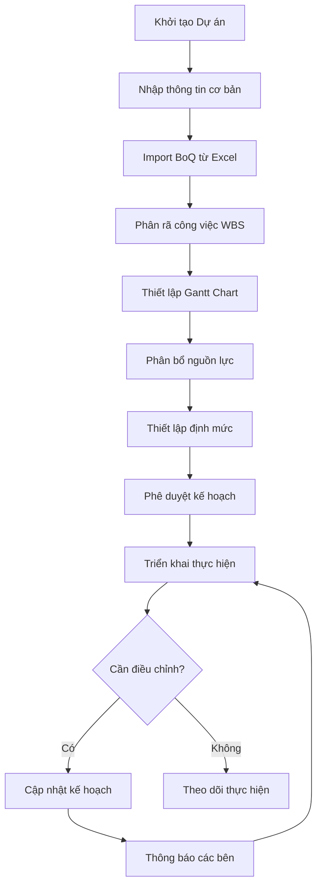
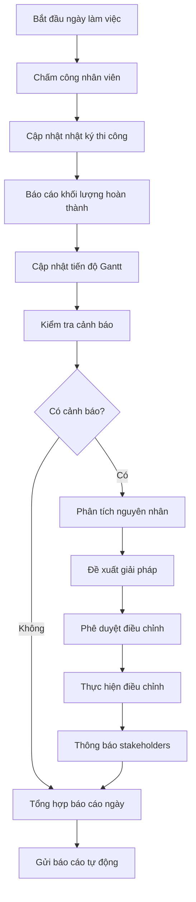
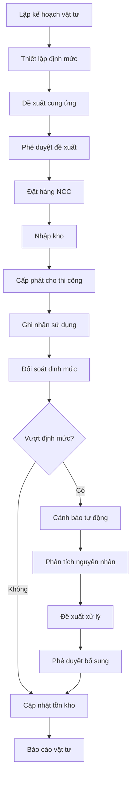
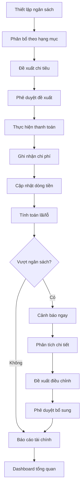
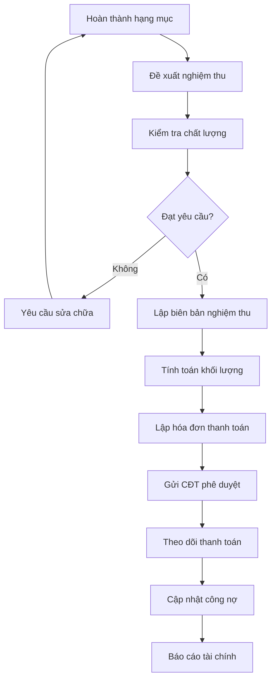

# Thiết kế Hệ thống Phần mềm Quản lý Dự án Thi công Xây dựng FastCons

## 1. Tổng quan Hệ thống

FastCons là phần mềm quản lý dự án thi công xây dựng chuyên sâu, hỗ trợ toàn diện các hoạt động từ lập kế hoạch đến nghiệm thu công trình. Hệ thống được thiết kế theo kiến trúc microservices với khả năng mở rộng cao và tích hợp đa nền tảng.

### 1.1 Mục tiêu Hệ thống
- Số hóa hoàn toàn quy trình quản lý dự án xây dựng
- Tối ưu hóa hiệu quả quản lý nguồn lực và chi phí
- Cung cấp báo cáo real-time và dashboard tổng quan
- Hỗ trợ làm việc trên đa thiết bị (Mobile, Web, Tablet)
- Đảm bảo tính minh bạch và truy xuất nguồn gốc

### 1.2 Đối tượng Sử dụng
- **Chỉ huy trưởng công trường**: Quản lý tiến độ, nhân lực, báo cáo
- **Kỹ sư quản lý dự án**: Lập kế hoạch, kiểm soát chất lượng
- **Cán bộ vật tư**: Quản lý kho, đề xuất cung ứng
- **Cán bộ kế toán**: Quản lý chi phí, thanh toán
- **QA/QC/QS**: Kiểm tra chất lượng, nghiệm thu
- **Ban giám đốc**: Theo dõi tổng quan, ra quyết định

## 2. Kiến trúc Hệ thống

### 2.1 Kiến trúc Tổng thể

```
┌─────────────────────────────────────────────────────────────┐
│                    PRESENTATION LAYER                       │
├─────────────────┬─────────────────┬─────────────────────────┤
│   Mobile App    │    Web Portal   │    Desktop Client       │
│   (iOS/Android) │   (React/Vue)   │    (Electron)           │
└─────────────────┴─────────────────┴─────────────────────────┘
                            │
┌─────────────────────────────────────────────────────────────┐
│                      API GATEWAY                           │
│              (Authentication, Rate Limiting)               │
└─────────────────────────────────────────────────────────────┘
                            │
┌─────────────────────────────────────────────────────────────┐
│                   MICROSERVICES LAYER                      │
├─────────────┬─────────────┬─────────────┬─────────────────┤
│   Project   │  Resource   │  Financial  │   Document      │
│ Management  │ Management  │ Management  │  Management     │
├─────────────┼─────────────┼─────────────┼─────────────────┤
│   Progress  │  Materials  │   Contract  │   Reporting     │
│  Tracking   │ Management  │ Management  │   Analytics     │
├─────────────┼─────────────┼─────────────┼─────────────────┤
│  Quantity   │  Timesheet  │    Cost     │   Notification  │
│ Management  │ Management  │ Management  │    Service      │
└─────────────┴─────────────┴─────────────┴─────────────────┘
                            │
┌─────────────────────────────────────────────────────────────┐
│                     DATA LAYER                             │
├─────────────┬─────────────┬─────────────┬─────────────────┤
│ PostgreSQL  │    Redis    │   MongoDB   │   File Storage  │
│(Relational) │  (Cache)    │ (Documents) │    (S3/MinIO)   │
└─────────────┴─────────────┴─────────────┴─────────────────┘
```

### 2.2 Các Module Chính

#### 2.2.1 Module Quản lý Kế hoạch (Plan Management)
- **Chức năng chính**:
  - Thiết lập kế hoạch thi công online
  - Phân rã công việc theo mô hình WBS
  - Quản lý sơ đồ Gantt
  - Phân bổ nguồn lực
  - Quản lý định mức thi công
  - Quản lý hồ sơ thi công

#### 2.2.2 Module Quản lý Tiến độ (Progress Management)
- **Chức năng chính**:
  - Kiểm soát tiến độ real-time
  - Báo cáo nguồn lực sử dụng
  - Cảnh báo chậm tiến độ
  - Quản lý tiến độ thầu phụ
  - Biểu đồ burn-up
  - Tính toán KPI hoàn thiện

#### 2.2.3 Module Quản lý Khối lượng (Quantity Management)
- **Chức năng chính**:
  - Quản lý bảng khối lượng nhận thầu
  - Kiểm soát sản lượng giao thầu
  - Quản lý nghiệm thu công trình
  - Tự động tổng hợp báo cáo
  - Đối chiếu với dự toán

#### 2.2.4 Module Quản lý Vật tư (Materials Management)
- **Chức năng chính**:
  - Quản lý kho vật tư
  - Kiểm soát cung ứng và sử dụng
  - Đối soát vật tư theo định mức
  - Đề xuất và phê duyệt online
  - Cảnh báo vượt định mức

#### 2.2.5 Module Quản lý Chi phí (Cost Management)
- **Chức năng chính**:
  - Quản lý hạng mục chi phí
  - Theo dõi dòng tiền real-time
  - Quản lý thanh toán và công nợ
  - Phê duyệt đề xuất online
  - Dự báo lãi/lỗ

#### 2.2.6 Module Quản lý Hợp đồng (Contract Management)
- **Chức năng chính**:
  - Quản lý danh mục đối tác
  - Quản lý BOQ theo hợp đồng
  - Phân quyền và phê duyệt
  - Theo dõi hiệu lực hợp đồng

#### 2.2.7 Module Nhật ký Thi công (Construction Log)
- **Chức năng chính**:
  - Báo cáo thi công trên app
  - Quản lý khối lượng hàng ngày
  - Lưu trữ và tìm kiếm
  - Đính kèm hình ảnh/tài liệu

#### 2.2.8 Module Chấm công (Timesheet Management)
- **Chức năng chính**:
  - Chấm công với FaceID
  - Quản lý đơn từ và ca làm
  - Tự động hóa bảng công/lương
  - Kiểm soát GPS

#### 2.2.9 Module Quản lý Tài liệu (Document Management)
- **Chức năng chính**:
  - Lưu trữ tập trung
  - Phân quyền truy cập
  - Tích hợp BIM Viewer
  - Ký số trực tuyến

## 3. Quy trình Nghiệp vụ Chi tiết

### 3.1 Quy trình Lập Kế hoạch Dự án



### 3.2 Quy trình Quản lý Tiến độ Hàng ngày



### 3.3 Quy trình Quản lý Vật tư



### 3.4 Quy trình Quản lý Chi phí



### 3.5 Quy trình Nghiệm thu và Thanh toán



## 4. Thiết kế Database

### 4.1 Các Entity Chính

```sql
-- Projects (Dự án)
CREATE TABLE projects (
    id UUID PRIMARY KEY,
    name VARCHAR(255) NOT NULL,
    code VARCHAR(50) UNIQUE NOT NULL,
    description TEXT,
    start_date DATE,
    end_date DATE,
    budget DECIMAL(15,2),
    status VARCHAR(20),
    owner_id UUID,
    created_at TIMESTAMP DEFAULT NOW(),
    updated_at TIMESTAMP DEFAULT NOW()
);

-- Work Breakdown Structure
CREATE TABLE wbs_items (
    id UUID PRIMARY KEY,
    project_id UUID REFERENCES projects(id),
    parent_id UUID REFERENCES wbs_items(id),
    code VARCHAR(50),
    name VARCHAR(255),
    description TEXT,
    level INTEGER,
    sort_order INTEGER,
    start_date DATE,
    end_date DATE,
    duration INTEGER,
    progress DECIMAL(5,2) DEFAULT 0,
    created_at TIMESTAMP DEFAULT NOW()
);

-- Bill of Quantities
CREATE TABLE boq_items (
    id UUID PRIMARY KEY,
    project_id UUID REFERENCES projects(id),
    wbs_item_id UUID REFERENCES wbs_items(id),
    item_code VARCHAR(50),
    description TEXT,
    unit VARCHAR(20),
    quantity DECIMAL(12,3),
    unit_price DECIMAL(12,2),
    total_amount DECIMAL(15,2),
    created_at TIMESTAMP DEFAULT NOW()
);

-- Resources
CREATE TABLE resources (
    id UUID PRIMARY KEY,
    type VARCHAR(20), -- 'LABOR', 'MATERIAL', 'EQUIPMENT'
    code VARCHAR(50),
    name VARCHAR(255),
    unit VARCHAR(20),
    unit_cost DECIMAL(12,2),
    supplier_id UUID,
    created_at TIMESTAMP DEFAULT NOW()
);

-- Daily Construction Logs
CREATE TABLE construction_logs (
    id UUID PRIMARY KEY,
    project_id UUID REFERENCES projects(id),
    log_date DATE,
    weather VARCHAR(100),
    temperature VARCHAR(20),
    work_description TEXT,
    issues TEXT,
    photos JSONB,
    created_by UUID,
    created_at TIMESTAMP DEFAULT NOW()
);

-- Material Inventory
CREATE TABLE material_inventory (
    id UUID PRIMARY KEY,
    project_id UUID REFERENCES projects(id),
    material_id UUID REFERENCES resources(id),
    quantity_in DECIMAL(12,3) DEFAULT 0,
    quantity_out DECIMAL(12,3) DEFAULT 0,
    quantity_balance DECIMAL(12,3) DEFAULT 0,
    last_updated TIMESTAMP DEFAULT NOW()
);

-- Contracts
CREATE TABLE contracts (
    id UUID PRIMARY KEY,
    project_id UUID REFERENCES projects(id),
    contract_number VARCHAR(50),
    contract_type VARCHAR(20), -- 'MAIN', 'SUBCONTRACTOR', 'SUPPLIER'
    party_name VARCHAR(255),
    contract_value DECIMAL(15,2),
    start_date DATE,
    end_date DATE,
    status VARCHAR(20),
    created_at TIMESTAMP DEFAULT NOW()
);

-- Financial Transactions
CREATE TABLE financial_transactions (
    id UUID PRIMARY KEY,
    project_id UUID REFERENCES projects(id),
    transaction_type VARCHAR(20), -- 'INCOME', 'EXPENSE'
    category VARCHAR(50),
    amount DECIMAL(15,2),
    description TEXT,
    transaction_date DATE,
    approved_by UUID,
    created_at TIMESTAMP DEFAULT NOW()
);
```

### 4.2 Indexes và Constraints

```sql
-- Indexes for performance
CREATE INDEX idx_projects_status ON projects(status);
CREATE INDEX idx_wbs_items_project ON wbs_items(project_id);
CREATE INDEX idx_construction_logs_date ON construction_logs(project_id, log_date);
CREATE INDEX idx_financial_transactions_project_date ON financial_transactions(project_id, transaction_date);

-- Constraints
ALTER TABLE projects ADD CONSTRAINT chk_project_dates CHECK (end_date >= start_date);
ALTER TABLE wbs_items ADD CONSTRAINT chk_wbs_dates CHECK (end_date >= start_date);
ALTER TABLE contracts ADD CONSTRAINT chk_contract_dates CHECK (end_date >= start_date);
```

## 5. API Design

### 5.1 RESTful API Endpoints

```typescript
// Project Management APIs
GET    /api/v1/projects                    // List all projects
POST   /api/v1/projects                    // Create new project
GET    /api/v1/projects/{id}               // Get project details
PUT    /api/v1/projects/{id}               // Update project
DELETE /api/v1/projects/{id}               // Delete project

// WBS Management
GET    /api/v1/projects/{id}/wbs           // Get WBS structure
POST   /api/v1/projects/{id}/wbs           // Create WBS item
PUT    /api/v1/wbs/{id}                    // Update WBS item
DELETE /api/v1/wbs/{id}                    // Delete WBS item

// Progress Tracking
GET    /api/v1/projects/{id}/progress      // Get project progress
POST   /api/v1/projects/{id}/progress      // Update progress
GET    /api/v1/projects/{id}/gantt         // Get Gantt chart data

// Construction Logs
GET    /api/v1/projects/{id}/logs          // Get construction logs
POST   /api/v1/projects/{id}/logs          // Create daily log
PUT    /api/v1/logs/{id}                   // Update log
DELETE /api/v1/logs/{id}                  // Delete log

// Material Management
GET    /api/v1/projects/{id}/materials     // Get material inventory
POST   /api/v1/projects/{id}/materials/in  // Material receipt
POST   /api/v1/projects/{id}/materials/out // Material issue

// Financial Management
GET    /api/v1/projects/{id}/finances      // Get financial summary
POST   /api/v1/projects/{id}/transactions  // Create transaction
GET    /api/v1/projects/{id}/budget        // Get budget vs actual

// Reporting
GET    /api/v1/projects/{id}/reports/progress    // Progress report
GET    /api/v1/projects/{id}/reports/financial   // Financial report
GET    /api/v1/projects/{id}/reports/materials   // Material report
```

### 5.2 WebSocket Events (Real-time)

```typescript
// Real-time events
interface WebSocketEvents {
  'progress:updated': ProgressUpdateEvent;
  'alert:budget_exceeded': BudgetAlertEvent;
  'alert:schedule_delay': ScheduleAlertEvent;
  'material:low_stock': MaterialAlertEvent;
  'log:created': LogCreatedEvent;
  'approval:required': ApprovalRequiredEvent;
}
```

## 6. Tích hợp và Interfaces

### 6.1 Tích hợp với Hệ thống Bên ngoài

```typescript
// ERP Integration
interface ERPIntegration {
  syncFinancialData(): Promise<void>;
  exportToAccounting(): Promise<void>;
  importBudgetData(): Promise<void>;
}

// BIM Integration
interface BIMIntegration {
  importBIMModel(file: File): Promise<void>;
  exportQuantities(): Promise<void>;
  viewBCFFiles(): Promise<void>;
}

// Mobile App Sync
interface MobileSync {
  syncOfflineData(): Promise<void>;
  uploadPhotos(): Promise<void>;
  downloadUpdates(): Promise<void>;
}
```

### 6.2 Notification System

```typescript
interface NotificationService {
  sendEmail(to: string[], subject: string, body: string): Promise<void>;
  sendSMS(phone: string, message: string): Promise<void>;
  sendPushNotification(userId: string, message: string): Promise<void>;
  createInAppNotification(userId: string, notification: Notification): Promise<void>;
}
```

## 7. Security và Performance

### 7.1 Security Measures
- **Authentication**: JWT tokens với refresh mechanism
- **Authorization**: Role-based access control (RBAC)
- **Data Encryption**: AES-256 cho dữ liệu nhạy cảm
- **API Security**: Rate limiting, input validation
- **File Security**: Virus scanning, file type validation
- **Audit Trail**: Log tất cả các thao tác quan trọng

### 7.2 Performance Optimization
- **Database**: Connection pooling, query optimization
- **Caching**: Redis cho session và frequently accessed data
- **CDN**: Static assets delivery
- **Load Balancing**: Multiple application instances
- **Background Jobs**: Queue system cho heavy operations

## 8. Deployment và Monitoring

### 8.1 Deployment Architecture

```yaml
# Docker Compose Example
version: '3.8'
services:
  api-gateway:
    image: fastcons/api-gateway:latest
    ports:
      - "80:80"
      - "443:443"
    
  project-service:
    image: fastcons/project-service:latest
    environment:
      - DATABASE_URL=postgresql://...
      - REDIS_URL=redis://...
    
  material-service:
    image: fastcons/material-service:latest
    
  financial-service:
    image: fastcons/financial-service:latest
    
  postgres:
    image: postgres:14
    environment:
      - POSTGRES_DB=fastcons
      - POSTGRES_USER=fastcons
      - POSTGRES_PASSWORD=secure_password
    
  redis:
    image: redis:7-alpine
    
  minio:
    image: minio/minio:latest
    environment:
      - MINIO_ROOT_USER=admin
      - MINIO_ROOT_PASSWORD=secure_password
```

### 8.2 Monitoring và Logging

```typescript
// Monitoring metrics
interface SystemMetrics {
  apiResponseTime: number;
  databaseConnectionPool: number;
  activeUsers: number;
  errorRate: number;
  memoryUsage: number;
  cpuUsage: number;
}

// Logging structure
interface LogEntry {
  timestamp: string;
  level: 'INFO' | 'WARN' | 'ERROR';
  service: string;
  userId?: string;
  projectId?: string;
  action: string;
  details: any;
  requestId: string;
}
```

## 9. Mobile App Architecture

### 9.1 React Native Structure

```typescript
// App structure
src/
├── components/
│   ├── common/
│   ├── forms/
│   └── charts/
├── screens/
│   ├── auth/
│   ├── dashboard/
│   ├── projects/
│   ├── logs/
│   └── reports/
├── services/
│   ├── api/
│   ├── storage/
│   └── sync/
├── store/
│   ├── slices/
│   └── middleware/
└── utils/
    ├── helpers/
    └── constants/
```

### 9.2 Offline Capability

```typescript
interface OfflineManager {
  syncWhenOnline(): Promise<void>;
  storeOfflineAction(action: OfflineAction): Promise<void>;
  getOfflineData(key: string): Promise<any>;
  clearOfflineData(): Promise<void>;
}
```

## 10. Kết luận

Hệ thống FastCons được thiết kế với kiến trúc hiện đại, khả năng mở rộng cao và tập trung vào trải nghiệm người dùng. Với việc số hóa hoàn toàn quy trình quản lý dự án xây dựng, hệ thống sẽ giúp các doanh nghiệp xây dựng tối ưu hóa hiệu quả, giảm thiểu rủi ro và nâng cao chất lượng quản lý dự án.

### Lợi ích chính:
- **Tăng hiệu quả**: Tự động hóa các quy trình thủ công
- **Giảm rủi ro**: Cảnh báo sớm và kiểm soát chặt chẽ
- **Minh bạch**: Truy xuất nguồn gốc và báo cáo real-time
- **Tiết kiệm chi phí**: Tối ưu hóa sử dụng nguồn lực
- **Nâng cao chất lượng**: Kiểm soát chất lượng tự động

### Roadmap phát triển:
1. **Phase 1**: Core modules (Project, Progress, Materials)
2. **Phase 2**: Advanced features (BIM, AI Analytics)
3. **Phase 3**: IoT integration và Advanced Reporting
4. **Phase 4**: Machine Learning cho dự báo và tối ưu hóa