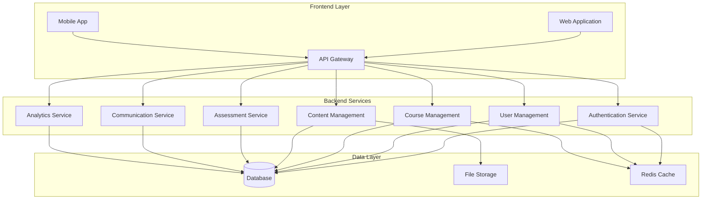
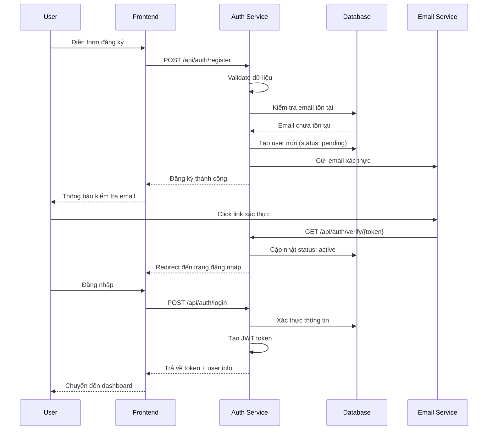
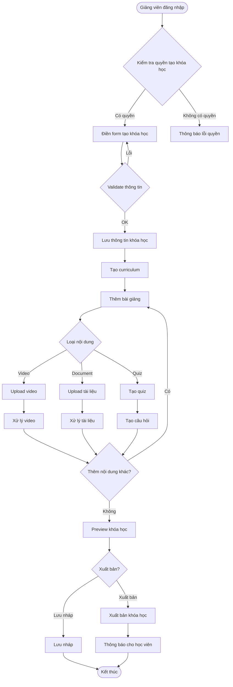
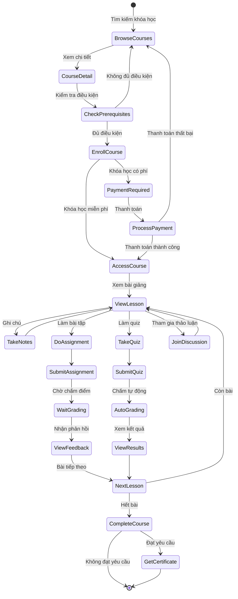
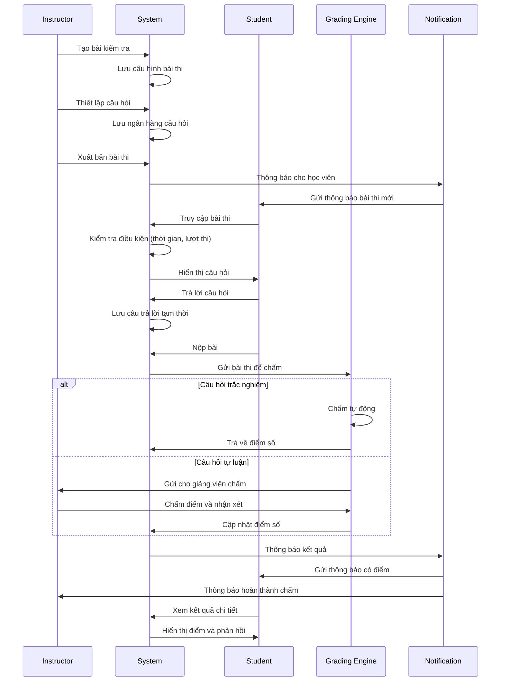
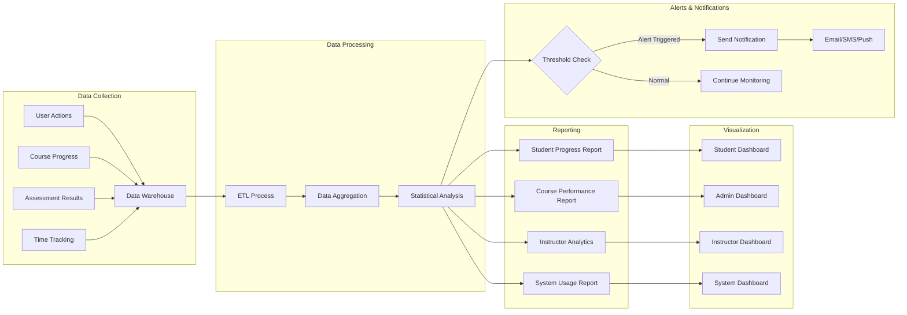
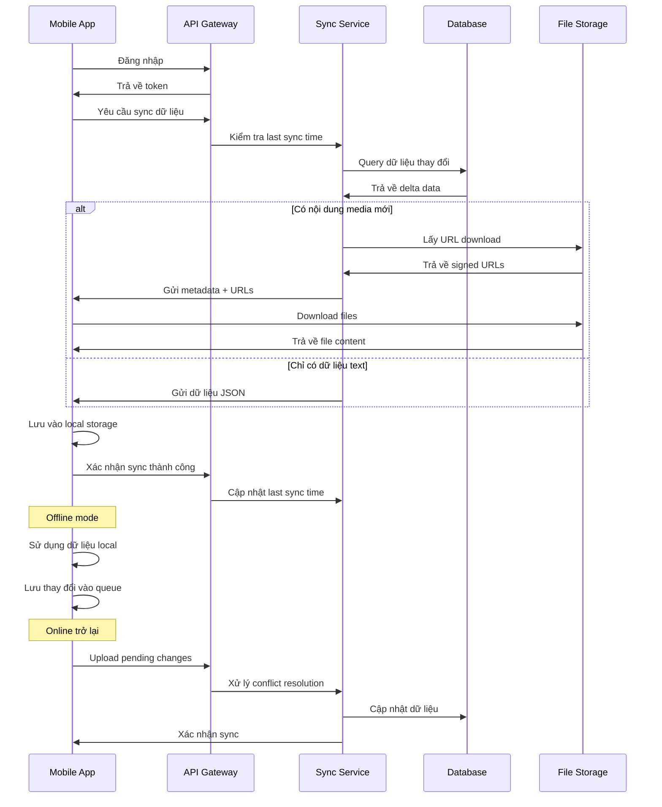
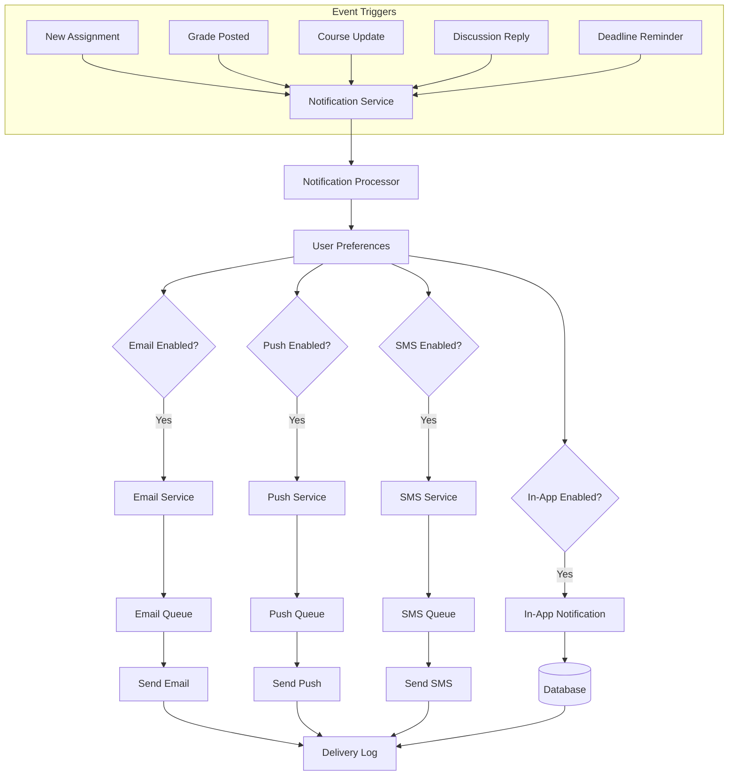
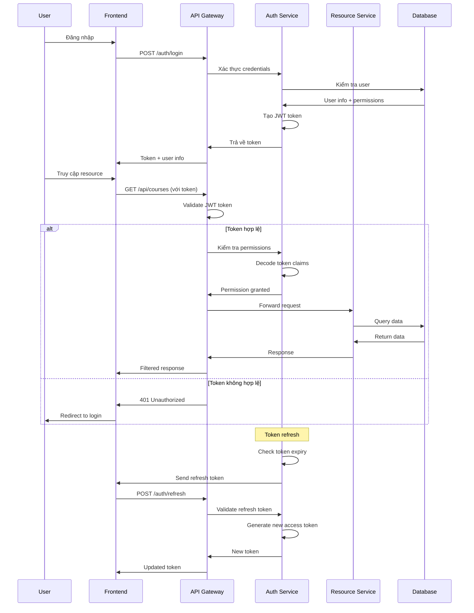

# FLOW DIAGRAMS - HỆ THỐNG LMS

## 1. SYSTEM ARCHITECTURE OVERVIEW

## 2. USER REGISTRATION & AUTHENTICATION FLOW

## 3. COURSE CREATION FLOW (INSTRUCTOR)

## 4. STUDENT LEARNING FLOW

## 5. ASSESSMENT & GRADING FLOW

## 6. COMMUNICATION & DISCUSSION FLOW

```mermaid
graph TD
    subgraph "Discussion Forum"
        A[Tạo topic thảo luận] --> B[Đăng bài viết]
        B --> C[Thành viên khác xem]
        C --> D{Phản hồi?}
        D -->|Có| E[Viết comment]
        D -->|Không| F[Đọc và like]
        E --> G[Thông báo cho tác giả]
        F --> H[Cập nhật thống kê]
        G --> I[Tác giả phản hồi lại]
        I --> C
    end
    
    subgraph "Direct Messaging"
        J[Gửi tin nhắn riêng] --> K[Kiểm tra quyền chat]
        K --> L{Có quyền?}
        L -->|Có| M[Gửi tin nhắn]
        L -->|Không| N[Thông báo lỗi]
        M --> O[Thông báo realtime]
        O --> P[Người nhận xem tin nhắn]
        P --> Q[Phản hồi]
        Q --> M
    end
    
    subgraph "Video Conference"
        R[Tạo lịch họp] --> S[Gửi lời mời]
        S --> T[Thành viên nhận lời mời]
        T --> U{Tham gia?}
        U -->|Có| V[Join meeting room]
        U -->|Không| W[Ghi nhận vắng mặt]
        V --> X[Video call]
        X --> Y[Ghi chú meeting]
        Y --> Z[Lưu recording]
    end
```

## 7. ANALYTICS & REPORTING FLOW

## 8. MOBILE APP SYNC FLOW

## 9. NOTIFICATION SYSTEM FLOW

## 10. SECURITY & AUTHENTICATION FLOW

Các flow diagram này mô tả chi tiết các quy trình nghiệp vụ chính của hệ thống LMS, giúp developers hiểu rõ luồng xử lý và có thể implement một cách chính xác và hiệu quả.