# Phân tích Nghiệp vụ Chi tiết - Sàn Thương mại Điện tử Shopee

## 1. Tổng quan Hệ thống Shopee

### 1.1 Định nghĩa
Shopee là sàn thương mại điện tử (marketplace) hàng đầu Đông Nam Á, kết nối người mua và người bán thông qua nền tảng trực tuyến. Shopee hoạt động theo mô hình C2C (Consumer-to-Consumer) và B2C (Business-to-Consumer), đóng vai trò trung gian trong quá trình mua bán.

### 1.2 Mô hình Kinh doanh
- **Marketplace Model**: Kết nối cung (sellers) với cầu (buyers)
- **Revenue Streams**: Commission, transaction fees, quảng cáo, dịch vụ logistics, payment fees
- **Value Proposition**: An toàn, tiện lợi, đa dạng sản phẩm, giá cả cạnh tranh

### 1.3 Sơ đồ Tổng quan Quy trình Nghiệp vụ

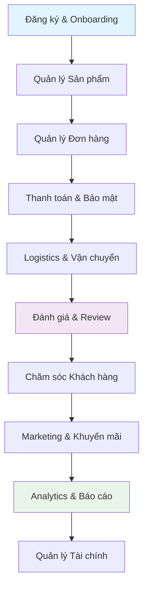

## 2. Các Nhóm Người dùng Chính

### 2.1 Người mua (Buyers)
- Cá nhân mua sắm trực tuyến
- Doanh nghiệp mua hàng B2B
- Khách hàng tiềm năng

### 2.2 Người bán (Sellers)
- **Individual Sellers**: Cá nhân bán hàng
- **SME Sellers**: Doanh nghiệp vừa và nhỏ
- **Brand Stores**: Thương hiệu chính thức
- **Mall Sellers**: Cửa hàng trong Shopee Mall

### 2.3 Shopee (Platform)
- **Operations Team**: Vận hành hàng ngày
- **Customer Service**: Chăm sóc khách hàng
- **Marketing Team**: Quảng cáo và khuyến mãi
- **Tech Team**: Phát triển và bảo trì hệ thống
- **Finance Team**: Quản lý tài chính và thanh toán

### 2.4 Đối tác Logistics
- SPX Express (Shopee Express)
- Giao Hàng Nhanh (GHN)
- Viettel Post
- J&T Express

## 3. Quy trình Nghiệp vụ Chi tiết

### 3.1 Quy trình Đăng ký & Onboarding

#### 3.1.1 Buyer Onboarding Flow

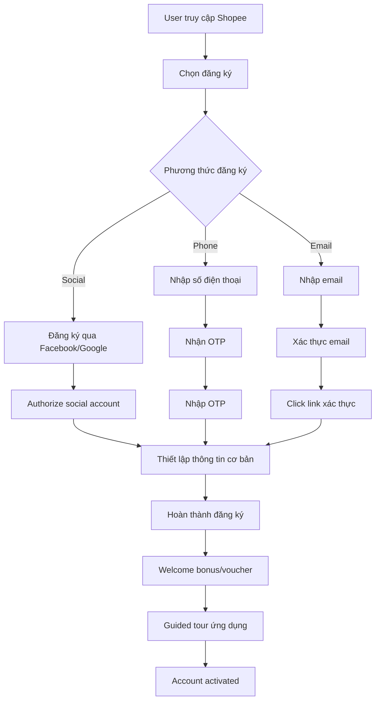

#### 3.1.2 Seller Onboarding Flow

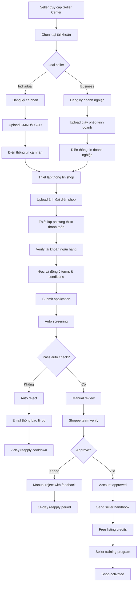

#### 3.1.3 Business Rules cho Onboarding

**Buyer Registration:**
1. Một số điện thoại chỉ đăng ký được 1 tài khoản
2. Email phải unique trong hệ thống
3. Social login tự động verify account
4. Welcome bonus: 15k voucher cho user mới

**Seller Registration:**
1. **Auto Screening Criteria**:
   - CMND/CCCD phải rõ nét, không bị che
   - Business license phải còn hiệu lực
   - Bank account phải match với tên đăng ký
   - Số điện thoại chưa được đăng ký

2. **Manual Review Process**:
   - Review time: 1-3 business days
   - Kiểm tra background của seller
   - Verify authenticity của documents
   - Assessment risk level

3. **Seller Tiers**:
   - **New Seller**: 0-3 tháng, limited features
   - **Regular Seller**: 3+ tháng, full features
   - **Preferred Seller**: High rating + volume
   - **Mall Seller**: Brand verification required

### 3.2 Quy trình Quản lý Sản phẩm

#### 3.2.1 Product Listing Flow

```mermaid
flowchart TD
    A[Seller vào Seller Center] --> B[Chọn "Thêm sản phẩm mới"]
    B --> C[Chọn danh mục sản phẩm]
    C --> D[Điền thông tin cơ bản]
    D --> E[Upload hình ảnh sản phẩm]
    E --> F[Thiết lập variations]
    F --> G[Cài đặt giá và inventory]
    G --> H[Thiết lập shipping]
    H --> I[SEO optimization]
    I --> J[Preview listing]
    
    J --> K{Kiểm tra thông tin}
    K -->|Sai| L[Chỉnh sửa thông tin]
    L --> J
    K -->|Đúng| M[Submit for review]
    
    M --> N[Auto content screening]
    N --> O{Pass auto check?}
    O -->|Không| P[Auto reject]
    P --> Q[Thông báo lỗi cụ thể]
    Q --> R[Seller fix issues]
    R --> M
    
    O -->|Có| S[Manual review (if needed)]
    S --> T{Manual approve?}
    T -->|Không| U[Manual reject]
    U --> V[Detailed feedback]
    V --> R
    
    T -->|Có| W[Product published]
    W --> X[Index to search engine]
    X --> Y[Notify seller]
    Y --> Z[Product live on platform]
```

#### 3.2.2 Inventory Management

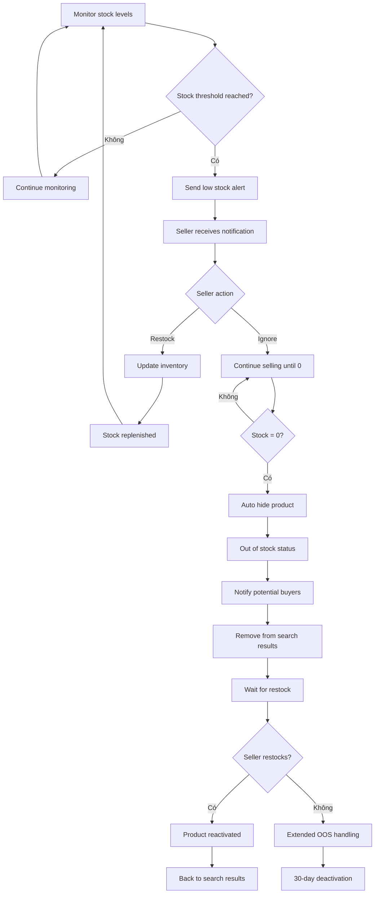

#### 3.2.3 Product Content Guidelines

**Image Requirements:**
1. Minimum 800x800 pixels
2. Maximum 2MB per image
3. Không watermark không được phép
4. Tối đa 9 ảnh per product
5. Ảnh đầu phải là ảnh chính của sản phẩm

**Content Rules:**
1. Tiêu đề: 3-120 ký tự
2. Mô tả: Tối thiểu 25 ký tự
3. Không được spam keywords
4. Cấm hàng fake, hàng nhái
5. Phải tuân thủ quy định pháp luật Việt Nam

### 3.3 Quy trình Quản lý Đơn hàng

#### 3.3.1 Order Processing Flow

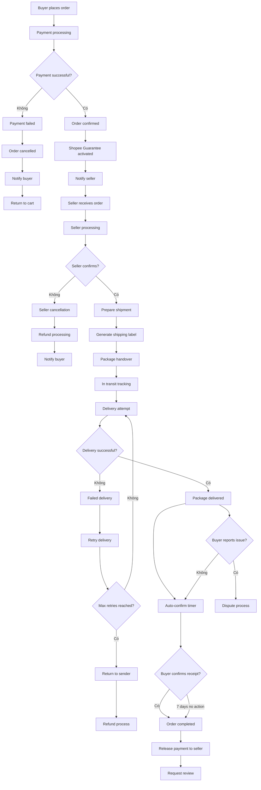

#### 3.3.2 Order States Management

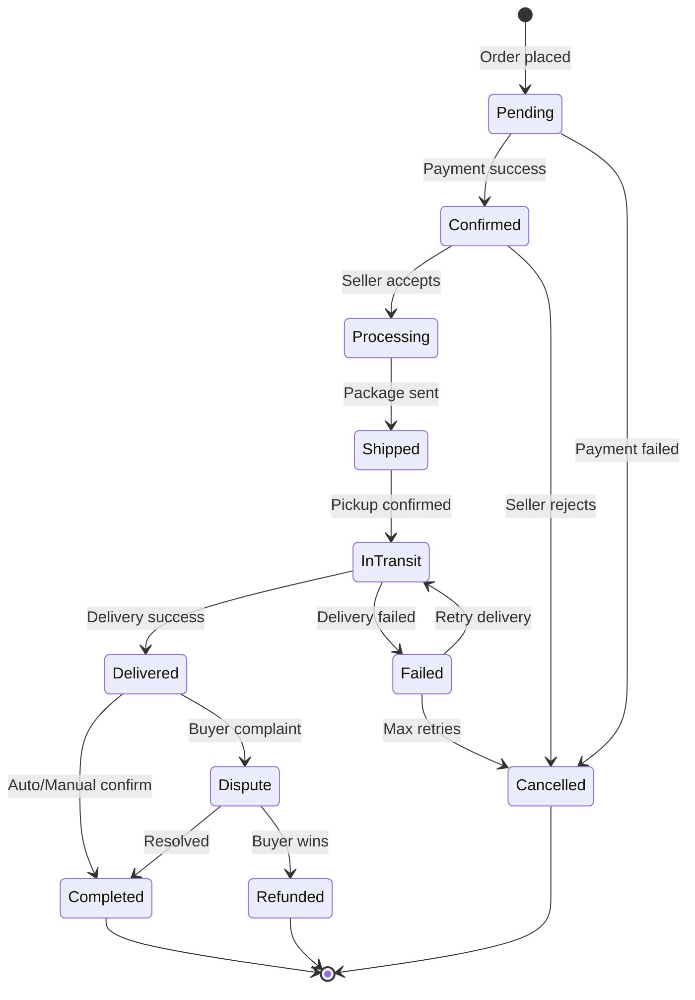

### 3.4 Quy trình Thanh toán & Bảo mật

#### 3.4.1 Payment Processing Flow

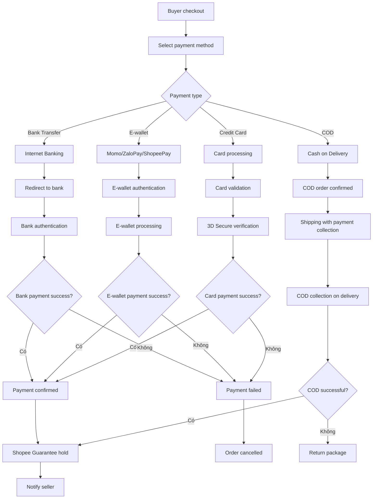

#### 3.4.2 Shopee Guarantee System

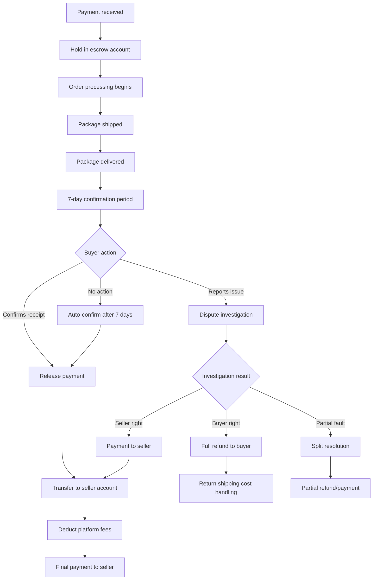

### 3.5 Quy trình Logistics & Vận chuyển

#### 3.5.1 Shipping Management Flow

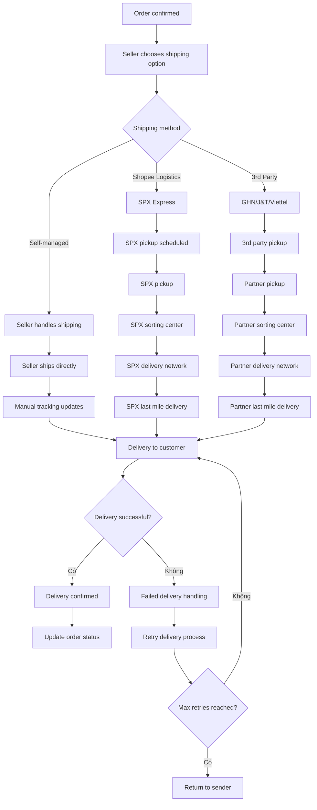

#### 3.5.2 Shipping Rate Calculation

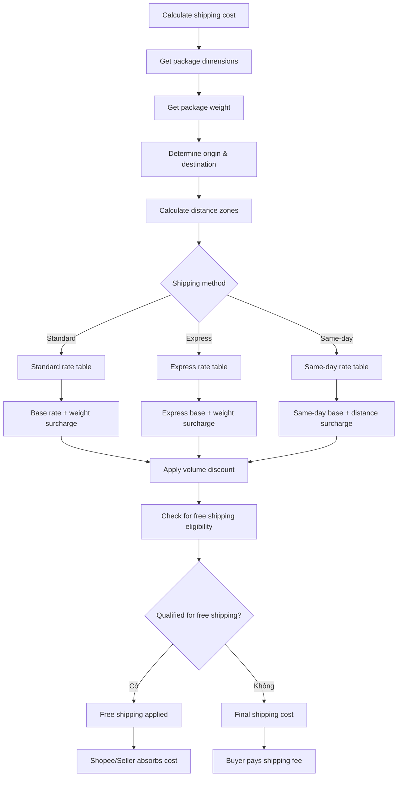

### 3.6 Quy trình Marketing & Khuyến mãi

#### 3.6.1 Campaign Management Flow

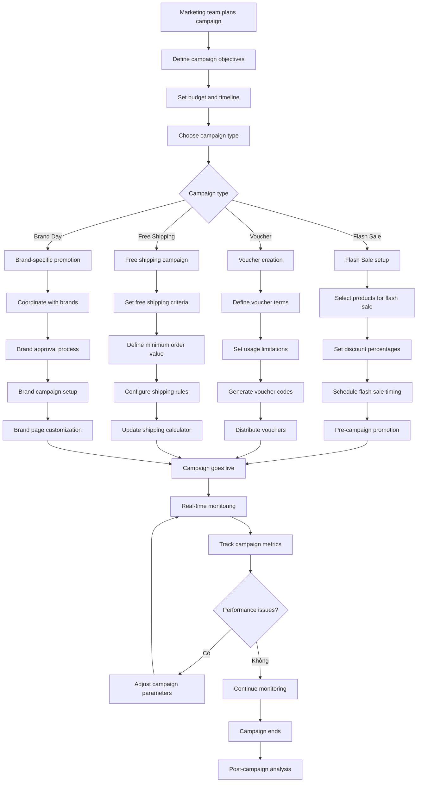

#### 3.6.2 Dynamic Pricing System

```mermaid
flowchart TD
    A[Monitor market conditions] --> B[Analyze competitor prices]
    B --> C[Check inventory levels]
    C --> D[Review demand patterns]
    D --> E[Calculate optimal price]
    E --> F{Price change needed?}
    F -->|Không| G[Maintain current price]
    F -->|Có| H[Calculate new price]
    
    G --> A
    H --> I[Check business rules]
    I --> J{Within acceptable range?}
    J -->|Không| K[Apply constraints]
    J -->|Có| L[Update product price]
    
    K --> M[Set minimum viable price]
    L --> N[Notify seller (if applicable)]
    M --> L
    N --> O[Update search rankings]
    O --> P[Monitor price impact]
    P --> Q[Collect performance data]
    Q --> A
```

### 3.7 Quy trình Chăm sóc Khách hàng

#### 3.7.1 Customer Support Flow

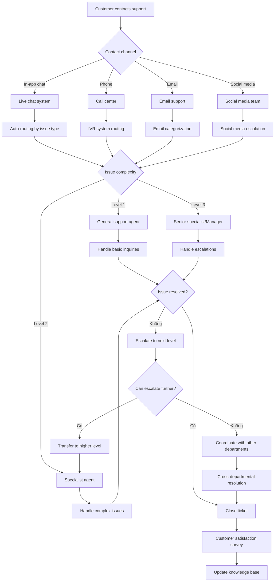

#### 3.7.2 Dispute Resolution Process

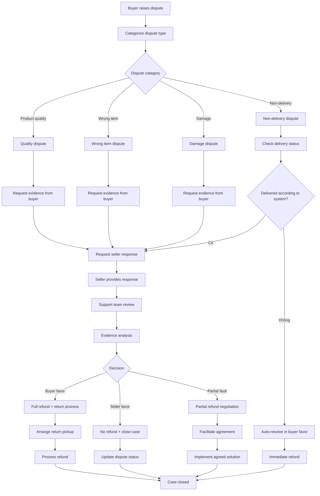

## 4. Tích hợp Hệ thống và API

### 4.1 Core System Architecture

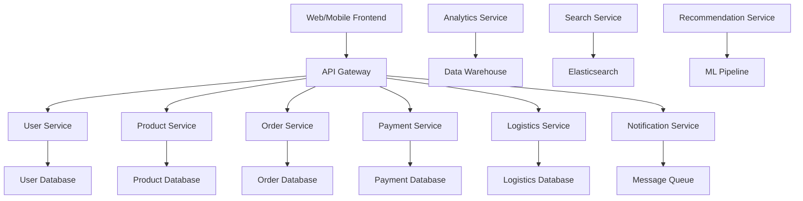

### 4.2 Key Performance Metrics

1. **Conversion Metrics**:
   - Conversion rate: 3-5%
   - Cart abandonment rate: <70%
   - Order completion rate: >95%

2. **Performance Metrics**:
   - Page load time: <3 seconds
   - API response time: <500ms
   - System uptime: 99.9%

3. **Business Metrics**:
   - GMV (Gross Merchandise Value)
   - Take rate: 5-8%
   - Customer acquisition cost
   - Customer lifetime value
   - Order frequency

## 5. Compliance và Security

### 5.1 Data Protection
- GDPR compliance cho EU users
- Vietnam Personal Data Protection Law
- PCI DSS cho card payments
- ISO 27001 security standards

### 5.2 Financial Compliance
- Vietnam State Bank regulations
- Anti-money laundering (AML)
- Know Your Customer (KYC)
- Tax compliance và reporting

### 5.3 Platform Governance
- Seller verification và monitoring
- Product compliance checks
- Intellectual property protection
- Consumer protection laws

## 6. Technology Stack

### 6.1 Frontend
- React Native (Mobile apps)
- React.js (Web frontend)
- Redux (State management)
- WebRTC (Live streaming)

### 6.2 Backend
- Node.js/Java (Microservices)
- Apache Kafka (Message streaming)
- Redis (Caching)
- PostgreSQL/MongoDB (Databases)

### 6.3 Infrastructure
- AWS/Google Cloud (Cloud platform)
- Kubernetes (Container orchestration)
- CDN (Content delivery)
- Load balancers

### 6.4 Analytics & ML
- Apache Spark (Big data processing)
- TensorFlow (Machine learning)
- Elasticsearch (Search & analytics)
- Real-time recommendation engine

## 7. Future Roadmap

### 7.1 Technology Enhancements
- AI-powered customer service
- Blockchain cho supply chain
- IoT integration cho smart logistics
- AR/VR shopping experiences

### 7.2 Business Expansion
- Cross-border e-commerce
- B2B marketplace
- Financial services (ShopeePay expansion)
- Digital content marketplace

### 7.3 Sustainability Initiatives
- Green logistics solutions
- Carbon footprint tracking
- Sustainable packaging programs
- Circular economy marketplace