# TỔNG QUAN FLOW NGHIỆP VỤ ZOHO CRM
## Tài liệu Phân tích Nghiệp vụ Chi tiết

**Phiên bản:** 1.0  
**Ngày tạo:** 04/06/2025  
**Người phụ trách:** Business Analyst Senior  
**Phạm vi:** Toàn bộ hệ thống Zoho CRM  

---

# 1. SƠ ĐỒ TỔNG QUAN HỆ THỐNG

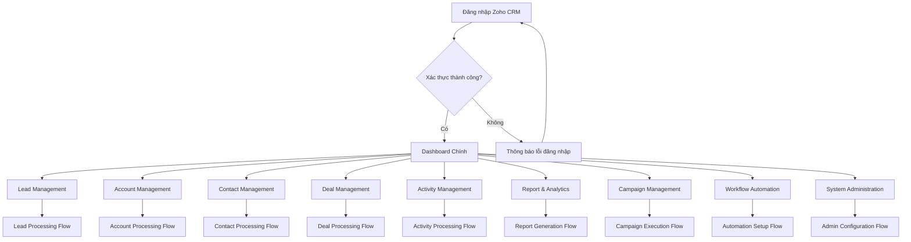
```mermaid
graph TD
    A[Đăng nhập Zoho CRM] --> B{Xác thực thành công?}
    B -->|Có| C[Dashboard Chính]
    B -->|Không| D[Thông báo lỗi đăng nhập]
    D --> A
    
    C --> E[Lead Management]
    C --> F[Account Management] 
    C --> G[Contact Management]
    C --> H[Deal Management]
    C --> I[Activity Management]
    C --> J[Report & Analytics]
    C --> K[Campaign Management]
    C --> L[Workflow Automation]
    C --> M[System Administration]
    
    E --> N[Lead Processing Flow]
    F --> O[Account Processing Flow]
    G --> P[Contact Processing Flow]
    H --> Q[Deal Processing Flow]
    I --> R[Activity Processing Flow]
    J --> S[Report Generation Flow]
    K --> T[Campaign Execution Flow]
    L --> U[Automation Setup Flow]
    M --> V[Admin Configuration Flow]
```

---

# 2. FLOW NGHIỆP VỤ CHI TIẾT THEO MODULE

## 2.1 LEAD MANAGEMENT FLOW

### 2.1.1 Sơ đồ Flow Lead Management

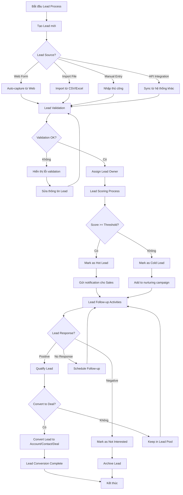
```mermaid
flowchart TD
    A[Bắt đầu Lead Process] --> B[Tạo Lead mới]
    B --> C{Lead Source?}
    C -->|Web Form| D[Auto-capture từ Web]
    C -->|Import File| E[Import từ CSV/Excel]
    C -->|Manual Entry| F[Nhập thủ công]
    C -->|API Integration| G[Sync từ hệ thống khác]
    
    D --> H[Lead Validation]
    E --> H
    F --> H
    G --> H
    
    H --> I{Validation OK?}
    I -->|Không| J[Hiển thị lỗi validation]
    J --> K[Sửa thông tin Lead]
    K --> H
    
    I -->|Có| L[Assign Lead Owner]
    L --> M[Lead Scoring Process]
    M --> N{Score >= Threshold?}
    N -->|Có| O[Mark as Hot Lead]
    N -->|Không| P[Mark as Cold Lead]
    
    O --> Q[Gửi notification cho Sales]
    P --> R[Add to nurturing campaign]
    
    Q --> S[Lead Follow-up Activities]
    R --> S
    S --> T{Lead Response?}
    T -->|Positive| U[Qualify Lead]
    T -->|Negative| V[Mark as Not Interested]
    T -->|No Response| W[Schedule Follow-up]
    
    U --> X{Convert to Deal?}
    X -->|Có| Y[Convert Lead to Account/Contact/Deal]
    X -->|Không| Z[Keep in Lead Pool]
    
    Y --> AA[Lead Conversion Complete]
    V --> BB[Archive Lead]
    W --> S
    Z --> S
    
    AA --> CC[Kết thúc]
    BB --> CC
```

### 2.1.2 Các bước thực hiện chi tiết - Lead Management

**Bước 1: Tạo Lead mới**
- *Hành động người dùng:* Click "New Lead" hoặc lead được tạo tự động từ web form
- *Phản hồi hệ thống:* Hiển thị form tạo lead với các trường bắt buộc
- *Dữ liệu liên quan:* Lead Source, Contact Info, Company Info, Lead Status
- *Điều kiện rẽ nhánh:* Dựa trên Lead Source để xác định quy trình xử lý

**Bước 2: Lead Validation**
- *Hành động người dùng:* Hệ thống tự động validate hoặc user review thông tin
- *Phản hồi hệ thống:* Kiểm tra format email, phone, trùng lặp dữ liệu
- *Dữ liệu liên quan:* Email validation, Phone format, Duplicate detection
- *Điều kiện rẽ nhánh:* Nếu validation fail thì yêu cầu sửa lỗi

**Bước 3: Lead Assignment**
- *Hành động người dùng:* Auto-assign dựa trên rules hoặc manual assign
- *Phản hồi hệ thống:* Gán lead cho sales rep theo territory/round robin
- *Dữ liệu liên quan:* Assignment Rules, Territory Management, User Availability
- *Điều kiện rẽ nhánh:* Theo priority của lead và availability của sales team

**Bước 4: Lead Scoring**
- *Hành động người dùng:* Hệ thống tự động tính score dựa trên criteria
- *Phản hồi hệ thống:* Cập nhật lead score và priority
- *Dữ liệu liên quan:* Scoring Rules, Lead Activities, Demographic Data
- *Điều kiện rẽ nhánh:* Score cao/thấp quyết định follow-up strategy

**Bước 5: Lead Follow-up**
- *Hành động người dùng:* Sales rep thực hiện call/email/meeting
- *Phản hồi hệ thống:* Log activities, update lead status
- *Dữ liệu liên quan:* Activity History, Next Follow-up Date, Lead Response
- *Điều kiện rẽ nhánh:* Dựa trên response để qualify hoặc disqualify

**Bước 6: Lead Conversion**
- *Hành động người dùng:* Convert lead thành Account/Contact/Deal
- *Phản hồi hệ thống:* Tạo record mới và liên kết dữ liệu
- *Dữ liệu liên quan:* Account Info, Contact Details, Deal Value
- *Điều kiện rẽ nhánh:* Convert hoặc keep lead active

### 2.1.3 Flow Ngoại lệ - Lead Management

**Ngoại lệ 1: Duplicate Lead Detection**
- *Điều kiện:* Email hoặc phone number đã tồn tại trong hệ thống
- *Xử lý:* Hiển thị warning và option merge hoặc create anyway
- *Thông báo:* "Potential duplicate lead detected. Would you like to merge?"
- *Luồng tiếp theo:* Merge leads hoặc tạo mới với flag duplicate

**Ngoại lệ 2: Invalid Lead Source**
- *Điều kiện:* Lead source không hợp lệ hoặc bị restricted
- *Xử lý:* Set default source và log warning
- *Thông báo:* "Invalid lead source detected. Default source applied."
- *Luồng tiếp theo:* Continue với default source

**Ngoại lệ 3: Assignment Rule Failure**
- *Điều kiện:* Không có sales rep available hoặc rules conflict
- *Xử lý:* Assign to queue hoặc manager
- *Thông báo:* "Auto-assignment failed. Lead added to unassigned queue."
- *Luồng tiếp theo:* Manager manual assignment

---

## 2.2 ACCOUNT MANAGEMENT FLOW

### 2.2.1 Sơ đồ Flow Account Management

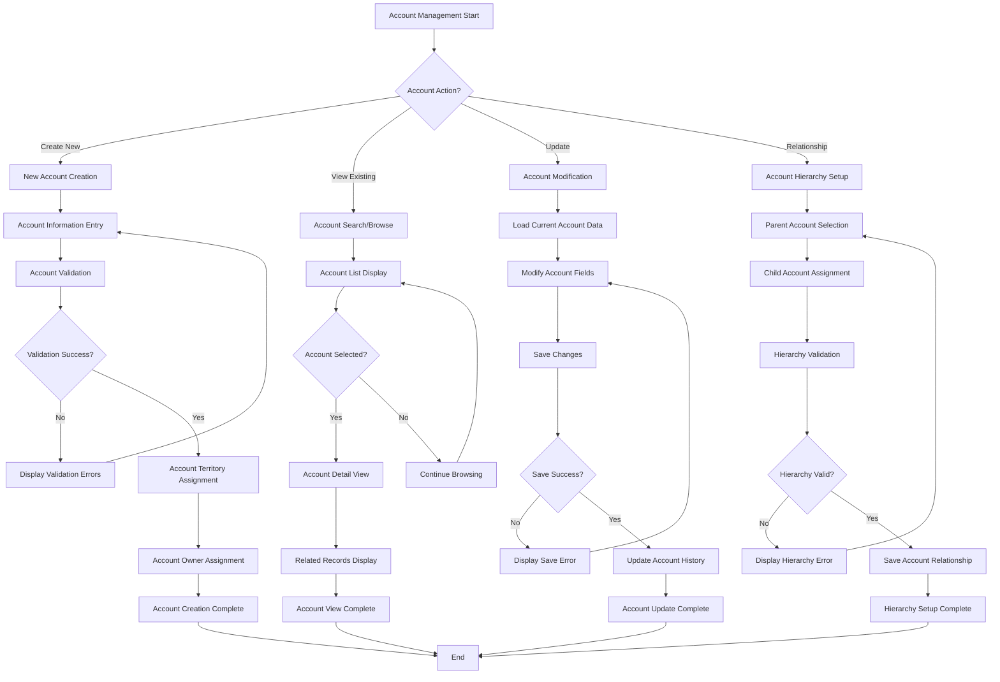
```mermaid
flowchart TD
    A[Account Management Start] --> B{Account Action?}
    B -->|Create New| C[New Account Creation]
    B -->|View Existing| D[Account Search/Browse]
    B -->|Update| E[Account Modification]
    B -->|Relationship| F[Account Hierarchy Setup]
    
    C --> G[Account Information Entry]
    G --> H[Account Validation]
    H --> I{Validation Success?}
    I -->|No| J[Display Validation Errors]
    J --> G
    I -->|Yes| K[Account Territory Assignment]
    
    D --> L[Account List Display]
    L --> M{Account Selected?}
    M -->|Yes| N[Account Detail View]
    M -->|No| O[Continue Browsing]
    O --> L
    
    E --> P[Load Current Account Data]
    P --> Q[Modify Account Fields]
    Q --> R[Save Changes]
    R --> S{Save Success?}
    S -->|No| T[Display Save Error]
    T --> Q
    S -->|Yes| U[Update Account History]
    
    F --> V[Parent Account Selection]
    V --> W[Child Account Assignment]
    W --> X[Hierarchy Validation]
    X --> Y{Hierarchy Valid?}
    Y -->|No| Z[Display Hierarchy Error]
    Z --> V
    Y -->|Yes| AA[Save Account Relationship]
    
    K --> BB[Account Owner Assignment]
    N --> CC[Related Records Display]
    U --> DD[Account Update Complete]
    AA --> EE[Hierarchy Setup Complete]
    BB --> FF[Account Creation Complete]
    CC --> GG[Account View Complete]
    
    DD --> HH[End]
    EE --> HH
    FF --> HH
    GG --> HH
```

### 2.2.2 Các bước thực hiện chi tiết - Account Management

**Bước 1: Account Creation**
- *Hành động người dùng:* Click "New Account", nhập thông tin company
- *Phản hồi hệ thống:* Validate company name, check duplicates
- *Dữ liệu liên quan:* Company Name, Industry, Revenue, Employee Count
- *Điều kiện rẽ nhánh:* Duplicate check results

**Bước 2: Account Territory Assignment**
- *Hành động người dùng:* Hệ thống auto-assign based on location/industry
- *Phản hồi hệ thống:* Apply territory rules, assign account owner
- *Dữ liệu liên quan:* Territory Rules, Geographic Data, Industry Mapping
- *Điều kiện rẽ nhánh:* Territory overlap handling

**Bước 3: Account Hierarchy Setup**
- *Hành động người dùng:* Define parent-child relationships
- *Phản hồi hệ thống:* Validate hierarchy logic, prevent circular references
- *Dữ liệu liên quan:* Parent Account, Subsidiary Accounts, Ownership %
- *Điều kiện rẽ nhánh:* Complex hierarchy validation

**Bước 4: Account Data Enrichment**
- *Hành động người dùng:* System auto-enriches from external sources
- *Phản hồi hệ thống:* Pull company data from D&B, LinkedIn, etc.
- *Dữ liệu liên quan:* Financial Data, Social Media, News Updates
- *Điều kiện rẽ nhánh:* Data availability and quality

---

## 2.3 CONTACT MANAGEMENT FLOW

### 2.3.1 Sơ đồ Flow Contact Management

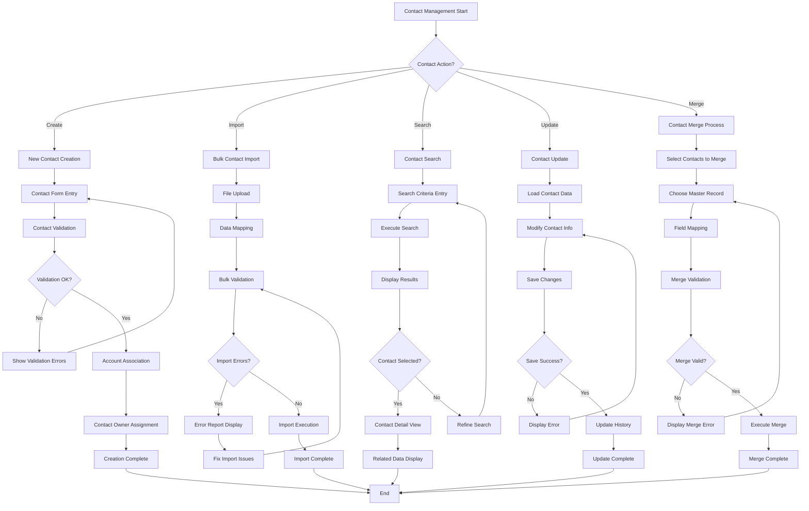
```mermaid
flowchart TD
    A[Contact Management Start] --> B{Contact Action?}
    B -->|Create| C[New Contact Creation]
    B -->|Import| D[Bulk Contact Import]
    B -->|Search| E[Contact Search]
    B -->|Update| F[Contact Update]
    B -->|Merge| G[Contact Merge Process]
    
    C --> H[Contact Form Entry]
    H --> I[Contact Validation]
    I --> J{Validation OK?}
    J -->|No| K[Show Validation Errors]
    K --> H
    J -->|Yes| L[Account Association]
    
    D --> M[File Upload]
    M --> N[Data Mapping]
    N --> O[Bulk Validation]
    O --> P{Import Errors?}
    P -->|Yes| Q[Error Report Display]
    Q --> R[Fix Import Issues]
    R --> O
    P -->|No| S[Import Execution]
    
    E --> T[Search Criteria Entry]
    T --> U[Execute Search]
    U --> V[Display Results]
    V --> W{Contact Selected?}
    W -->|Yes| X[Contact Detail View]
    W -->|No| Y[Refine Search]
    Y --> T
    
    F --> Z[Load Contact Data]
    Z --> AA[Modify Contact Info]
    AA --> BB[Save Changes]
    BB --> CC{Save Success?}
    CC -->|No| DD[Display Error]
    DD --> AA
    CC -->|Yes| EE[Update History]
    
    G --> FF[Select Contacts to Merge]
    FF --> GG[Choose Master Record]
    GG --> HH[Field Mapping]
    HH --> II[Merge Validation]
    II --> JJ{Merge Valid?}
    JJ -->|No| KK[Display Merge Error]
    KK --> GG
    JJ -->|Yes| LL[Execute Merge]
    
    L --> MM[Contact Owner Assignment]
    S --> NN[Import Complete]
    X --> OO[Related Data Display]
    EE --> PP[Update Complete]
    LL --> QQ[Merge Complete]
    MM --> RR[Creation Complete]
    
    NN --> SS[End]
    OO --> SS
    PP --> SS
    QQ --> SS
    RR --> SS
```

### 2.3.2 Các bước thực hiện chi tiết - Contact Management

**Bước 1: Contact Creation**
- *Hành động người dùng:* Input contact details (name, email, phone, title)
- *Phản hồi hệ thống:* Real-time validation, duplicate detection
- *Dữ liệu liên quan:* Personal Info, Job Title, Account Relationship
- *Điều kiện rẽ nhánh:* Duplicate contact handling

**Bước 2: Account Association**
- *Hành động người dùng:* Link contact to existing account or create new
- *Phản hồi hệ thống:* Search accounts, validate association
- *Dữ liệu liên quan:* Account Lookup, Contact Role, Reporting Structure
- *Điều kiện rẽ nhánh:* Multiple account associations

**Bước 3: Contact Enrichment**
- *Hành động người dùng:* System auto-fills from social networks
- *Phản hồi hệ thống:* Pull LinkedIn, Twitter profile data
- *Dữ liệu liên quan:* Social Profiles, Professional Background
- *Điều kiện rẽ nhánh:* Privacy settings compliance

---

## 2.4 DEAL MANAGEMENT FLOW

### 2.4.1 Sơ đồ Flow Deal Management

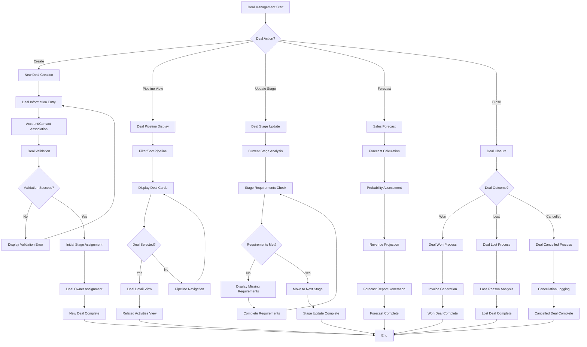
```mermaid
flowchart TD
    A[Deal Management Start] --> B{Deal Action?}
    B -->|Create| C[New Deal Creation]
    B -->|Pipeline View| D[Deal Pipeline Display]
    B -->|Update Stage| E[Deal Stage Update]
    B -->|Forecast| F[Sales Forecast]
    B -->|Close| G[Deal Closure]
    
    C --> H[Deal Information Entry]
    H --> I[Account/Contact Association]
    I --> J[Deal Validation]
    J --> K{Validation Success?}
    K -->|No| L[Display Validation Error]
    L --> H
    K -->|Yes| M[Initial Stage Assignment]
    
    D --> N[Filter/Sort Pipeline]
    N --> O[Display Deal Cards]
    O --> P{Deal Selected?}
    P -->|Yes| Q[Deal Detail View]
    P -->|No| R[Pipeline Navigation]
    R --> O
    
    E --> S[Current Stage Analysis]
    S --> T[Stage Requirements Check]
    T --> U{Requirements Met?}
    U -->|No| V[Display Missing Requirements]
    V --> W[Complete Requirements]
    W --> T
    U -->|Yes| X[Move to Next Stage]
    
    F --> Y[Forecast Calculation]
    Y --> Z[Probability Assessment]
    Z --> AA[Revenue Projection]
    AA --> BB[Forecast Report Generation]
    
    G --> CC{Deal Outcome?}
    CC -->|Won| DD[Deal Won Process]
    CC -->|Lost| EE[Deal Lost Process]
    CC -->|Cancelled| FF[Deal Cancelled Process]
    
    DD --> GG[Invoice Generation]
    EE --> HH[Loss Reason Analysis]
    FF --> II[Cancellation Logging]
    
    M --> JJ[Deal Owner Assignment]
    Q --> KK[Related Activities View]
    X --> LL[Stage Update Complete]
    BB --> MM[Forecast Complete]
    GG --> NN[Won Deal Complete]
    HH --> OO[Lost Deal Complete]
    II --> PP[Cancelled Deal Complete]
    JJ --> QQ[New Deal Complete]
    
    KK --> RR[End]
    LL --> RR
    MM --> RR
    NN --> RR
    OO --> RR
    PP --> RR
    QQ --> RR
```

### 2.4.2 Các bước thực hiện chi tiết - Deal Management

**Bước 1: Deal Creation**
- *Hành động người dùng:* Create deal from lead conversion hoặc manual entry
- *Phản hồi hệ thống:* Initialize deal with default stage và probability
- *Dữ liệu liên quan:* Deal Name, Value, Close Date, Stage, Probability
- *Điều kiện rẽ nhánh:* Deal source (converted lead vs new opportunity)

**Bước 2: Deal Stage Management**
- *Hành động người dùng:* Update deal stage based on sales progress
- *Phản hồi hệ thống:* Validate stage progression rules
- *Dữ liệu liên quan:* Stage Requirements, Activities Completed, Approvals
- *Điều kiện rẽ nhánh:* Stage-gate validation

**Bước 3: Deal Forecasting**
- *Hành động người dùng:* System calculates forecast based on pipeline
- *Phản hồi hệ thống:* Generate weighted forecast reports
- *Dữ liệu liên quan:* Deal Probability, Close Date, Amount, Historical Data
- *Điều kiện rẽ nhánh:* Forecast period và confidence levels

---

## 2.5 ACTIVITY MANAGEMENT FLOW

### 2.5.1 Sơ đồ Flow Activity Management

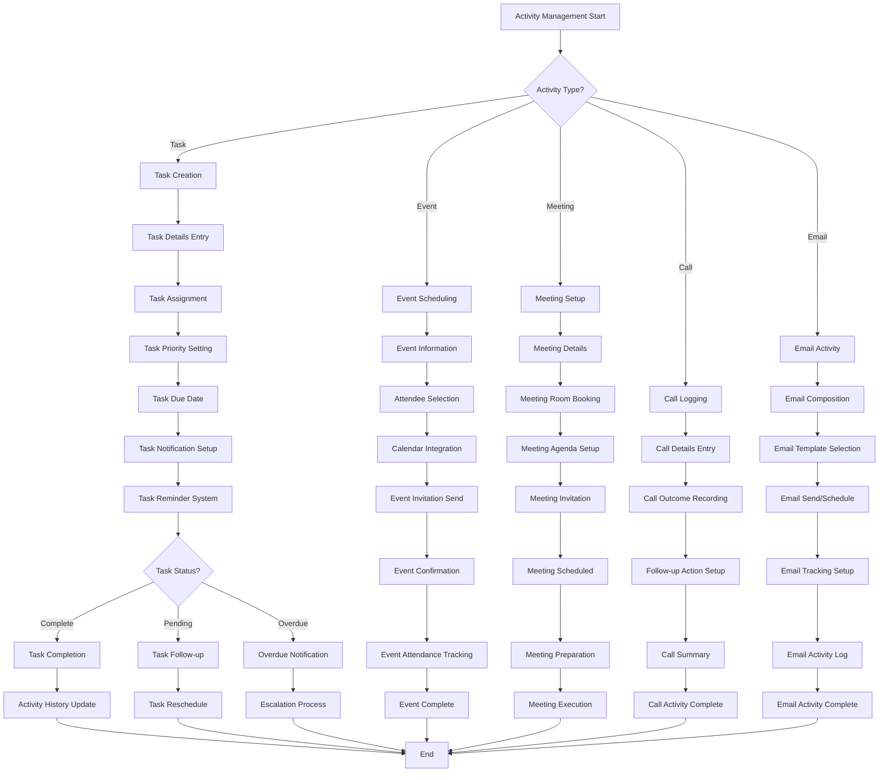
```mermaid
flowchart TD
    A[Activity Management Start] --> B{Activity Type?}
    B -->|Task| C[Task Creation]
    B -->|Event| D[Event Scheduling]
    B -->|Call| E[Call Logging]
    B -->|Email| F[Email Activity]
    B -->|Meeting| G[Meeting Setup]
    
    C --> H[Task Details Entry]
    H --> I[Task Assignment]
    I --> J[Task Priority Setting]
    J --> K[Task Due Date]
    K --> L[Task Notification Setup]
    
    D --> M[Event Information]
    M --> N[Attendee Selection]
    N --> O[Calendar Integration]
    O --> P[Event Invitation Send]
    
    E --> Q[Call Details Entry]
    Q --> R[Call Outcome Recording]
    R --> S[Follow-up Action Setup]
    
    F --> T[Email Composition]
    T --> U[Email Template Selection]
    U --> V[Email Send/Schedule]
    V --> W[Email Tracking Setup]
    
    G --> X[Meeting Details]
    X --> Y[Meeting Room Booking]
    Y --> Z[Meeting Agenda Setup]
    Z --> AA[Meeting Invitation]
    
    L --> BB[Task Reminder System]
    P --> CC[Event Confirmation]
    S --> DD[Call Summary]
    W --> EE[Email Activity Log]
    AA --> FF[Meeting Scheduled]
    
    BB --> GG{Task Status?}
    GG -->|Complete| HH[Task Completion]
    GG -->|Pending| II[Task Follow-up]
    GG -->|Overdue| JJ[Overdue Notification]
    
    CC --> KK[Event Attendance Tracking]
    DD --> LL[Call Activity Complete]
    EE --> MM[Email Activity Complete]
    FF --> NN[Meeting Preparation]
    
    HH --> OO[Activity History Update]
    II --> PP[Task Reschedule]
    JJ --> QQ[Escalation Process]
    KK --> RR[Event Complete]
    NN --> SS[Meeting Execution]
    
    OO --> TT[End]
    PP --> TT
    QQ --> TT
    RR --> TT
    SS --> TT
    LL --> TT
    MM --> TT
```

---

## 2.6 WORKFLOW AUTOMATION FLOW

### 2.6.1 Sơ đồ Flow Workflow Automation

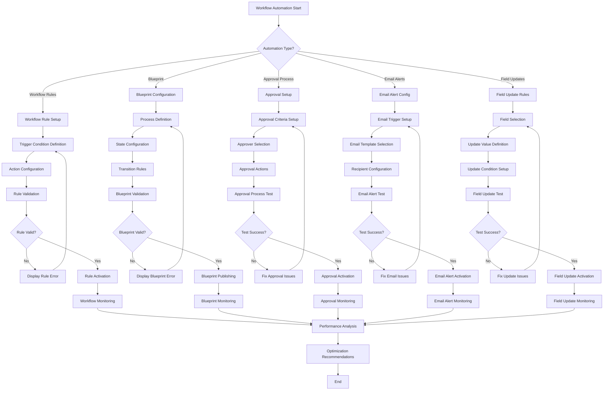
```mermaid
flowchart TD
    A[Workflow Automation Start] --> B{Automation Type?}
    B -->|Workflow Rules| C[Workflow Rule Setup]
    B -->|Blueprint| D[Blueprint Configuration]
    B -->|Approval Process| E[Approval Setup]
    B -->|Email Alerts| F[Email Alert Config]
    B -->|Field Updates| G[Field Update Rules]
    
    C --> H[Trigger Condition Definition]
    H --> I[Action Configuration]
    I --> J[Rule Validation]
    J --> K{Rule Valid?}
    K -->|No| L[Display Rule Error]
    L --> H
    K -->|Yes| M[Rule Activation]
    
    D --> N[Process Definition]
    N --> O[State Configuration]
    O --> P[Transition Rules]
    P --> Q[Blueprint Validation]
    Q --> R{Blueprint Valid?}
    R -->|No| S[Display Blueprint Error]
    S --> N
    R -->|Yes| T[Blueprint Publishing]
    
    E --> U[Approval Criteria Setup]
    U --> V[Approver Selection]
    V --> W[Approval Actions]
    W --> X[Approval Process Test]
    X --> Y{Test Success?}
    Y -->|No| Z[Fix Approval Issues]
    Z --> U
    Y -->|Yes| AA[Approval Activation]
    
    F --> BB[Email Trigger Setup]
    BB --> CC[Email Template Selection]
    CC --> DD[Recipient Configuration]
    DD --> EE[Email Alert Test]
    EE --> FF{Test Success?}
    FF -->|No| GG[Fix Email Issues]
    GG --> BB
    FF -->|Yes| HH[Email Alert Activation]
    
    G --> II[Field Selection]
    II --> JJ[Update Value Definition]
    JJ --> KK[Update Condition Setup]
    KK --> LL[Field Update Test]
    LL --> MM{Test Success?}
    MM -->|No| NN[Fix Update Issues]
    NN --> II
    MM -->|Yes| OO[Field Update Activation]
    
    M --> PP[Workflow Monitoring]
    T --> QQ[Blueprint Monitoring]
    AA --> RR[Approval Monitoring]
    HH --> SS[Email Alert Monitoring]
    OO --> TT[Field Update Monitoring]
    
    PP --> UU[Performance Analysis]
    QQ --> UU
    RR --> UU
    SS --> UU
    TT --> UU
    
    UU --> VV[Optimization Recommendations]
    VV --> WW[End]
```

---

## 2.7 REPORT & ANALYTICS FLOW

### 2.7.1 Sơ đồ Flow Report & Analytics

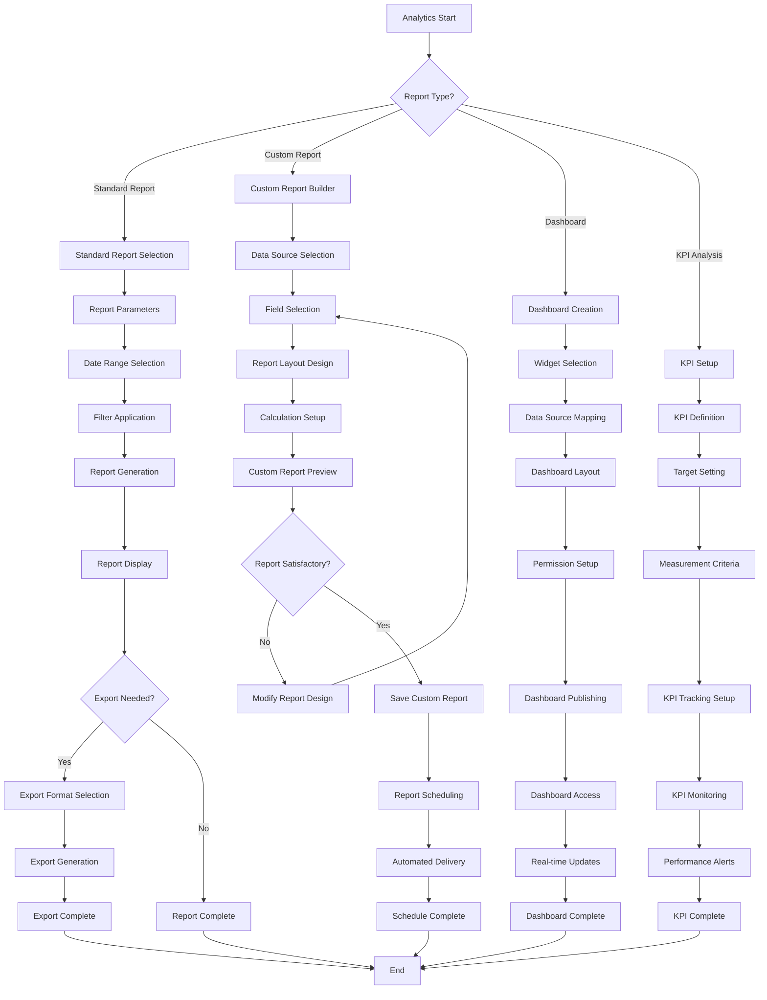
```mermaid
flowchart TD
    A[Analytics Start] --> B{Report Type?}
    B -->|Standard Report| C[Standard Report Selection]
    B -->|Custom Report| D[Custom Report Builder]
    B -->|Dashboard| E[Dashboard Creation]
    B -->|KPI Analysis| F[KPI Setup]
    
    C --> G[Report Parameters]
    G --> H[Date Range Selection]
    H --> I[Filter Application]
    I --> J[Report Generation]
    
    D --> K[Data Source Selection]
    K --> L[Field Selection]
    L --> M[Report Layout Design]
    M --> N[Calculation Setup]
    N --> O[Custom Report Preview]
    O --> P{Report Satisfactory?}
    P -->|No| Q[Modify Report Design]
    Q --> L
    P -->|Yes| R[Save Custom Report]
    
    E --> S[Widget Selection]
    S --> T[Data Source Mapping]
    T --> U[Dashboard Layout]
    U --> V[Permission Setup]
    V --> W[Dashboard Publishing]
    
    F --> X[KPI Definition]
    X --> Y[Target Setting]
    Y --> Z[Measurement Criteria]
    Z --> AA[KPI Tracking Setup]
    
    J --> BB[Report Display]
    R --> CC[Report Scheduling]
    W --> DD[Dashboard Access]
    AA --> EE[KPI Monitoring]
    
    BB --> FF{Export Needed?}
    FF -->|Yes| GG[Export Format Selection]
    FF -->|No| HH[Report Complete]
    GG --> II[Export Generation]
    
    CC --> JJ[Automated Delivery]
    DD --> KK[Real-time Updates]
    EE --> LL[Performance Alerts]
    
    II --> MM[Export Complete]
    JJ --> NN[Schedule Complete]
    KK --> OO[Dashboard Complete]
    LL --> PP[KPI Complete]
    
    HH --> QQ[End]
    MM --> QQ
    NN --> QQ
    OO --> QQ
    PP --> QQ
```

---

# 3. CHUYỂN ĐỔI MÀN HÌNH

## 3.1 Sơ đồ Navigation Flow

```mermaid
stateDiagram-v2
    [*] --> Login
    Login --> Dashboard : Authentication Success
    Login --> ErrorPage : Authentication Failed
    ErrorPage --> Login : Retry Login
    
    Dashboard --> LeadModule : Access Leads
    Dashboard --> AccountModule : Access Accounts
    Dashboard --> ContactModule : Access Contacts
    Dashboard --> DealModule : Access Deals
    Dashboard --> ActivityModule : Access Activities
    Dashboard --> ReportModule : Access Reports
    Dashboard --> AdminModule : Access Admin
    
    LeadModule --> LeadList : View All Leads
    LeadModule --> LeadForm : Create/Edit Lead
    LeadModule --> LeadDetail : View Lead Details
    LeadList --> LeadDetail : Select Lead
    LeadDetail --> LeadForm : Edit Lead
    LeadForm --> LeadDetail : Save Success
    LeadForm --> LeadForm : Validation Error
    
    AccountModule --> AccountList : View All Accounts
    AccountModule --> AccountForm : Create/Edit Account
    AccountModule --> AccountDetail : View Account Details
    AccountList --> AccountDetail : Select Account
    AccountDetail --> AccountForm : Edit Account
    AccountForm --> AccountDetail : Save Success
    AccountForm --> AccountForm : Validation Error
    
    ContactModule --> ContactList : View All Contacts
    ContactModule --> ContactForm : Create/Edit Contact
    ContactModule --> ContactDetail : View Contact Details
    ContactList --> ContactDetail : Select Contact
    ContactDetail --> ContactForm : Edit Contact
    ContactForm --> ContactDetail : Save Success
    ContactForm --> ContactForm : Validation Error
    
    DealModule --> DealPipeline : View Pipeline
    DealModule --> DealForm : Create/Edit Deal
    DealModule --> DealDetail : View Deal Details
    DealPipeline --> DealDetail : Select Deal
    DealDetail --> DealForm : Edit Deal
    DealForm --> DealDetail : Save Success
    DealForm --> DealForm : Validation Error
    
    ActivityModule --> ActivityList : View Activities
    ActivityModule --> ActivityForm : Create Activity
    ActivityModule --> Calendar : Calendar View
    ActivityList --> ActivityForm : Edit Activity
    Calendar --> ActivityForm : Create from Calendar
    ActivityForm --> ActivityList : Save Success
    
    ReportModule --> ReportList : View Reports
    ReportModule --> ReportBuilder : Custom Report
    ReportModule --> Dashboard : View Dashboard
    ReportList --> ReportViewer : Run Report
    ReportBuilder --> ReportViewer : Preview Report
    
    AdminModule --> UserManagement : Manage Users
    AdminModule --> SystemConfig : System Settings
    AdminModule --> WorkflowSetup : Workflow Config
    
    LeadDetail --> Dashboard : Home Navigation
    AccountDetail --> Dashboard : Home Navigation
    ContactDetail --> Dashboard : Home Navigation
    DealDetail --> Dashboard : Home Navigation
    ActivityList --> Dashboard : Home Navigation
    ReportViewer --> Dashboard : Home Navigation
```

## 3.2 Modal và Pop-up States

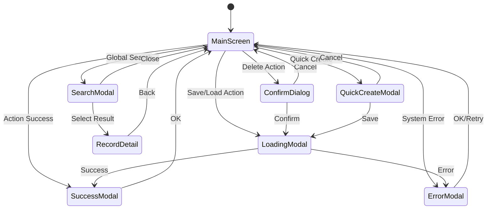
```mermaid
stateDiagram-v2
    [*] --> MainScreen
    MainScreen --> ConfirmDialog : Delete Action
    MainScreen --> LoadingModal : Save/Load Action
    MainScreen --> ErrorModal : System Error
    MainScreen --> SuccessModal : Action Success
    
    ConfirmDialog --> MainScreen : Cancel
    ConfirmDialog --> LoadingModal : Confirm
    LoadingModal --> SuccessModal : Success
    LoadingModal --> ErrorModal : Error
    SuccessModal --> MainScreen : OK
    ErrorModal --> MainScreen : OK/Retry
    
    MainScreen --> QuickCreateModal : Quick Create
    QuickCreateModal --> MainScreen : Cancel
    QuickCreateModal --> LoadingModal : Save
    
    MainScreen --> SearchModal : Global Search
    SearchModal --> MainScreen : Close
    SearchModal --> RecordDetail : Select Result
    RecordDetail --> MainScreen : Back
```

---

# 4. FLOW NGOẠI LỆ TỔNG HỢP

## 4.1 System Level Exceptions

**Ngoại lệ 1: Session Timeout**
- *Điều kiện:* User inactive > session timeout period
- *Xử lý:* Auto-save draft, redirect to login
- *Thông báo:* "Session expired. Please log in again. Your work has been saved."
- *Luồng tiếp theo:* Login → Restore draft data

**Ngoại lệ 2: Network Connection Lost**
- *Điều kiện:* Internet connection interrupted
- *Xử lý:* Cache unsaved data, show offline mode
- *Thông báo:* "Connection lost. Working in offline mode."
- *Luồng tiếp theo:* Auto-sync when connection restored

**Ngoại lệ 3: Server Error (500)**
- *Điều kiện:* Internal server error occurred
- *Xử lý:* Show error page, log error details, retry mechanism
- *Thông báo:* "System temporarily unavailable. Please try again in a few minutes."
- *Luồng tiếp theo:* Auto-retry → Manual retry → Contact support

**Ngoại lệ 4: Insufficient Permissions**
- *Điều kiện:* User attempts action without proper permissions
- *Xử lý:* Block action, log security event
- *Thông báo:* "You don't have permission to perform this action."
- *Luồng tiếp theo:* Return to previous screen

**Ngoại lệ 5: Data Validation Failure**
- *Điều kiện:* Required fields missing or invalid format
- *Xử lý:* Highlight errors, prevent save
- *Thông báo:* "Please correct the highlighted fields before saving."
- *Luồng tiếp theo:* Fix errors → Re-validate → Save

## 4.2 Data Level Exceptions

**Ngoại lệ 6: Duplicate Record Detection**
- *Điều kiện:* Matching records found based on duplicate rules
- *Xử lý:* Show potential duplicates, offer merge option
- *Thông báo:* "Potential duplicate records found. Would you like to merge or create anyway?"
- *Luồng tiếp theo:* Merge records → Create duplicate → Cancel

**Ngoại lệ 7: Record Lock Conflict**
- *Điều kiện:* Multiple users editing same record
- *Xử lý:* Show lock warning, offer read-only mode
- *Thông báo:* "This record is being edited by [User Name]. Open in read-only mode?"
- *Luồng tiếp theo:* Read-only view → Wait for unlock → Force edit (admin only)

**Ngoại lệ 8: Data Import Errors**
- *Điều kiện:* Import file contains invalid data
- *Xử lý:* Generate error report, import valid records
- *Thông báo:* "Import completed with errors. 50 records imported, 5 failed."
- *Luồng tiếp theo:* Review errors → Fix data → Re-import failed records

## 4.3 Integration Exceptions

**Ngoại lệ 9: Email Service Failure**
- *Điều kiện:* Email service unavailable or quota exceeded
- *Xử lý:* Queue emails, retry mechanism
- *Thông báo:* "Email service temporarily unavailable. Your emails will be sent when service resumes."
- *Luồng tiếp theo:* Auto-retry → Manual retry → Alternative delivery

**Ngoại lệ 10: Third-party Integration Failure**
- *Điều kiện:* External API connection failed
- *Xử lý:* Use cached data, log integration error
- *Thông báo:* "Unable to sync with [Service Name]. Using last cached data."
- *Luồng tiếp theo:* Manual sync → Check integration settings → Contact admin

---

# 5. VẤN ĐỀ BẢO MẬT CẦN LƯU Ý

## 5.1 Authentication & Authorization

### 5.1.1 Điểm rủi ro bảo mật:
- **Login Process**: Brute force attacks, credential stuffing
- **Session Management**: Session hijacking, fixation attacks
- **Password Management**: Weak passwords, password reuse
- **Multi-factor Authentication**: MFA bypass attempts

### 5.1.2 Biện pháp kiểm soát:
- Implement account lockout after failed login attempts
- Use strong session tokens with proper expiration
- Enforce password complexity và rotation policies
- Mandatory MFA for admin accounts và sensitive operations
- IP whitelisting for admin access
- Single Sign-On (SSO) integration với enterprise identity providers

## 5.2 Data Protection

### 5.2.1 Điểm rủi ro bảo mật:
- **Data Access**: Unauthorized data viewing, privilege escalation
- **Data Export**: Mass data extraction, data leakage
- **Data Sharing**: Inappropriate sharing, external access
- **Data Retention**: Excessive data storage, incomplete deletion

### 5.2.2 Biện pháp kiểm soát:
- Role-based access control (RBAC) với principle of least privilege
- Field-level security cho sensitive data
- Export restrictions và audit trails
- Data encryption at rest và in transit
- Regular access reviews và cleanup
- Data loss prevention (DLP) controls

## 5.3 API Security

### 5.3.1 Điểm rủi ro bảo mật:
- **API Authentication**: API key exposure, token theft
- **Rate Limiting**: API abuse, DDoS attacks
- **Input Validation**: Injection attacks, malformed requests
- **Data Exposure**: Excessive data in API responses

### 5.3.2 Biện pháp kiểm soát:
- OAuth 2.0 với scope restrictions
- API rate limiting và throttling
- Input validation và sanitization
- API response filtering
- API gateway với security policies
- Regular API security testing

## 5.4 Workflow Security

### 5.4.1 Điểm rủi ro bảo mật:
- **Automation Rules**: Privilege escalation through workflows
- **Email Actions**: Email spoofing, phishing
- **Data Updates**: Unauthorized data modifications
- **External Integrations**: Third-party security risks

### 5.4.2 Biện pháp kiểm soát:
- Workflow execution với limited privileges
- Email authentication (SPF, DKIM, DMARC)
- Change approval workflows cho critical data
- Security assessment của third-party integrations
- Workflow monitoring và anomaly detection

## 5.5 Audit & Compliance

### 5.5.1 Điểm rủi ro bảo mật:
- **Audit Logs**: Log tampering, incomplete logging
- **Compliance**: GDPR, CCPA violations
- **Data Retention**: Non-compliant data storage
- **Cross-border Data**: Data residency violations

### 5.5.2 Biện pháp kiểm soát:
- Immutable audit logging với centralized storage
- Regular compliance assessments
- Automated data retention policies
- Data residency controls
- Privacy impact assessments
- Regular security training cho users

---

# 6. PERFORMANCE & SCALABILITY CONSIDERATIONS

## 6.1 Database Performance

### 6.1.1 Query Optimization:
- Index optimization cho frequently accessed fields
- Query execution plan analysis
- Database connection pooling
- Caching strategies cho static data

### 6.1.2 Data Volume Management:
- Archival policies cho old records
- Partitioning strategies cho large tables
- Bulk operation optimization
- Real-time vs batch processing decisions

## 6.2 User Interface Performance

### 6.2.1 Page Load Optimization:
- Lazy loading cho non-critical components
- Progressive loading cho large datasets
- Client-side caching
- CDN usage cho static assets

### 6.2.2 Mobile Performance:
- Responsive design optimization
- Offline capability
- Bandwidth-conscious features
- Touch interface optimization

---

# 7. INTEGRATION PATTERNS

## 7.1 Inbound Integrations

### 7.1.1 Web Forms Integration:
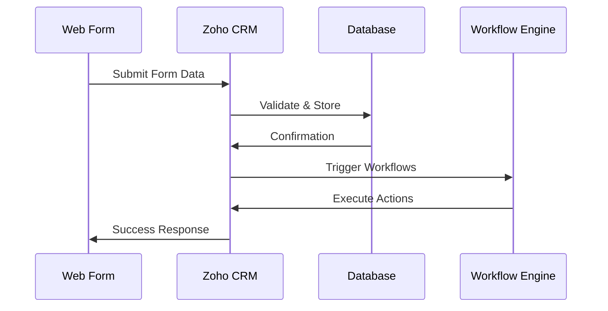
```mermaid
sequenceDiagram
    participant WF as Web Form
    participant ZC as Zoho CRM
    participant DB as Database
    participant WF_Engine as Workflow Engine
    
    WF->>ZC: Submit Form Data
    ZC->>DB: Validate & Store
    DB->>ZC: Confirmation
    ZC->>WF_Engine: Trigger Workflows
    WF_Engine->>ZC: Execute Actions
    ZC->>WF: Success Response
```

### 7.1.2 Email Integration:
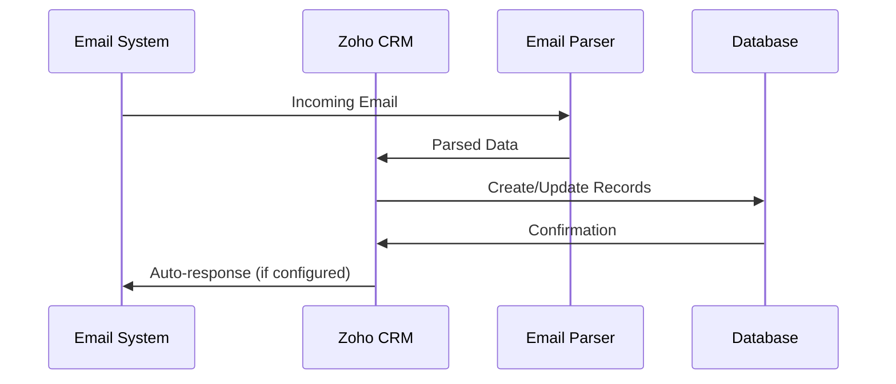
```mermaid
sequenceDiagram
    participant ES as Email System
    participant ZC as Zoho CRM
    participant Parser as Email Parser
    participant DB as Database
    
    ES->>Parser: Incoming Email
    Parser->>ZC: Parsed Data
    ZC->>DB: Create/Update Records
    DB->>ZC: Confirmation
    ZC->>ES: Auto-response (if configured)
```

## 7.2 Outbound Integrations

### 7.2.1 Marketing Automation:
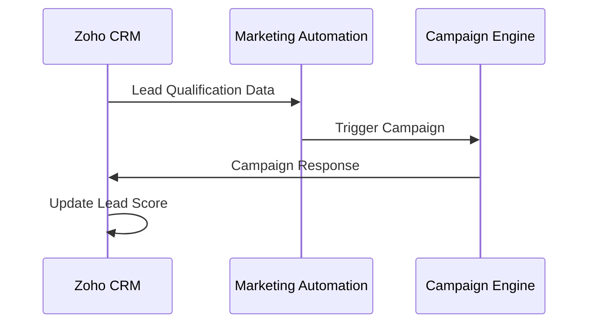
```mermaid
sequenceDiagram
    participant ZC as Zoho CRM
    participant MA as Marketing Automation
    participant Campaign as Campaign Engine
    
    ZC->>MA: Lead Qualification Data
    MA->>Campaign: Trigger Campaign
    Campaign->>ZC: Campaign Response
    ZC->>ZC: Update Lead Score
```

### 7.2.2 ERP Integration:
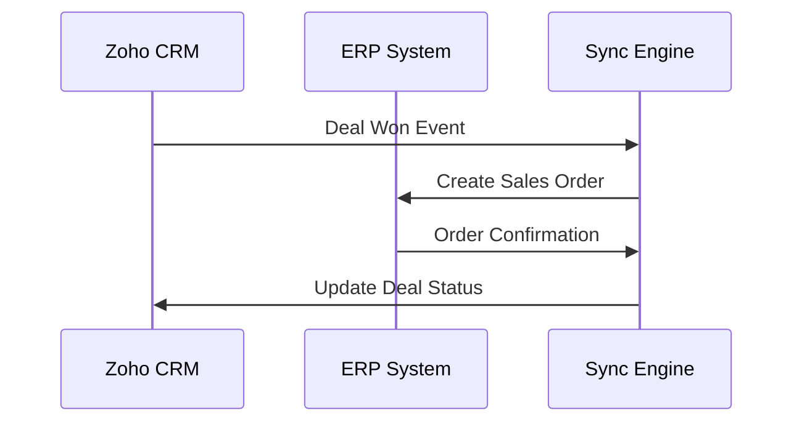
```mermaid
sequenceDiagram
    participant ZC as Zoho CRM
    participant ERP as ERP System
    participant Sync as Sync Engine
    
    ZC->>Sync: Deal Won Event
    Sync->>ERP: Create Sales Order
    ERP->>Sync: Order Confirmation
    Sync->>ZC: Update Deal Status
```

---

# 8. MOBILE APPLICATION FLOWS

## 8.1 Mobile-Specific Features

### 8.1.1 Offline Capability:
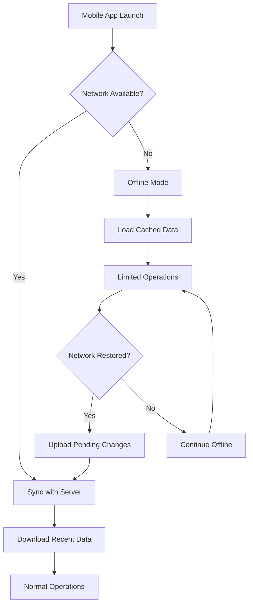
```mermaid
flowchart TD
    A[Mobile App Launch] --> B{Network Available?}
    B -->|Yes| C[Sync with Server]
    B -->|No| D[Offline Mode]
    
    C --> E[Download Recent Data]
    E --> F[Normal Operations]
    
    D --> G[Load Cached Data]
    G --> H[Limited Operations]
    H --> I{Network Restored?}
    I -->|Yes| J[Upload Pending Changes]
    I -->|No| K[Continue Offline]
    J --> C
    K --> H
```

### 8.1.2 GPS Integration:
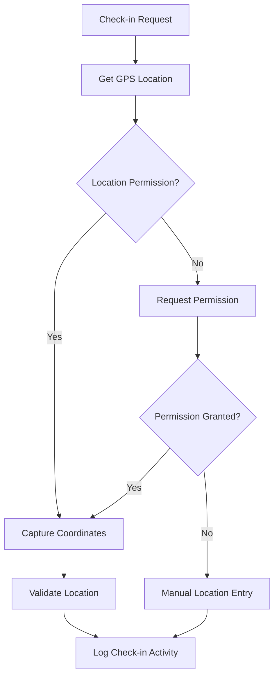
```mermaid
flowchart TD
    A[Check-in Request] --> B[Get GPS Location]
    B --> C{Location Permission?}
    C -->|No| D[Request Permission]
    C -->|Yes| E[Capture Coordinates]
    D --> F{Permission Granted?}
    F -->|No| G[Manual Location Entry]
    F -->|Yes| E
    E --> H[Validate Location]
    H --> I[Log Check-in Activity]
    G --> I
```

---

# 9. ADVANCED AUTOMATION SCENARIOS

## 9.1 AI-Powered Lead Scoring

### 9.1.1 Machine Learning Flow:
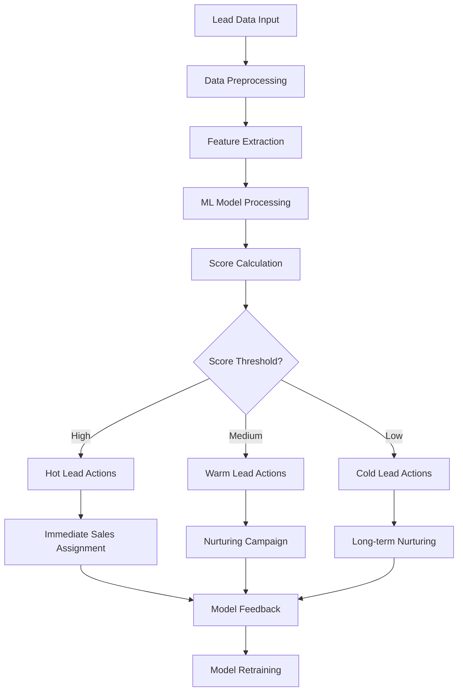
```mermaid
flowchart TD
    A[Lead Data Input] --> B[Data Preprocessing]
    B --> C[Feature Extraction]
    C --> D[ML Model Processing]
    D --> E[Score Calculation]
    E --> F{Score Threshold?}
    F -->|High| G[Hot Lead Actions]
    F -->|Medium| H[Warm Lead Actions]
    F -->|Low| I[Cold Lead Actions]
    
    G --> J[Immediate Sales Assignment]
    H --> K[Nurturing Campaign]
    I --> L[Long-term Nurturing]
    
    J --> M[Model Feedback]
    K --> M
    L --> M
    M --> N[Model Retraining]
```

## 9.2 Predictive Analytics

### 9.2.1 Deal Forecast Prediction:
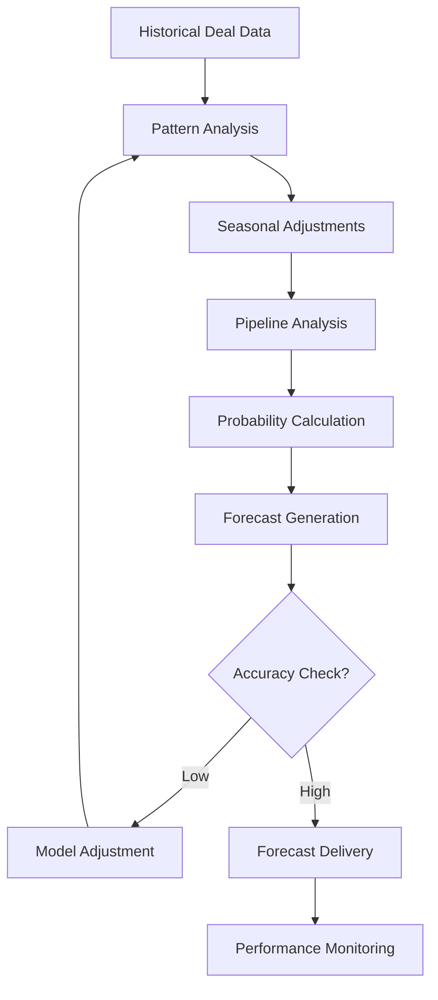
```mermaid
flowchart TD
    A[Historical Deal Data] --> B[Pattern Analysis]
    B --> C[Seasonal Adjustments]
    C --> D[Pipeline Analysis]
    D --> E[Probability Calculation]
    E --> F[Forecast Generation]
    F --> G{Accuracy Check?}
    G -->|Low| H[Model Adjustment]
    G -->|High| I[Forecast Delivery]
    H --> B
    I --> J[Performance Monitoring]
```

---

# 10. DISASTER RECOVERY & BUSINESS CONTINUITY

## 10.1 Backup & Recovery Flows

### 10.1.1 Data Backup Process:
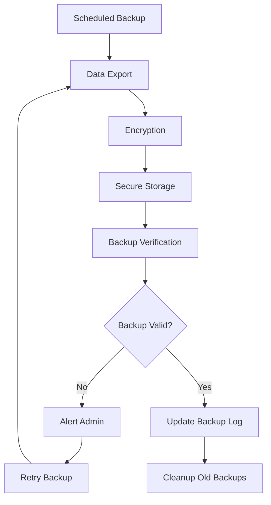
```mermaid
flowchart TD
    A[Scheduled Backup] --> B[Data Export]
    B --> C[Encryption]
    C --> D[Secure Storage]
    D --> E[Backup Verification]
    E --> F{Backup Valid?}
    F -->|No| G[Alert Admin]
    F -->|Yes| H[Update Backup Log]
    G --> I[Retry Backup]
    I --> B
    H --> J[Cleanup Old Backups]
```

### 10.1.2 System Recovery Process:
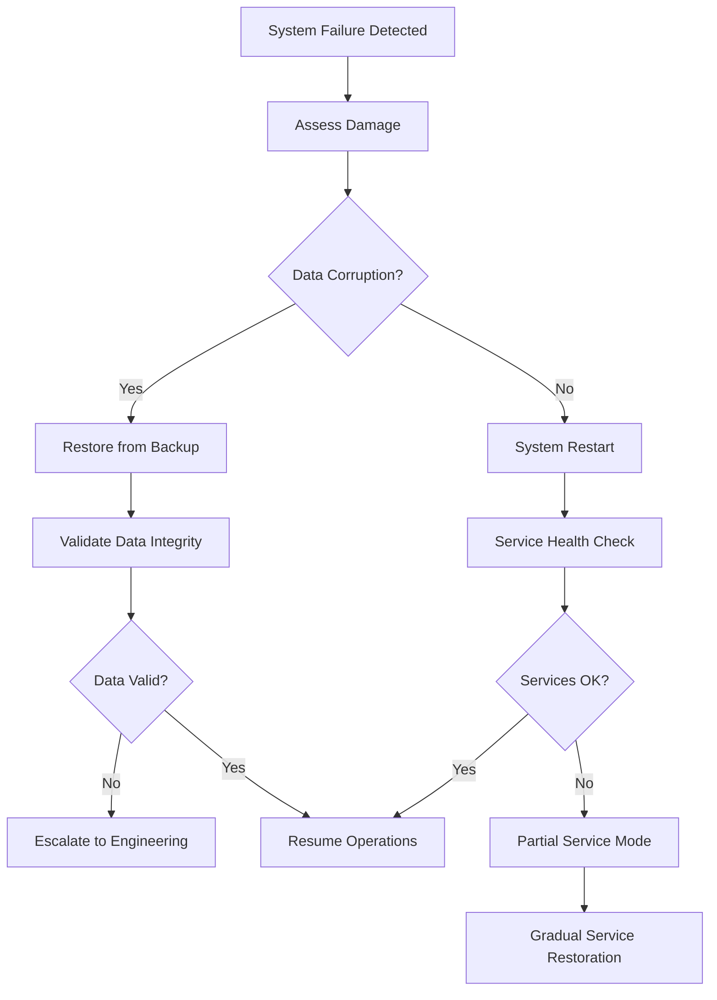
```mermaid
flowchart TD
    A[System Failure Detected] --> B[Assess Damage]
    B --> C{Data Corruption?}
    C -->|Yes| D[Restore from Backup]
    C -->|No| E[System Restart]
    D --> F[Validate Data Integrity]
    E --> G[Service Health Check]
    F --> H{Data Valid?}
    G --> I{Services OK?}
    H -->|No| J[Escalate to Engineering]
    H -->|Yes| K[Resume Operations]
    I -->|No| L[Partial Service Mode]
    I -->|Yes| K
    L --> M[Gradual Service Restoration]
```

---

# 11. KẾT LUẬN VÀ KHUYẾN NGHỊ

## 11.1 Tóm tắt Flow chính

Tài liệu này đã trình bày đầy đủ các flow nghiệp vụ của Zoho CRM bao gồm:

1. **Core Modules**: Lead, Account, Contact, Deal, Activity Management
2. **Advanced Features**: Workflow Automation, Reports & Analytics
3. **System Integration**: API, Email, Mobile, Third-party services
4. **Security & Compliance**: Authentication, Authorization, Audit
5. **Performance & Scalability**: Optimization strategies
6. **Exception Handling**: Comprehensive error scenarios
7. **Mobile & Offline**: Mobile-specific workflows
8. **AI & Automation**: Advanced automation scenarios
9. **Disaster Recovery**: Business continuity planning

## 11.2 Khuyến nghị Implementation

### 11.2.1 Phase 1 - Core Implementation:
- Implement basic CRUD operations cho tất cả modules
- Setup fundamental security controls
- Establish basic workflows và notifications
- Configure standard reports

### 11.2.2 Phase 2 - Advanced Features:
- Deploy automation workflows
- Implement advanced security features
- Setup integration với external systems
- Configure advanced analytics

### 11.2.3 Phase 3 - Optimization:
- Performance tuning
- AI-powered features
- Mobile optimization
- Advanced compliance features

## 11.3 Success Metrics

### 11.3.1 Technical Metrics:
- System uptime > 99.9%
- Page load time < 3 seconds
- API response time < 500ms
- Data accuracy > 99.5%

### 11.3.2 Business Metrics:
- User adoption rate > 80%
- Process automation rate > 60%
- Data quality improvement > 40%
- Sales productivity increase > 25%

## 11.4 Risk Mitigation

### 11.4.1 Technical Risks:
- Regular performance monitoring
- Automated testing procedures
- Disaster recovery testing
- Security vulnerability assessments

### 11.4.2 Business Risks:
- User training programs
- Change management processes
- Data migration validation
- Business continuity planning

---

**Lưu ý:** Tài liệu này là living document và cần được cập nhật thường xuyên theo sự phát triển của hệ thống và yêu cầu nghiệp vụ mới.

**Người phê duyệt:** [Tên người phê duyệt]  
**Ngày phê duyệt:** [Ngày phê duyệt]  
**Phiên bản tiếp theo:** [Ngày review tiếp theo]